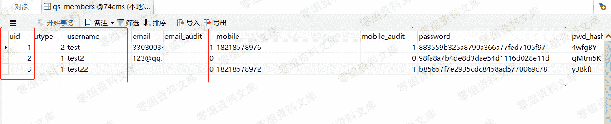
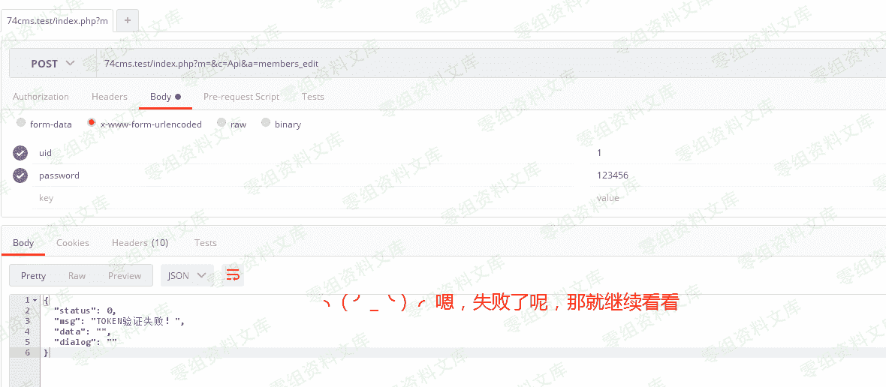
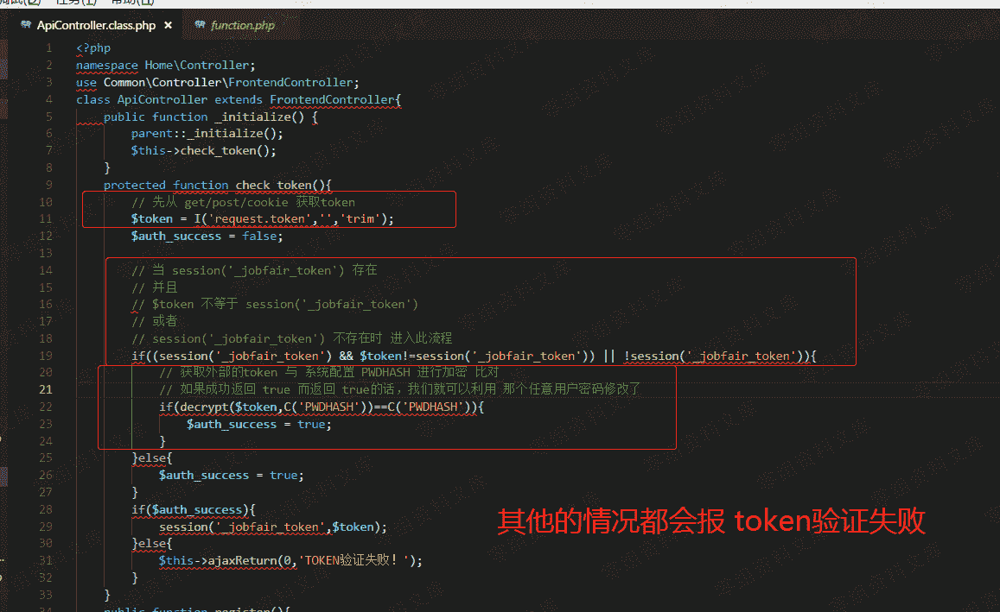
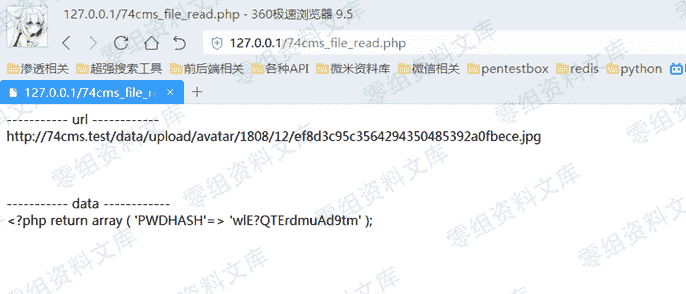
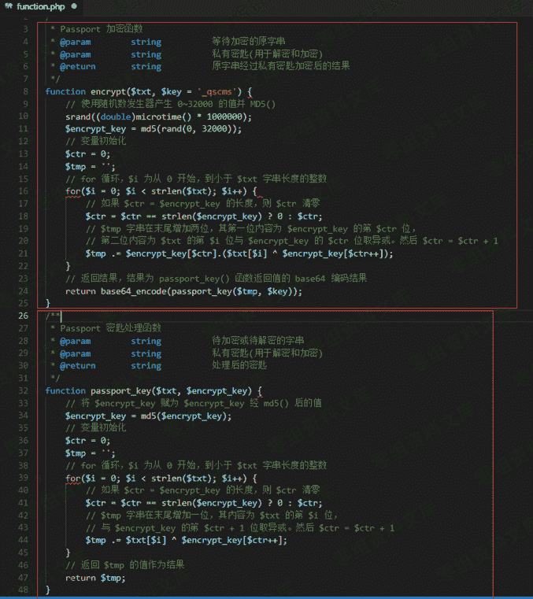
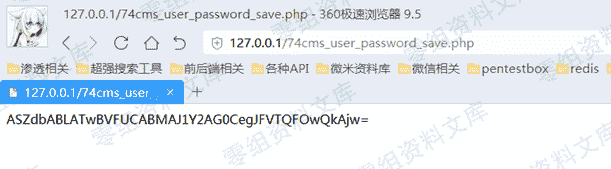
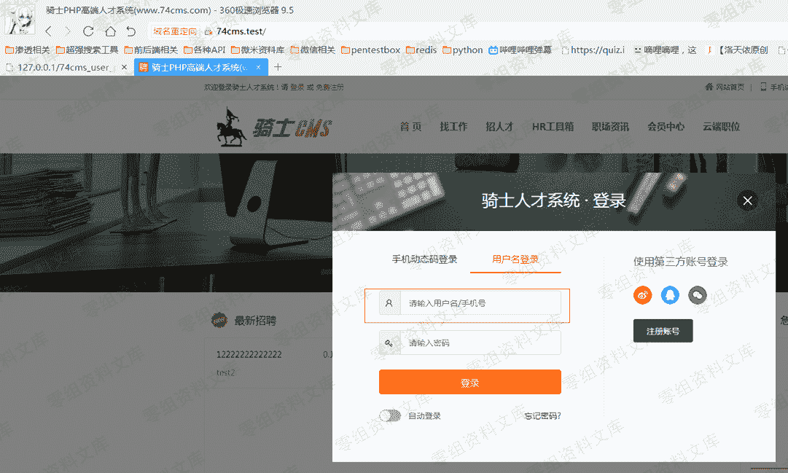
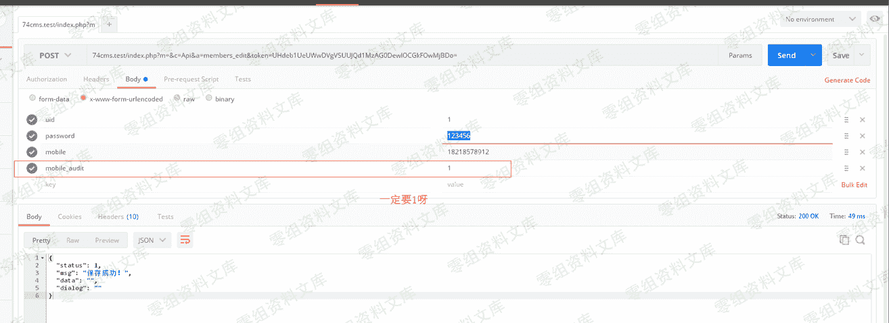

# 74cms v4.2.126-因任意文件读取漏洞导致的任意用户密码修改漏洞

> 原文：[http://book.iwonder.run/0day/74cms/新版 74cms v4.2.126-因任意文件读取漏洞导致的任意用户密码修改漏洞.html](http://book.iwonder.run/0day/74cms/新版 74cms v4.2.126-因任意文件读取漏洞导致的任意用户密码修改漏洞.html)

## 0x00 前言

厂商：74cms 下载地址：[http://www.74cms.com/download/index.html](http://www.74cms.com/download/index.html) 关于版本： 新版的 74cms 采用了 tp3.2.3 重构了，所以可知底层是 tp，74cms 新版升级是后台升级的，所以先将将升级方法。 注：此漏洞不用升级至最新版本也可使用。 0x01 74cms 升级到最新版 1， 先去官网下载 骑士人才系统基础版(安装包) 2， 将下载好的包进行安装 3， 进入后台点击查看如果不是最新版的话，请点击升级！ 4， 如果是本地环境的话，会提示 域名不合法升级失败，这个问题很好解决 5， 搜索文件 74cms\upload\Application\Admin\Controller\ApplyController.class.php 6， 查找所有$_SERVER['HTTP_HOST'] 改为 [http://baidu.com](http://baidu.com) 即可

## 0x02

突突突突突突突 文件： 74cms\upload\Application\Home\Controller\ApiController.class.php 方法：members_edit(

从这里看漏洞整体都很简单。没有过多的套路的，有的只是中规中矩。 那么就让我们直接利用试试。

先看看数据库现在的数据

接着让我们来调接口看看

文件： 74cms\upload\Application\Home\Controller\ApiController.class.php 方法：check_token(

接口调用失败的原因是因为，上图的析构函数 调用了方法 check_token 进行了 token 验证

这些都没有问题， $token 也是我们可以操控的。

现在的问题就是 C('PWDHASH') 我们现在无法得到。

好在，我们还可以通过组合漏洞的形式来获取。

想要利用此漏洞，我的想法是先通过，任意读取漏洞，先把 C('PWDHASH') 的值读取出来，然后在加密验证一下即可

而加密的代码其实我们不需要去看，因为这是全局通用的代码，所以我们正式环境中复制出来加密一下就可以利用了。

思路： 先下载此源码然后本地把此加密函数保存下来即可。（因为没人会没事去改加密函数） 然后在通过 “任意文件读取漏洞” 读取目标站点的 C('PWDHASH') 的值，接着本地加密成 token 这样漏洞就可以使用了

任意文件读取的小脚本下载

[https://github.com/ianxtianxt/74cms_file_read](https://github.com/ianxtianxt/74cms_file_read)

下载此文件以后

设置成这样，然后执行一下

接着把 PWDHASH 复制出来

我们这里看看加密的代码： 文件：74cms\upload\Application\Common\Common\function.php 函数：encrypt(

然后加密一下

这时你就会发现虽然我们密码改了但是不知道用户名怎么办？

好在我们可以这样利用！ 人家登录是可以用户名，手机号登录的，所以我们就

当然如果你要修改用户名登录的话，也可以，看你自己喜欢了

## 0x03 利用小工具

为了方便大家，手工做这种事情是很累的，所以还是要写个小工具，可以方便的去利用。 利用工具:

[https://github.com/ianxtianxt/74cms_file_read](https://github.com/ianxtianxt/74cms_file_read)

## 四、参考链接

> [https://www.yuque.com/pmiaowu/bfgkkh/rymscc](https://www.yuque.com/pmiaowu/bfgkkh/rymscc)

