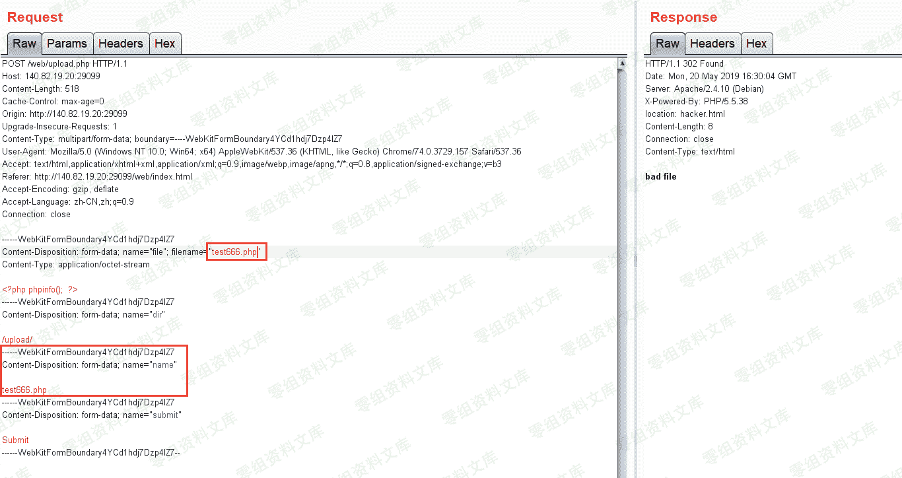
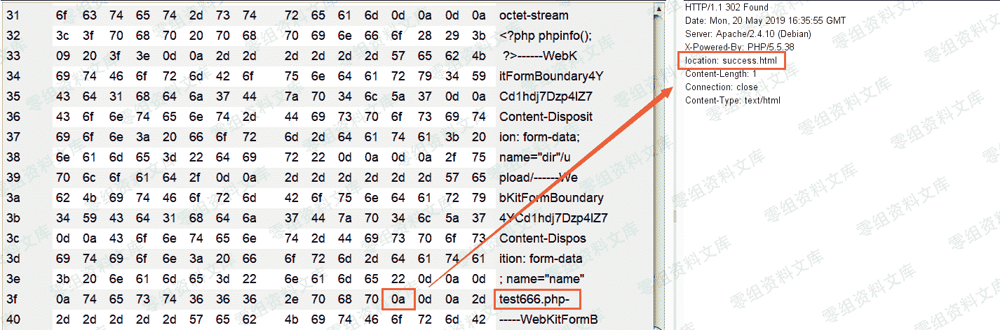

# （CVE-2017-15715）Apache 解析漏洞

> 原文：[http://book.iwonder.run/0day/Apache/CVE-2017-15715.html](http://book.iwonder.run/0day/Apache/CVE-2017-15715.html)

## 一、漏洞简介

## 二、漏洞影响

Apache 2.4.0 到 2.4.29

## 三、复现过程

首先正常上传一个图片，发现无法上传

如果文件名取自$_FILES['file']['name']，就会自动把换行符去掉，而文件名取自 post 参数 name 中，就能很好的利用到这个解析漏洞

下面我们上传一个包含换行符的文件，这里需要注意只能时\x0a 而不是\x0d\x0a，\x0d\x0a 的情况是我们直接添加一个换行符，我们利用 burp 的 hex 功能在 test666.php 后面添加一个\x0a

从响应包中可以看到上传成功了，但是相应页面 success.html 中并没有告诉我们上传文件的目录

但是我们在请求包中还可以看到一个参数 dir = /upload/，所以猜测上传目录为·/upload/test666.php%0a

