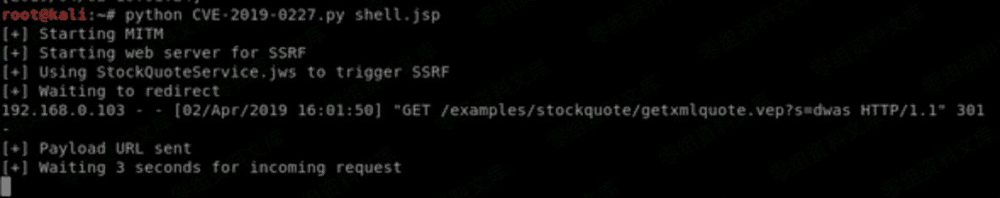

# （CVE-2019-0227）Apache Axis 1.4 远程代码执行

> 原文：[http://book.iwonder.run/0day/Apache/2.html](http://book.iwonder.run/0day/Apache/2.html)

## 一、漏洞简介

Apache Axis™是一个简单对象访问协议（SOAP）引擎。在最近的一次红队行动中，我们发现目标装有老版本的 Apache Axis（1.4）。现在较新的有 Apache Axis2, Apache CXF,和 Metro 等。尽管 Apache Axis 已经过时，但它仍然在许多情况下被使用，例如使用 Axis 构造的项目难以重写或者项目中含有使用 SOAP 编码的服务。

我们的目标仍在使用过时的版本，因此我们觉得值得深入挖掘，看看是否有可利用的漏洞。最后，我们找到了一个 RCE 漏洞，该漏洞是由于在默认的示例中使用了过期的硬编码域名作为默认安装。Apache 官方为该漏洞签署编号：CVE-2019-0227。现在，我们已经购买了过期域名（www.xmltoday.com）从而防止该漏洞被恶意利用。在本文中，我们将在本地环境中（无需域名）为你演示这个漏洞，同时这个漏洞对 Axis2 也有影响。

Axis 如果你在服务器的 Apache Axis 或 Axis2 的找到服务端请求伪造（SSRF）漏洞，你也可能实现目标服务器的代码执行。在 Ambionics Security 的博客文章中有类似的介绍。因为涉及到产权保护，我不会介绍那篇文章的太多细节，总而言之：Axis 以管理员权限处理 localhost 的请求，攻击者可以通过 SSRF 漏洞修改 HTTP GET 请求部分来伪装成 localhost 用户。

## 二、漏洞影响

Apache Axis 版本= 1.4

## 三、复现过程

[https://github.com/ianxtianxt/cve-2019-0227](https://github.com/ianxtianxt/cve-2019-0227)

### 1、需要在 msf 设置监听，另外需要修改代码 24-30 行处

```
＃您需要更改这些变量以匹配您的配置

myip =  “ 192.168.0.117 ”  ＃您机器的 IP

target =  “ 192.168.0.102 ”  ＃目标 IP

网关=  “ 192.168.0.1 ”  ＃默认网关

targetport =  “ 8080 ”  ＃目标运行轴的端口（可能是 8080）

pathtoaxis =  “ http://192.168.0.102:8080/axis ”  ＃这可以是自定义的视轴安装，但是这是默认

spoofinterface =  “ eth0 ”  ＃伪造的接口

jspwritepath =  “ webapps \\ axis \\ exploit.jsp ”  ＃在目标上写入 JSP 有效负载的相对路径这是 Tomcat 安装的默认路径 
```


### 2、然后执行 py 文件



等待返回 shell 

