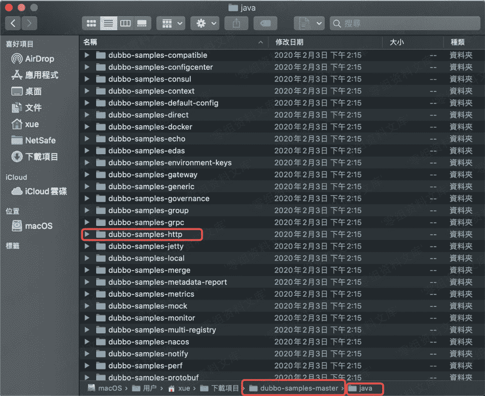
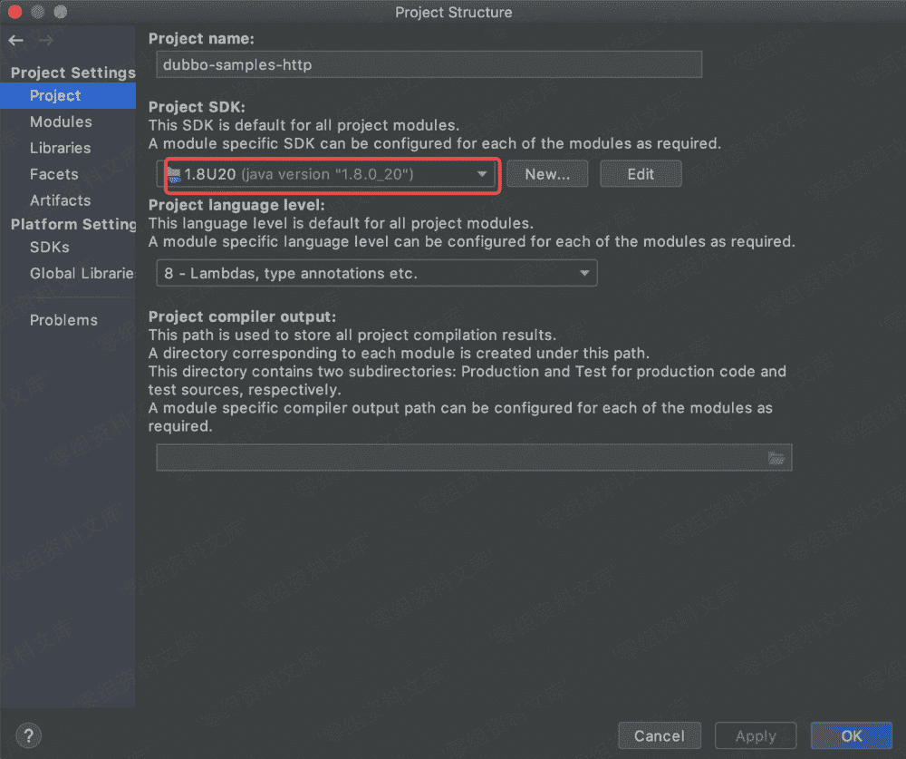
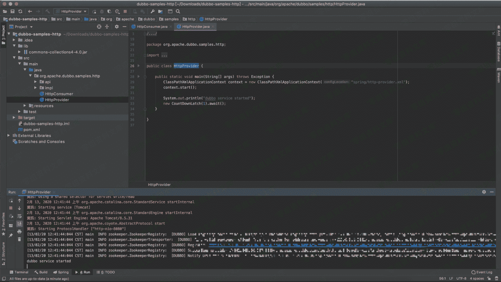
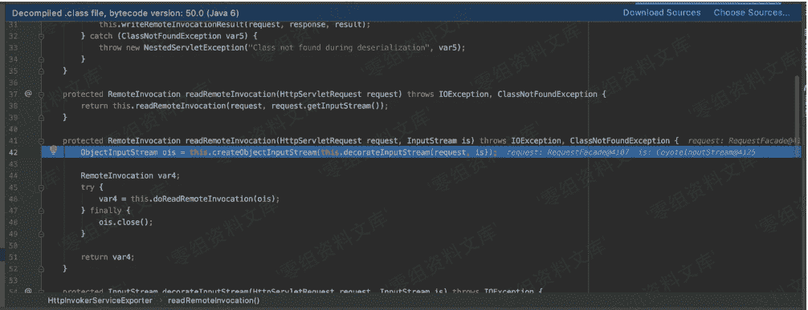
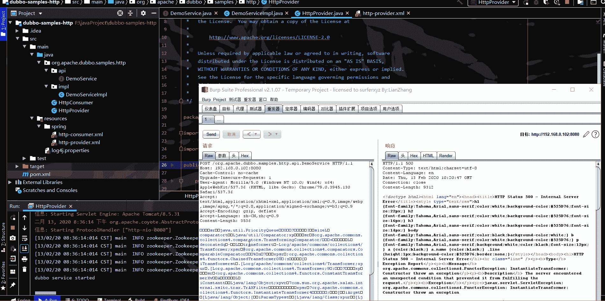

# （CVE-2019-17564）Apache Dubbo 反序列化漏洞

> 原文：[http://book.iwonder.run/0day/Apache Dubbo/CVE-2019-17564.html](http://book.iwonder.run/0day/Apache Dubbo/CVE-2019-17564.html)

## 一、漏洞简介

`Apache Dubbo`支持多种协议，推荐官方使用`Dubbo`协议。`Apache Dubbo HTTP`协议中的一个反序列化漏洞（CVE-2019-17564），漏洞该主要原因的在于当`Apache Dubbo`启用`HTTP`协议之后，`Apache Dubbo`对消息体处理不当导致不安全反序列化，当项目包中存在可用的`gadgets`时即可导致远程代码执行。

## 二、漏洞影响

2.7.0 <= Apache Dubbo <= 2.7.4.1 2.6.0 <= Apache Dubbo <= 2.6.7 Apache Dubbo = 2.5.x

## 三、复现过程

*   1.环境建设

为了环境搭建方便，访问`dubbo-samples`的 github 项目主页（[https://github.com/apache/dubbo-samples）](https://github.com/apache/dubbo-samples）)

下载源码以后，分离出 http 部分



修改 pom.xml 中 32 行`dubbo.version`


修改其为漏洞版本,以 2.7.3 为例,随后在 Idea 中开启即可 修改 JDK 版本为 1.8



随后导入一个可控的 gadgets 用于分析,例如`commons-collections4-4.0`,并启动`HttpProvider`



##### 注:Dubbo 启动依赖 zookeeper,这部分使用不再赘述,请自行查阅 google

*   2.漏洞分析

我们进入`org.apache.dubbo.remoting.http.servlet.DispatcherServlet`在 43 行`handler.handle(request, response);`处打入断点，利用 burp 进行发包跟踪它的走向


随后发现其进入`org.apache.dubbo.rpc.protocol.http.HttpProtocol`中的`handle`


进一步跟踪



最终进入`org.springframework.remoting.rmi.RemoteInvocationSerializingExporter`


该 ois 对象来源为报文中 post data 部分,对于传入的 ois 并没有做任何安全过滤和检查,直接就行了`readObject`方法导致 RCE 产生.


很多人不太理解 Java 反序列化漏洞怎么 rce,这里给出一段示例代码

使用`ysoserial`随意生成一个序列化文件,再利用下面的代码读取该序列化文件即可达到效果,可见直接使用`readObject`方法的危害

```
import java.io.FileInputStream;
import java.io.ObjectInputStream;

public class test1 {
    public test1() {
    }

    public static void main(String[] args) throws Exception {
        FileInputStream fis = new FileInputStream("/Users/xue/Documents/NetSafe/Tools/JavaTools/1.ser");
        ObjectInputStream ois = new ObjectInputStream(fis);
        ois.readObject();
    }
} 
```

*   3.漏洞复现

ysoserial 下载地址：[http://www.0-sec.org/download/ysoserial.zip](../../download/ysoserial.zip)

利用 ysoserial 生成 payload

```
java -jar ysoserial-master-30099844c6-1.jar CommonsCollections4 "calc" > payload.out 
```

将 payload 粘贴至 burp 中




## 参考链接

> [https://qiita.com/shimizukawasaki/items/39c9695d439768cfaeb5](https://qiita.com/shimizukawasaki/items/39c9695d439768cfaeb5)
> 
> [https://www.cnblogs.com/wh4am1/p/12307848.html](https://www.cnblogs.com/wh4am1/p/12307848.html)

