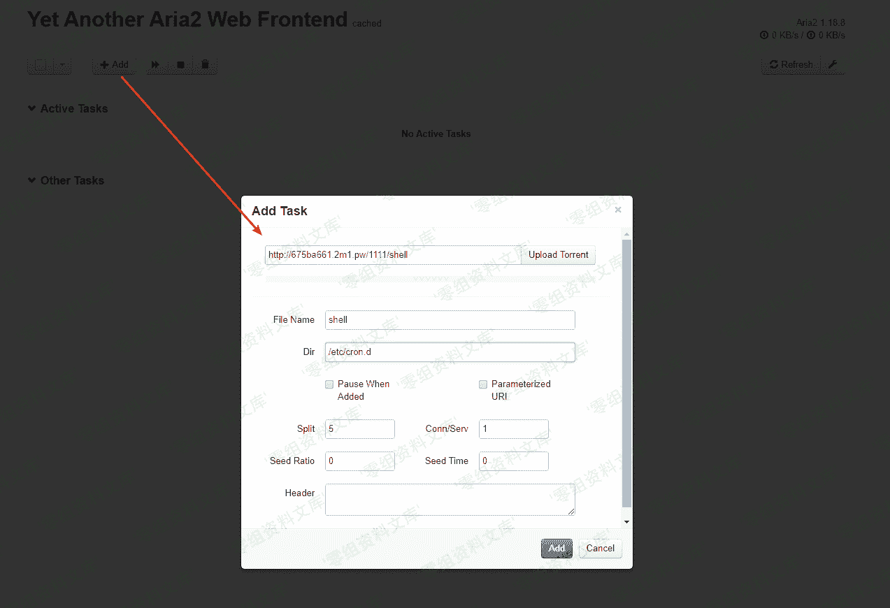
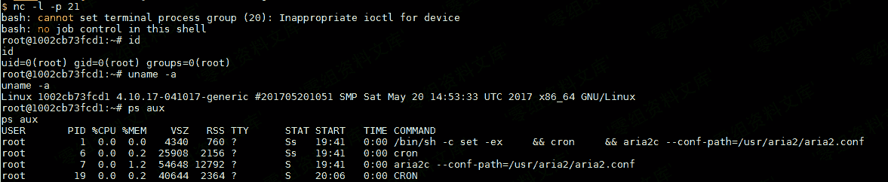

# （CVE-2016-3088）Aria2 任意文件写入漏洞

> 原文：[http://book.iwonder.run/0day/Aria2/CVE-2016-3088.html](http://book.iwonder.run/0day/Aria2/CVE-2016-3088.html)

## 一、漏洞简介

Aria2 是一个命令行下轻量级、多协议、多来源的下载工具（支持 HTTP/HTTPS、FTP、BitTorrent、Metalink），内建 XML-RPC 和 JSON-RPC 接口。在有权限的情况下，我们可以使用 RPC 接口来操作 aria2 来下载文件，将文件下载至任意目录，造成一个任意文件写入漏洞。

## 二、漏洞影响

Aria2 < 1.18.8

## 三、复现过程

因为 rpc 通信需要使用 json 或者 xml，不太方便，所以我们可以借助第三方 UI 来和目标通信，如 [http://binux.github.io/yaaw/demo/](http://binux.github.io/yaaw/demo/) 。

> [https://github.com/ianxtianxt/yaaw](https://github.com/ianxtianxt/yaaw) 源码在这里，也可自行搭建。

打开 yaaw，点击配置按钮，填入运行 aria2 的目标域名：`http://your-ip:6800/jsonrpc`:

然后点击 Add，增加一个新的下载任务。在 Dir 的位置填写下载至的目录，File Name 处填写文件名。比如，我们通过写入一个 crond 任务来反弹 shell：

这时候，arai2 会将恶意文件（我指定的 URL）下载到/etc/cron.d/目录下，文件名为 shell。而在 debian 中，/etc/cron.d 目录下的所有文件将被作为计划任务配置文件（类似 crontab）读取，等待一分钟不到即成功反弹 shell：

> 如果反弹不成功，注意 crontab 文件的格式，以及换行符必须是`\n`，且文件结尾需要有一个换行符。

