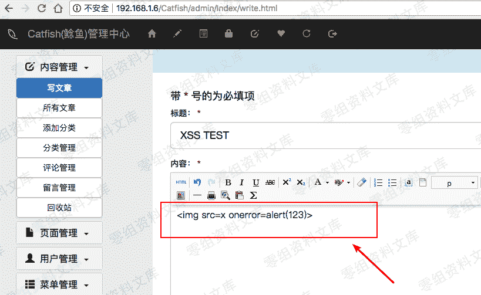
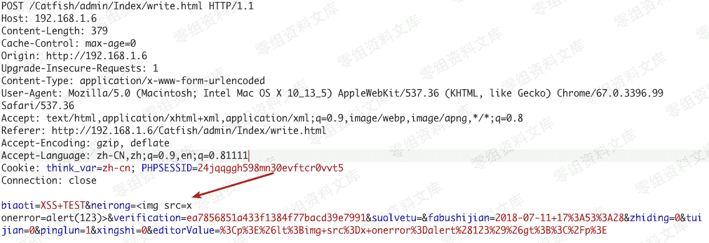
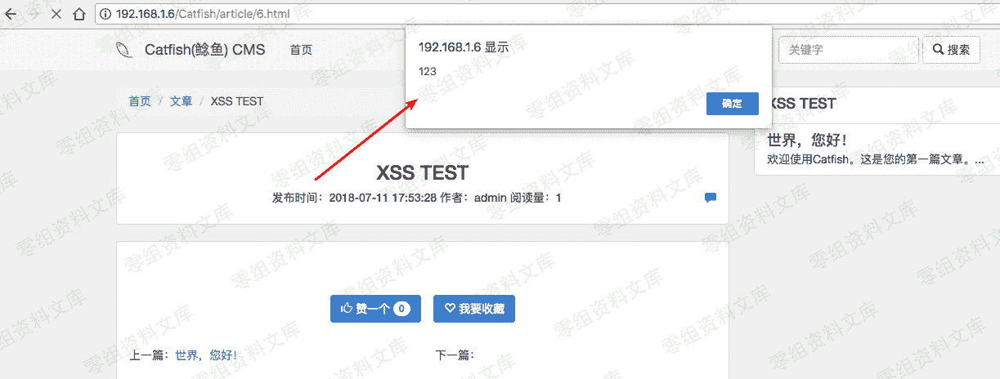

# CatfishCMS 后台储存型 xss

> 原文：[http://book.iwonder.run/0day/CatfishCMS/1.html](http://book.iwonder.run/0day/CatfishCMS/1.html)

## 一、漏洞简介

网站背景中的管理员可以发布包含存储 XSS 漏洞的文章 提交标题以抓取数据包 使用 burp 修改参数 浏览文章可以触发 XSS

## 二、漏洞影响

## 三、复现过程



```
neiron= 
```





