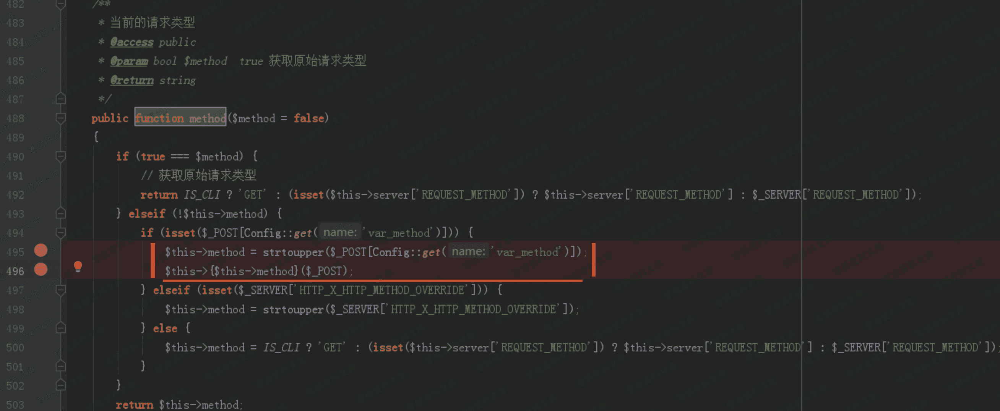
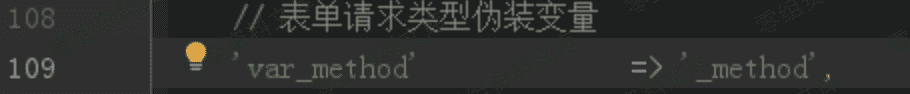
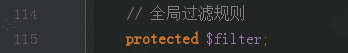

# （CNVD-2019-06255）CatfishCMS 远程命令执行

> 原文：[http://book.iwonder.run/0day/CatfishCMS/CatfishCMS 远程命令执行.html](http://book.iwonder.run/0day/CatfishCMS/CatfishCMS 远程命令执行.html)

## 一、漏洞简介

## 二、漏洞影响

v4.8.54

## 三、复现过程

### 1、_method=__construct

CatfishCMS 基于 thinkPHP5 开发。 Request 类（catfish/library/think/Request.php）用于处理请求。 它的成员函数 method 用于获取请求的类型。



application/config.php 中定义了“表单请求类型伪装变量”:



POST 请求参数 “ _method=**construct ”，将** construct 传给了 var_method ，在 Request 类的 method 函数中执行后，实现了对 Request 类的 __construct 构造函数的调用；并且将完整的 POST 参数传给了构造函数。

### 2、method=*&filter[]=system

catfish/library/think/Request.php 模块中的 Request 类的构造函数：


中存在的参数，就取用户传入的值为其赋值。

_method=**construct 使得 method 函数调用了** construct 构造函数， 并且将完整的 POST 参数传递过去。实现了对本类中的 $method 和 $filter 两个全局变量的覆盖。




filter[]=system 的补充说明： filter[]=system 或者 filter=system 都可以，[]符号可有可无；system 意为执行系统命令。

Method=* 的补充说明：

method 参数的取值限定为：catfish/library/think/Route.php 模块中定义的路由规则。如：GET、POST、PUT、* 等任何一个值都可以；如果值不在此表或为空，都会报错。


### 3、s=dir

application/config.php 中定义 PATHINFO 变量名为’ s ’。可用 s 传入需要执行的命令，如 s=dir

最终的的 payload：

```
s=dir&_method=__construct&method=*&filter[]=system 
```

_method=**construct 使得 Request 类的 method 函数调用** construct 构造函数，并且将完整的 payload 传递给构造函数；构造函数中对 method 和 filter 两个全局变量进行覆盖，method=&filter[]=system ；参数 s=dir 传入需要执行的系统命令 dir 。

```
s=echo "shell" >shell.php&filter[]=system&method=*&_method=__construct 
```

