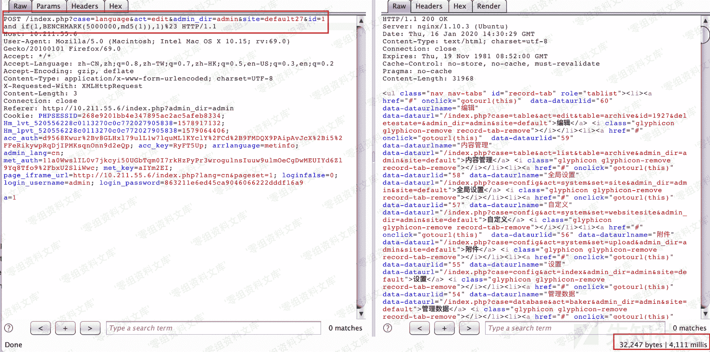

# CmsEasy 7.3.8 sql 注入漏洞

> 原文：[http://book.iwonder.run/0day/CmsEasy/2.html](http://book.iwonder.run/0day/CmsEasy/2.html)

## 一、漏洞简介

## 二、漏洞影响

CmsEasy 7.3.8

## 三、复现过程

漏洞代码位于 lib/admin/language_admin.php 的 add_action 函数

在测试后发现 CmsEasy V7.3.8 框架已经对 SQLi 进行了转义和过滤，包括（select、* 、sleep 等等），为了确定具体的过滤名单，从源码中查找检测函数

##### 但是经过一番搜索后，源码中发现实际调用的注入检测函数并没有被定义，仔细研究后确定是在几个加密混淆的核心代码中实现了。。（闭源一定意味着安全吗？）——通过一番周折后得到函数

显而易见，这样简单的过滤很容易被部分 SQLi 关键组成字符绕过，导致 SQL 注入，例如，可以使用 benchmark 函数来代替 sleep 以达到基于时间的注入。除了通过得到源码来明确黑名单的，用 fuzz 同样可以得到过滤的黑名单，之后再想办法绕过

而类似的漏洞成因在同一个文件的 edit_action 函数中也存在

这两处接口都存在 SQL 注入漏洞，提交的 payload 绕过过滤黑名单后可以进行利用

## 参考链接

> [https://xz.aliyun.com/t/7273](https://xz.aliyun.com/t/7273)

