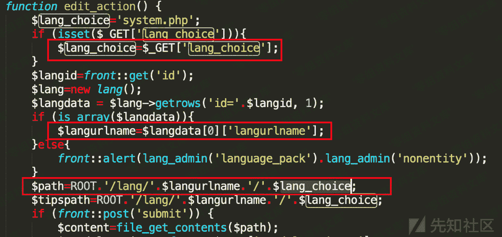
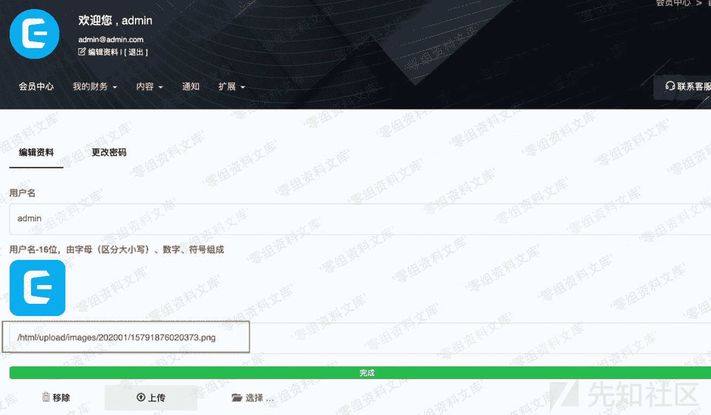
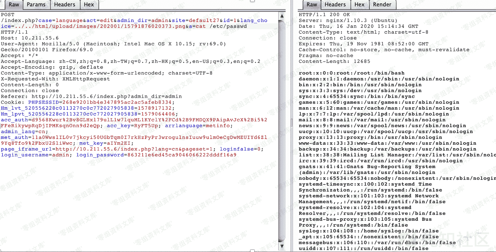

# CmsEasy 7.3.8 本地文件包含漏洞

> 原文：[http://book.iwonder.run/0day/CmsEasy/3.html](http://book.iwonder.run/0day/CmsEasy/3.html)

## 一、漏洞简介

## 二、漏洞影响

CmsEasy 7.3.8

## 三、复现过程

CmsEasy V7.3.8 框架后端的语言编辑功能函数接口对 include 的文件路径没有做安全性校验，攻击者可以通过该接口包含上传的带有 PHP 代码内容的任意后缀（合法）文件，导致远程代码执行

漏洞代码位置是位于 CmsEasy_7.3.8_UTF-8_20191230/lib/admin/language_admin.php 文件中的 edit_action 函数

$lang_choice 是从用户的 GET 请求参数中直接获取的，$langurlname 是从数据库中获取的 langurlname 字段。后面将这两个参数直接拼接路劲赋值给$path，这里的$lang_choice 拼接在最后，可以任意赋值（为后面文件包含导致命令执行奠定基础）。

接着由于 266 行判断 POST 参数是否有 submit，我们可以直接不传这个参数来绕开这一段的代码执行，到 299 行直接通过 inlcude 函数包含我们任意传递的值，导致文件包含

CmsEasy 对于任何用户存在文件和图片上传功能，虽然我们不能直接上传 php 文件（默认禁止），但是可以上传内容为 php 代码的图片后缀文件，因此可以通过这一处文件包含达到最后高危的命令执行问题

## 参考链接

> [https://xz.aliyun.com/t/7273](https://xz.aliyun.com/t/7273)

