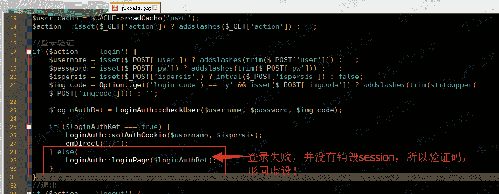
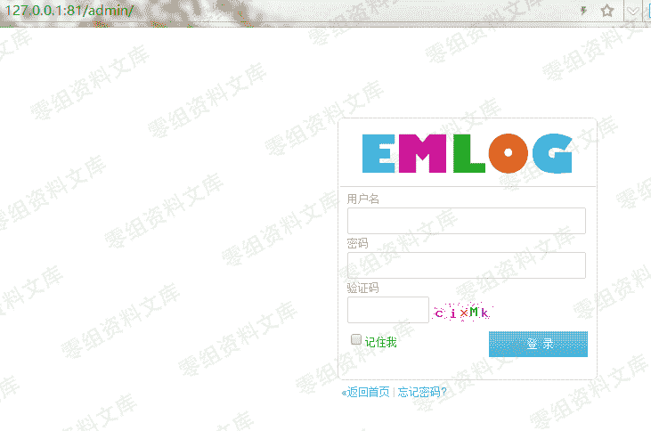
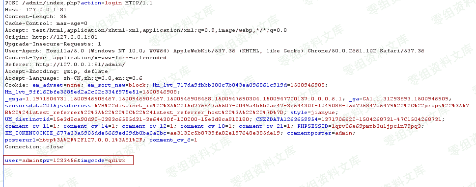
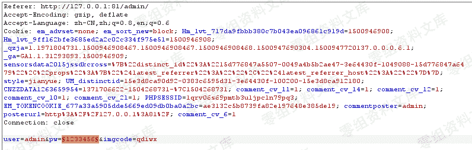
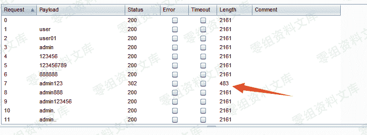

# Emlog 6.0 后台暴力破解

> 原文：[http://book.iwonder.run/0day/Emlog/3.html](http://book.iwonder.run/0day/Emlog/3.html)

## 一、漏洞简介

Emlog 博客系统默认后台登陆地址为[http://域名/admin/login.php 而后台登陆时，错误情况下，验证码未刷新，导致可暴力破解登陆管理员账号低危漏洞，但是在 emlog5.3.1 和 6.0 测试版本均存在](http://域名/admin/login.php 而后台登陆时，错误情况下，验证码未刷新，导致可暴力破解登陆管理员账号低危漏洞，但是在 emlog5.3.1 和 6.0 测试版本均存在) ...

## 二、漏洞影响

emlog5.3.1 和 6.0

## 三、复现过程



访问

```
http://0-sec.org:81/admin/ 
```



已知管理员用户名为：admin（可在前端文章页寻找作者用户名）


登陆后台


随便输入 admin admin123 qdiwx，点击登陆

然后 burpsuite 抓包



CTRL+I 尝试暴力破解：






成功爆破出密码，所以再次验证：验证码没消除会话，导致可暴力破解漏洞的存在

## 四、参考链接

> [http://www.dyboy.cn/post-900.html](http://www.dyboy.cn/post-900.html)

