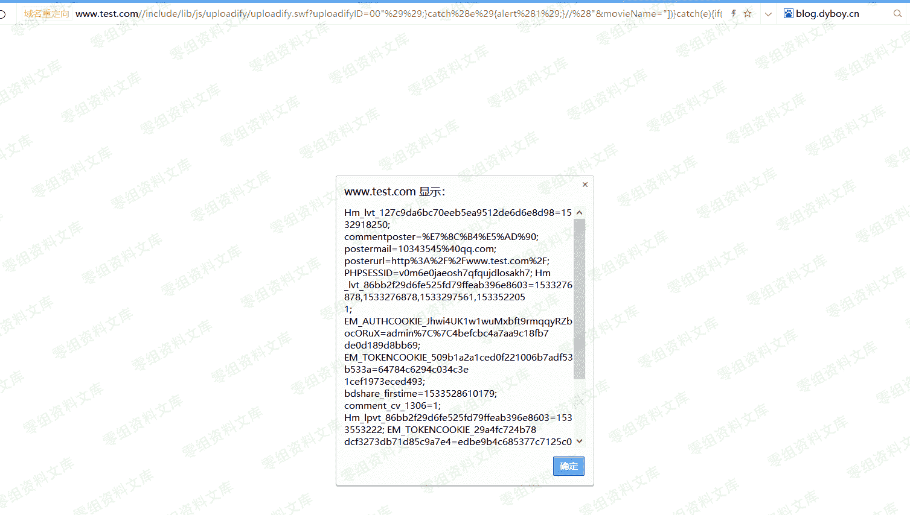
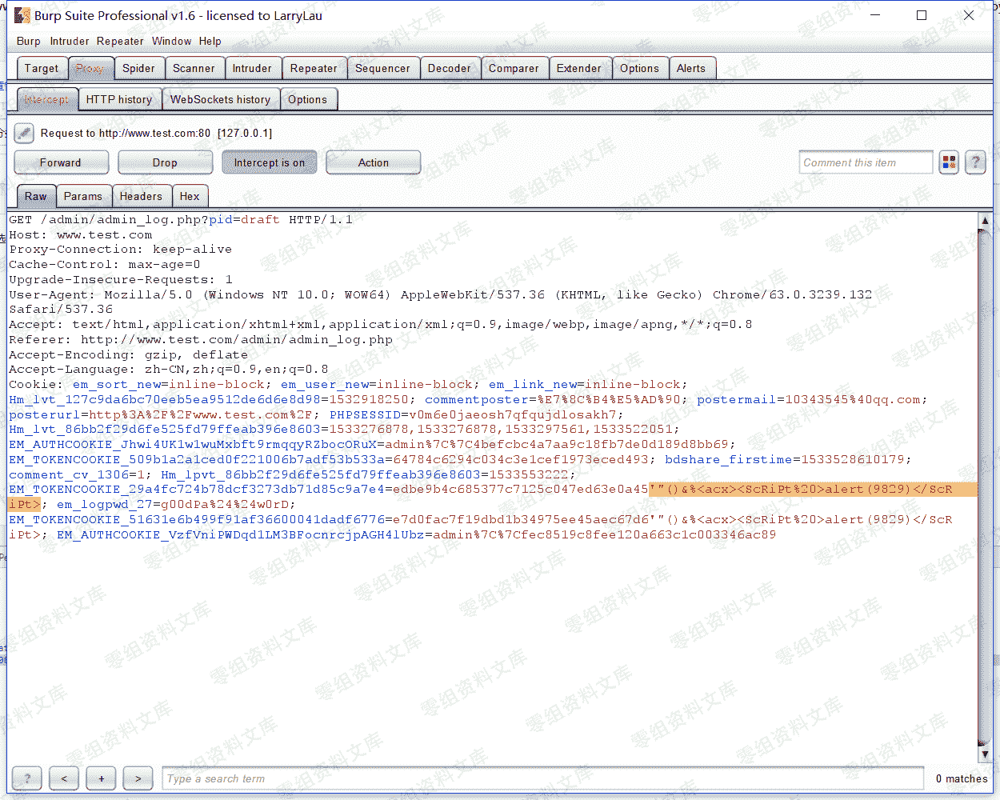

# Emlog 6.0 xss 集合

> 原文：[http://book.iwonder.run/0day/Emlog/7.html](http://book.iwonder.run/0day/Emlog/7.html)

## 一、漏洞简介

## 二、漏洞影响

Emlog 6.0

## 三、复现过程

### Uploadify SWF XSS

Emlog 使用了 uploadify.swf 的方式上传文件，文件路径 /include/lib/js/uploadify/uploadify.swf

payload

```
http://www.0-sec.org/include/lib/js/uploadify/uploadify.swf?uploadifyID=00%22%29%29;}catch%28e%29{alert%281%29;}//%28%22&movieName=%22])}catch(e){if(!window.x){window.x=1;alert(document.cookie)}}//&.swf 
```

效果，可无视浏览器 filter：



### 反射 xss

此处的 XSS 主要发生在 cookie 上，因为某些页面如 admin/admin_log,admin/sort.php,admin/link.php 页面需要在表单中添加了 hidden 属性的 token 值，而这个 token 值直接从用户的 cookie 中取得，导致了一个反射型 XSS

拦截抓包修改 cookie 中的 token 值如下：



效果：


### 侧边栏存储性 XSS

为了同样是为了支持 HTML 代码的输出，没有转义对应的脚本代码标签，导致了存储性的 XSS 存在


