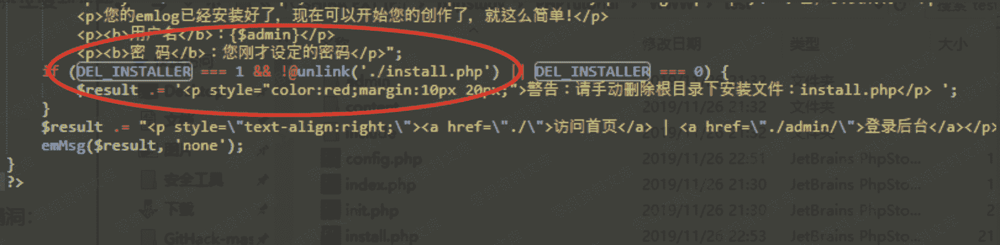
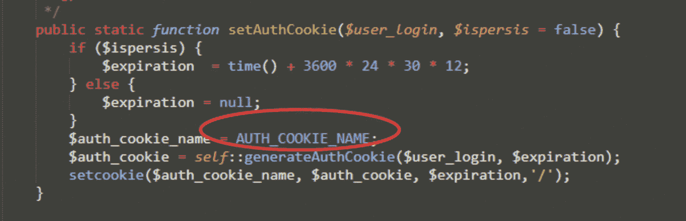
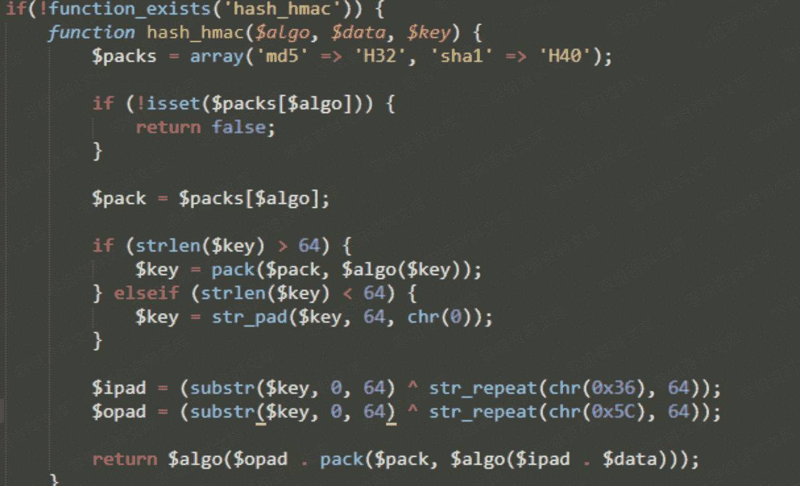
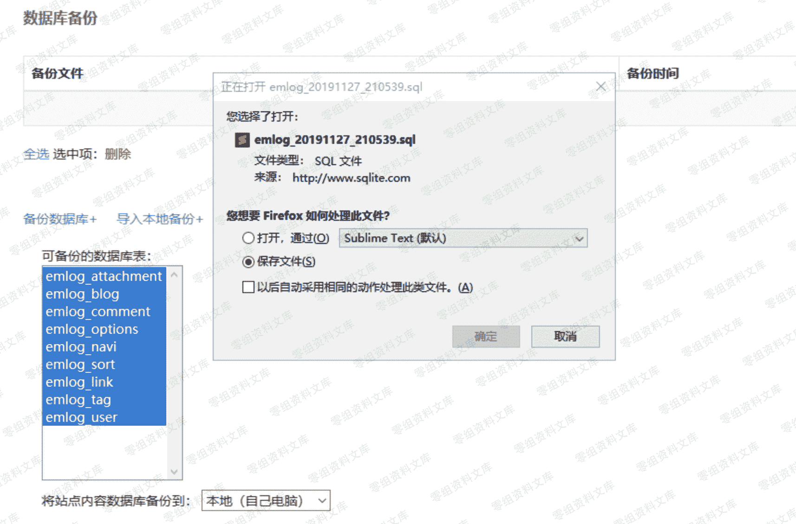

# Emlog 越权&后台 getshell

> 原文：[http://book.iwonder.run/0day/Emlog/1.html](http://book.iwonder.run/0day/Emlog/1.html)

## 一、漏洞简介

## 二、漏洞影响

## 三、复现过程

### 代码分析

#### 安装漏洞

​ 其实一般代码审计都是从安装文件开始审计，一般安装脚本主要存在如下漏洞：

```
无验证功能，任意重装覆盖
表单不做过滤写入 config.php 导致 getshell
$_GET['step']跳过限制步骤
漏洞文件：install.php 
```

​ ​首先我们直奔第一个点能否任意重装，我们可以看到必须常量 DEL_INSTALLER 为 1 的时候才会触发删除 install.php,那么我们追踪 DEL_INSTALLER 看看



这里可以看到 DEL_INSTALLER 默认值就是 0，所以一般情况下这里是可以任意重装的，我们从黑盒的测试也可以印证这一点。同时表单也做了过滤所以这里也没有后面两种情况。


#### 越权漏洞

​ ​在安装完毕后打开 config.php 看到两个比较奇怪的常量定义：AUTH_KEY 和 AUTH_COOKIE_NAME 从名字来看这连个常量肯定是有一定联系的。如下图：


我们在抓包时候发现了 AUTH_COOKIE_NAME 这个常量，说明这是一个 cookie 名。我们继续再代码中追踪这个常量。


我们可以看到在登录验证 cookie 中使用了这个常量，我们追踪一下 cookie 值是如何构造的



这里可以看到，调用了 emHash 这个类方法，并且这里使用了 AUTH_KEY 这个常量，这里说明这两个常量是有联系的。我们在继续追踪 hash_hmac()到底使用 key 做了什么。


这里对传入的$key 也就是 AUTH_KEY 进行了 md5 加密到一个二进制字符串中而后分割为 64 个字节与一个字符*64 次的字符串进行异或最后得到两个字符串$ipad,$opad 最后再将他们打包拼接用 md5 加密返回给上级调用。我们再回到上级。



我们知道 generateAuthCookie 方法中的 $key、$hash 是由 AUTH_KEY 加密而成。最终的 cookie 是由$user_login 、 $expiration $hash 拼接而成，而$expiration 是 cookie 的生存时间，$user_login 是用户名。这里可以得知$key、$user_login、$expiration 都是固定的那么只要知道 AUTH_KEY 就有伪造 cookie 造成越权的可能。

​例如我们准备两个靶机，一个靶机登陆，获取这个靶机的 cookie 即可越权登陆另外一个靶机。前提是两个靶机的 AUTH_KEY 得一致。这里有点鸡肋但是还是有利用的可能。我们将两个靶机的 cookie 拿出来比较确实是一样的。 ​ ​ 

#### 后台 getshell（一）

​ ​其实上诉两个漏洞已经能够让我们进入后台了，现在的任务就是如何 Getshell 了。这里我随便看了一下发现后台有设置上传附件后缀的功能。 ​ ​  ​ ​ 但是测试发现，加入 php 后缀你发现会将 phpt 替换为 X,从源码中可有很直观看到这点。 ​ ​  ​ ​此时我注意到了备份功能，这个后缀是保存在数据库中的，既然我不能直接将后缀写入数据库，那么我能不能通过数据备份恢复的方法写入数据库呢。 ​ ​ 这里直接备份所有表，下载下来然后找到写入后缀的语句，加上 php,如下 ​ ​  ​ ​  ​ ​ 导入备份后发现设置中的上传后缀有 php ​ ​  ​ ​ 直接在文章发表出上传 PHP 文件即可 getshell ​ ​ 

#### 后台 getshell（二）

我们还发现这个 cms 中上传插件的地方可以上传 zip，这里我们想如果在插件中插入一句话木马是不是也能 getshell?我们找到插件上传的脚本，发现使用了一个叫 emUnzip 的函数。


我们继续追踪这个函数，发现这个解压函数是使用 ZipArchive()类来实现解压缩的。我们可以看到代码 755 行中获取了压缩包的内部目录/文件的名称 ,并将其分割为数组将第一个元素赋值给了$dir，我们看到 switch 中 plugin 选项，这里又将获取的第一个文件夹名称赋值给$plugin_name,使用 getFromName 方法获取了压缩包是否存在$dir . $plugin_name . '.php'这个文件。综上这里就是检测压缩包中文件夹里面是否存在一个与文件夹名称一致的 PHP 文件，最后在再压。这里也没对文件进行其他校验操作。因此我们只要再构造 文件夹名和文件名相同的内容的压缩包，同时由上方代码也可以知道，文件将会被解压到 /content/plugins/a/a.php(文件夹名称 a)


构建压缩包上传插件：


## 四、参考链接

> [https://xz.aliyun.com/t/6861](https://xz.aliyun.com/t/6861)

