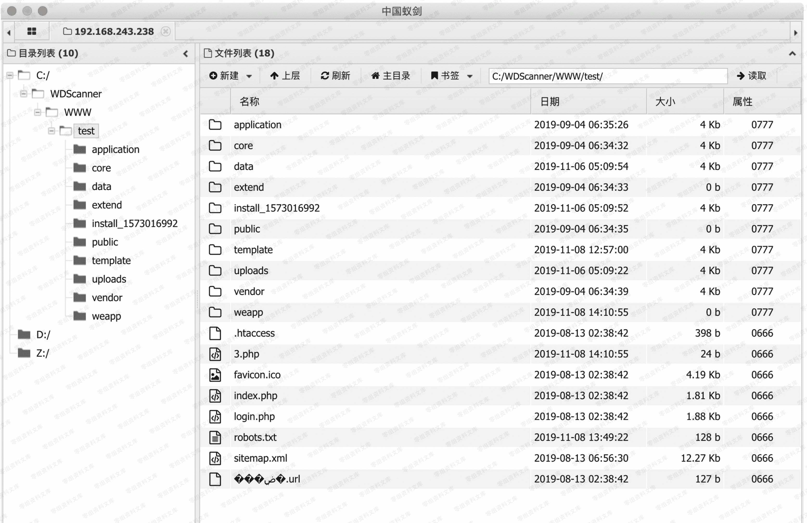

# Eyoucms 1.3.9 上传漏洞

> 原文：[http://book.iwonder.run/0day/Eyoucms/1.html](http://book.iwonder.run/0day/Eyoucms/1.html)

## 一、漏洞简介

EyouCms 是基于 TP5.0 框架为核心开发的免费+开源的企业内容管理系统，专注企业建站用户需求提供海量各行业模板，降低中小企业网站建设、网络营销成本，致力于打造用户舒适的建站体验。易优 cms v1.3.7 后台插件模块存在代码执

## 二、漏洞影响

Weapp.php 文件中的 create()方法接收了请求中的参数，过滤后直接存入 php 配置文件中，但是由于过滤不严，导致可以直接写入代码进去并执行。

## 三、复现过程

### 1、登陆后台

在后台-----》插件应用-----》上传插件这里可以上传 zip 文件

在 Weapp.php 文件中的 upload()方法中可以上传 zip 文件，并会自动解压到一个文件夹名是随机 md5 值的文件夹下

在后台开启插件功能，上传 zip 文件，zip 中有 php 一句话木马以及一个任意图片(图片内容无所谓，正常图片即可，但是必须得有)

上传后，虽然会返回错误信息，但是实际上后台已经解压了 zip 文件

访问内容管理模块，任意选择一个产品进行编辑，再图片集处可以上传图片，选择在线管理，可以在左侧看到该文件夹名

直接访问该文件夹下的 php 一句话木马文件即可

