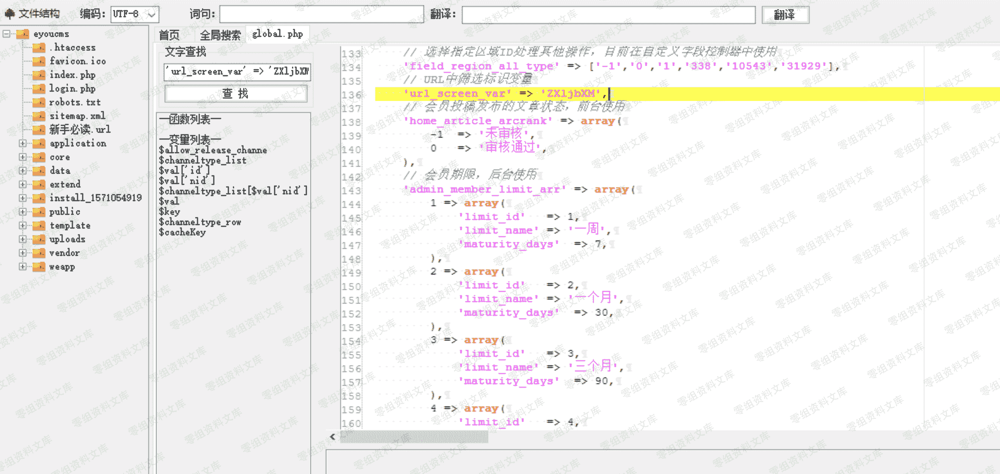

# Eyoucms 1.39 前台 sql 注入

> 原文：[http://book.iwonder.run/0day/Eyoucms/5.html](http://book.iwonder.run/0day/Eyoucms/5.html)

## 一、漏洞简介

## 二、漏洞影响

## 三、复现过程

```
http://0-sec.org:8081/eyoucms/?m=home&c=View&a=index&aid=89 
```


然后开启 burp 抓包，构建如下的包

需要改两方面的参数一是 referer，改成我们访问的页面

然后将 get 的 url 构造为如下


然后放进 sqlmap 一把梭就行啦

### 代码分析



'url_screen_var'这个值=>'ZXLjbXM'，这里它 cms 也注释说明了这个参数代表了文章状态，在前台使用的。

ZXljbXM

这里使用这个参数是需要注册一个用户权限，正好是可以在前台使用

所以上图的 refer 就代表我们是从用户权限的那里过来的

根据它 ZXLjbXM 所需求的构造如下 url。

```
GET /eyoucms/?ZXljbXM=1&a=index&c=Lists&m=home&tid=3&yanse=1 
```

看最后的参数 yanse 是它这个的 cms 的产品评论里的参数。本来是系统自带的

但是这个参数也是属于用户发表的文章里面的构造，所以结合 ZXLjbXM 即可构造可以存在注入的 url 链接


它这里请求的参数没有做防护

其实它这个文件的三个参数都是可以注入但是构造的请求 url 不相同。通过更改最后的参数即可

如果安装者是经过调整此点，或者仅用来展示网站的，那利用点可能微乎其微了

这个注入点比较鸡肋。其实没有多少高深的东西，只是笔者运气好，恰好看见这个参数。要不真的发现不了。

因为这个文件属于它 cms 自带的一处产品编辑的文件，实在不容易被注意到。

## 四、参考链接

> [https://xz.aliyun.com/t/6983](https://xz.aliyun.com/t/6983)

