# （CVE-2019-11231）GetSimple CMS 远程命令执行

> 原文：[http://book.iwonder.run/0day/GetSimple CMS/1.html](http://book.iwonder.run/0day/GetSimple CMS/1.html)

## 一、漏洞简介

在 GetSimple 3.3.15 版本中，攻击者可以通过伪造管理员 cookie，绕过身份验证登陆后台，进而通过后台编辑模板功能模块写入 php 代码，造成远程代码执行漏洞。

## 二、漏洞影响

GetSimple<=3.3.15

## 三、复现过程

### 漏洞分析

在分析该漏洞前，不得不提.htaccess 文件，本次漏洞的产生，是因为默认情况下 apache 对.htaccess 配置文件的开启情况不同而产生的。

htaccess 文件是 Apache 服务器中的配置文件，它负责相关目录下的网页配置。通过配置 htaccess 文件，可以实现众多功能，例如：允许/阻止特定的用户或者目录的访问、禁止目录列表、配置默认文档等。

启用.htaccess，需要在 apache 配置文件中，启用 AllowOverride。

在笔者测试了两款环境，分别为配置了 wamp 的 windows 与 ubuntu 服务器，在这两个环境中，默认情况对 htaccess 文件的启用情况是不同的。

先来看安装有 wamp 的 windows 环境，打开 apahce 配置文件 httpd.conf


可以看到，这里将位于 conf/extra/httpd-vhosts.conf 文件导入

跟进 httpd-vhosts.conf 文件


可以看到，在这里，默认情况下 AllowOverride 默认值是 All

当 AllowOverride 指令设置为 All 时，所有具有”.htaccess”作用域的指令都允许出现在.htaccess 文件中。

此时，目录中的.htaccess 配置文件为启用状态

例如位于 getsimplecms/data 目录中的.htaccess 配置文件

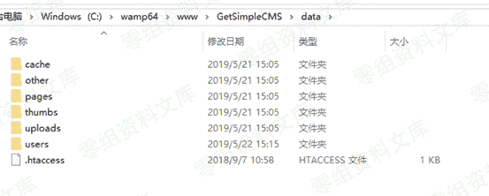

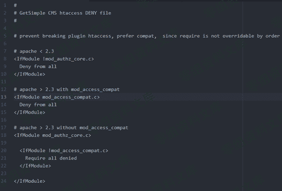

当此.htaccess 配置文件被加载时，是禁止该目录被 web 端访问的

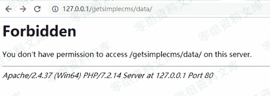

也就是说，通过该方法，通过 web 端访问 data 目录时，不会显示其中文件列表

与其中文件内容，是可以很好的保护存在于该目录下的文件，不被泄露

但是在笔者的 ubuntu 服务器，ubuntu apache2.conf 中

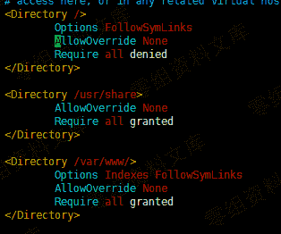

AllowOverride 默认值是 None，默认的情况下，不加载目录中的.htaccess

我们将上述的.htaccess 文件放入 ubuntu 服务器的 web 目录中


再通过浏览器访问这个路径


如上图可见，.htaccess 并没有生效，而路径中的文件，是可以被泄露的

回归到本次漏洞：

访问[http://127.0.0.1/getsimplecms/data/users/admin.xml](http://127.0.0.1/getsimplecms/data/users/admin.xml)


在.htaccess 没有生效的情况下，我们获取 admin.xml 中记录的用户相关信息，该 cms 并没有将用户信息写入数据库，而是全部存于该文件中

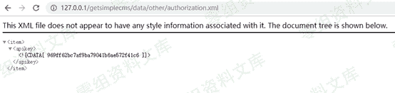

访问[http://127.0.0.1/getsimplecms/data/other/authorization.xml 获取 authorization.xml 中记录的 apikey](http://127.0.0.1/getsimplecms/data/other/authorization.xml 获取 authorization.xml 中记录的 apikey)

现在我们得到如下的信息：（用户名/加密后的密码/apikey）

该 cms 并没有将用户信息写入数据库，而是全部存于 xml 文件中

通过获取的信息，接下来进一步分析如何利用这些泄露的信息：

Cookie**算法分析：**

分析下 GetSimple 中的 cookie 是如何生成的

位于\GetSimpleCMS\admin\inc\cookie_functions.php

create_cookie 方法

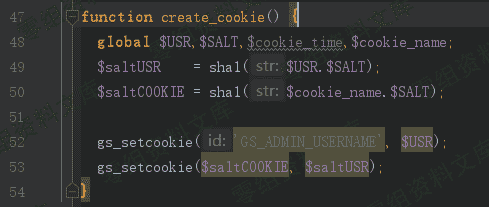

计算 cookie 所需的$USR $SALT 对应如下：

GetSimpleCMS\data\users\admin.xml 文件

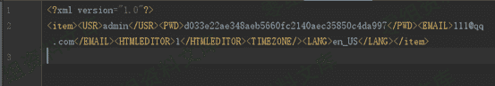


getsimplecms\data\other\authorization.xml

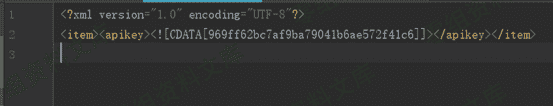


这些信息是可以直接读取出来的

getsimplecms 中 Cookie 的算法的实现如下:

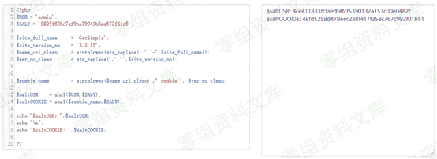

算法相对简单，通过$SALT 值与$USR 进行拼接；$SALT 值与$cookie_name 拼接，最终通过 sha1 进行加密，算出对应的 cookie 键值对

通过泄露的文件与 cookie 算法，可以顺利计算出对应用户的 cookie

现在，可以伪造任意成员的 cookie 了

以 USR :admin 举例说明：

最终拼接的 cookie 为：

GS_ADMIN_USERNAME=admin;48fd5258d478eec2a8f417f358c767c992f01b51=8ce411833fcfaedf4fcf5390132a153c00e0482c

Password**算法分析：**

分析下 Password 的计算方式


Password 的加密，是通过 passhash()方法来实现的

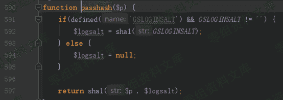

GSLOGINSALT 是用来保护的密码的额外的 salt 值，默认情况为空。

所以这里的密码计算就比较直接了，通过 sha1 方法对明文密码进行加密

```
sha1($p) 
```

通过 sha1 hash 将明文密码加密为密文。


也就是说，只要获取了加密后的 password，有一定几率，可以破解为明文：

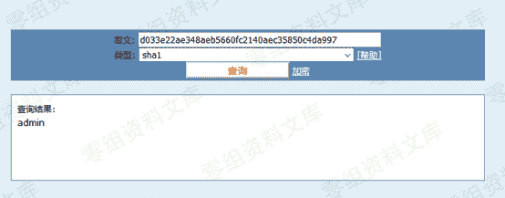

获取到管理员 cookie/password 后，使用管理员账号登陆后台

通过伪造 cookie 访问后台：

未登录时，访问后台地址

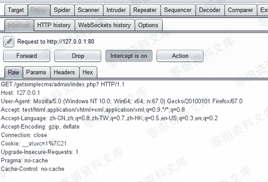

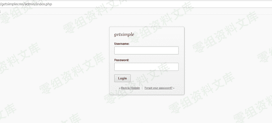

此时需要填写正确的用户名密码才可以登陆后台

这里，通过改包的方式，将 cookie 修改为之前计算出的值

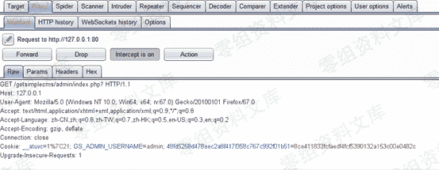

此时，无需登陆，直接进入后台


访问如下 url

[http://127.0.0.1/getsimplecms/admin/theme-edit.php](http://127.0.0.1/getsimplecms/admin/theme-edit.php)


在这里可以对模板文件进行编辑，在这里可以写入任意 php 代码，造成远程代码执行漏洞

例如：


访问如下地址：

[http://127.0.0.1/getsimplecms/theme/Innovation/template.php](http://127.0.0.1/getsimplecms/theme/Innovation/template.php)

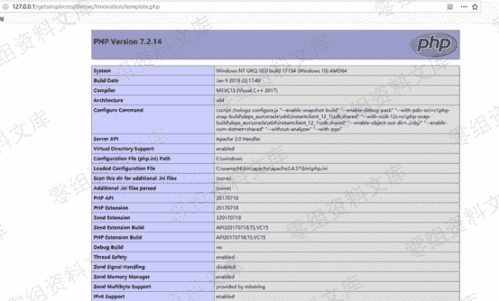

插入的 php 代码被成功执行

