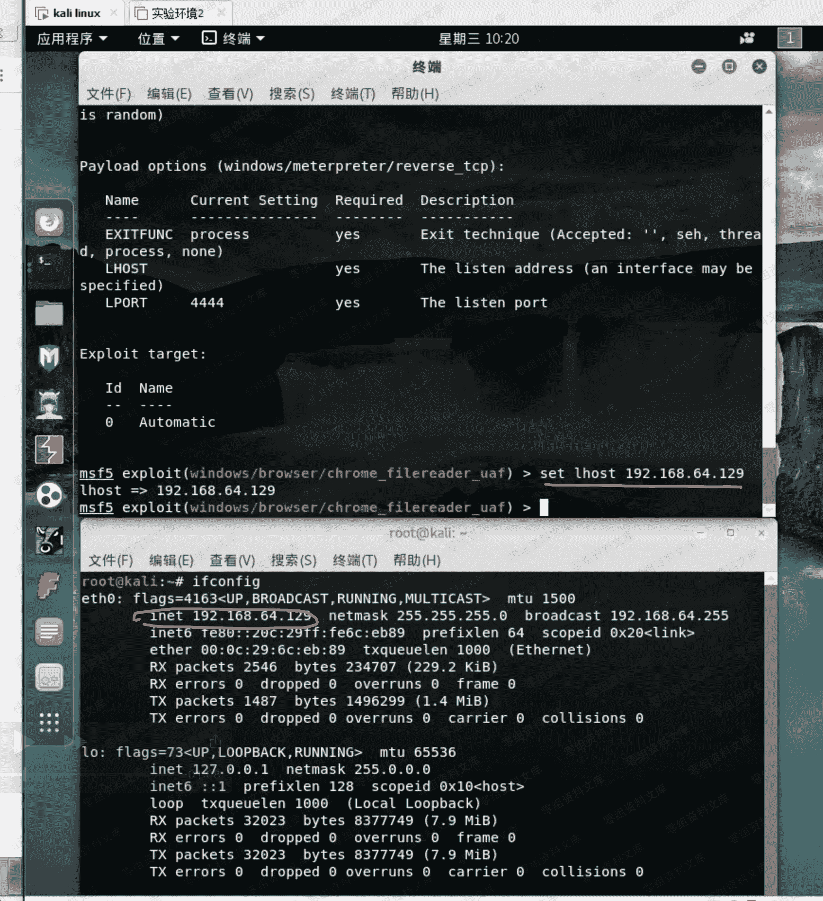
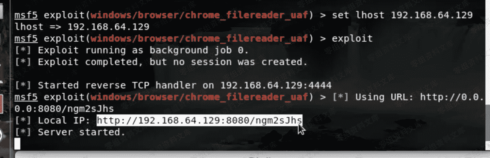

# （CVE-2019-5786）Chrome 远程代码执行漏洞

> 原文：[http://book.iwonder.run/0day/Google/CVE-2019-5786.html](http://book.iwonder.run/0day/Google/CVE-2019-5786.html)

## 一、漏洞简介

攻击者利用该漏洞配合一个 win32k.sys 的内核提权（CVE-2019-0808 ）可以在 win7 上穿越 Chrome 沙箱

## 二、漏洞影响

72.0.3626.121 或更高版本

## 三、复现过程

测试环境为：

```
win7 x86
谷歌浏览器版本为 72.0.3626.119 
```


这里看一下参数说明


设置 lhost 为我们的本机 ip



执行 exploit 之后，会返回一个链接



只要被攻击者访问了这个链接，就会触发漏洞，返回 session


