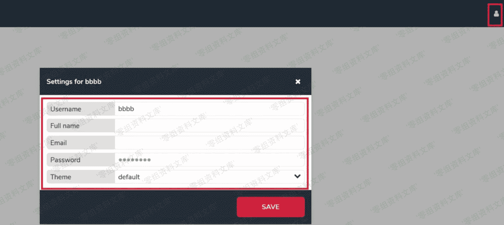
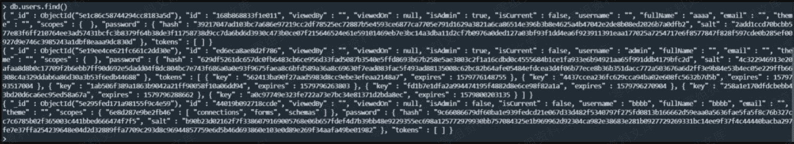
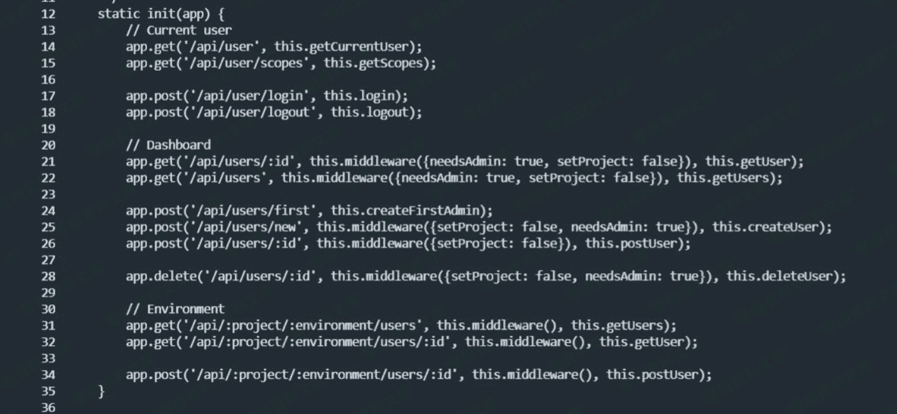
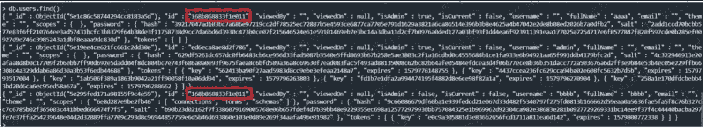
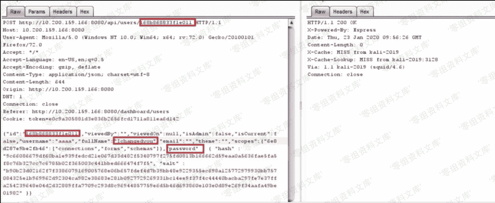
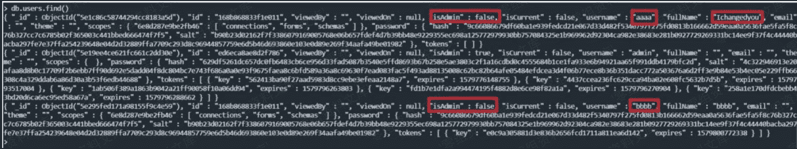

# （CVE-2020-6949）HashBrown CMS postUser 函数存在提权漏洞

> 原文：[http://book.iwonder.run/0day/Hashbrown CMS/CVE-2020-6949.html](http://book.iwonder.run/0day/Hashbrown CMS/CVE-2020-6949.html)

## 一、漏洞简介

HashBrown CMS 是一套开源的无头内容管理系统（CMS）。 HashBrown CMS 1.3.3 及之前版本中的‘postUser’函数存在提权漏洞。攻击者可利用该漏洞修改管理员账户的哈希密码或重置该账户。

## 二、漏洞影响

HashBrown CMS 1.3.3 及之前版本

## 三、复现过程

在读和部分此 cms 的源码后，希望对用户管理方面做个审计。这款 CMS 的用户分为两种，一种是 admin 权限用户， 可以创建和设置别的用户的属性，比如参管理那些项目，用户名密码设置等等。另外一种是 editor 账户，其能管理哪些项目是由 admin 设置的，editor 账户只能修改自己的用户名和密码。如下图这里的三个账户，admin 和 aaaa 是 admin 用户，bbbb 是 editor 账户


由于该 CMS 不提供用户注册和找回密码的功能， 所以没有太多的地方可以去尝试突破，我就尝试聚焦有没有办法把 editor 账户提权成 admin 账户，那 editor 账户只有一个地方可以修改自己的密码和其他属性。



随意做个修改后在 burpsuit 截取请求如下。

```
POST http://10.200.159.166:8080/api/users/44019b092718ccde HTTP/1.1
Host: 10.200.159.166:8080
User-Agent: Mozilla/5.0 (Windows NT 10.0; Win64; x64; rv:72.0) Gecko/20100101 Firefox/72.0
Accept: */*
Accept-Language: en-US,en;q=0.5
Accept-Encoding: gzip, deflate
Content-Type: application/json; charset=utf-8
Content-Length: 159
Cookie: token=2e10b7f6b3cc8fbf81452d980029d6e843ac5760

{"id":"44019b092718ccde","viewedBy":"","viewedOn":null,"isAdmin":false,"isCurrent":false,"username":"bbbb","fullName":"bbbb","email":"","theme":"","scopes":{}} 
```

Grep 定位到文件 Server/Controller/UserController.js

```
root@SIN-Ubuntu-A:~/hashbrown-cms/hashbrown-cms-1.3.1/src# grep /api/users/ * -r

Server/Controller/UserController.js:        app.get('/api/users/:id', this.middleware({needsAdmin: true, setProject: false}), this.getUser);

Server/Controller/UserController.js:        app.post('/api/users/first', this.createFirstAdmin);

Server/Controller/UserController.js:        app.post('/api/users/new', this.middleware({setProject: false, needsAdmin: true}), this.createUser);

Server/Controller/UserController.js:        app.post('/api/users/:id', this.middleware({setProject: false}), this.postUser);

Server/Controller/UserController.js:        app.delete('/api/users/:id', this.middleware({setProject: false, needsAdmin: true}), this.deleteUser); 
```

其中的 postUser function, 其中可看到该函数在 151 行会对 cookie 里面的 token 进行验证，在 153 行获取 user 的 scope。Scope 这里指的就是是不是 admin 用户，可以管理那些项目。但是这里有个要注意的地方 148 行的 req.params.id 是 post 内容里面 json id 字段的值，但是 155 行的 user.id 是 url 末段的 id 值。对于 editor 用户来说应该永远一直，因为 editor 只能修改自己账户。Admin 用户有可能不一样，因为 admin 用户是可修改其他账户的。我们可以看到 156 到 159 行是做了安全性检察的，如果当前 user id 获取的属性没有 users 的 scope（不是 admin 权限账户），那就用数据库里面的属性覆盖当前 post 提交内容的 isAdmin 和 scopes 两个内容，保证不会让 editor 自己提权到 admin 账户。到此没有看到对其他 post 提交内容做检察。之后 168 行用查询 id 的方式对响应的条目做修改。


此时如果我们在数据库中查看的话可以有个更清晰的认识，如果第一个条目是 aaaa 账户，isadmin 设置为 true，第二个是 admin 账户，第三个是 bbbb 账户，每个账户 password 字段包含 hash，salt 和 token 字段。



这里我产生了一个想法，如果我是 bbbb 账户，提交修改自己账户请求的时候写入的是 aaaa 账户的 id 会发生什么样的事情呢？但是做这件事之前我们要先确定 bbbb 账户有没有办法得到 aaaa 账户的 id。在阅读/Server/Controller/UserController.js 源码后确实是可以的。如下 31 行，发送 get 请求到 API 可以获取到当前项目的所有用户，包括所有的 admin 账户。而项目 id 等是当管理员赋予 editor 权限后，登录后从请求中就可以拿到的。



发送请求得到账户的信息。


那接下来我们就可以篡改 bbbb 发送修改自己账户的请求，但是 post 提交的 id 是 aaaa 账户。如下图保持了 url 最后一段是 bbbb 自己的 id，post 提交的 id 是 aaaa 账户，显示 200 ok。


此时如果查看数据库会看到确实 aaaa 和 bbbb 条目的 id 一样，但是 bbbb 的内容并没有实际的改变，只是换了一个 id。对别的账户也没有任何的修改。



但其实如果我们再深一步就会发现这有利用的点。在之前的源码中 168 行 HashBrown.Service.UserService.updateUserById(id, properties); 使用了查询匹配 id 做修改的方式。我们追踪这个函数。在文件 Server/Service/UserService.js 中看到 mergeOne 的数据库操作方式。这意味这如果 aaaa 和 bbbb 有相同的 id，但是 aaaa 在数据库的前面位置，如果 bbbb 提出对这个 id 的修改，修改会被接受但是写入 aaaa 的条目。


接下来我们来做测试,提交的 ID 全部改成 aaaa 账户的 id，因为现在原始的 bbbb 的 id 已经不存在了。还提交了 aaaa 的 fullname 和 password 字段修改其密码是和 bbbb 同样的内容。



结果如下，可以看到 aaaa 的条目修改后接受了 fullname，和 password，isadmin 和 scopes 继承了 bbbb 的内容，这是因为前面源码中的 156 到 159 行的作用。



到此为止，我们虽然不能将 bbbb 账户自己提升成 admin，但是可以去修改别的账户的关键参数包括密码，这无疑是一个用户权限的漏洞。经过相似的分析修改 username 可以达到类似的效果。随后我提交此漏洞，开发人员征求了我的意见以后保证无法修改成同样的 id 或者 username 来规避了这个问题。

## 参考链接

> [https://mp.weixin.qq.com/s?__biz=MjM5MDYxODkyMA==&mid=2651345793&idx=1&sn=02381bb3dbd4679b12be4628d665e815&chksm=bdbef7c68ac97ed063e8df46a42e2a111dfd52f108f6b267f8dfc183b6b0ed3f87b6af757487&mpshare=1&scene=1&srcid=&sharer_sharetime=1582514363054&sharer_shareid=346bf064ccfaeb680ec3e1af3a4fc9a8&key=019d47c25aa835ac2d58a398c473737e01644761ca991f7009ada9eb1ef69e4dd41b2008c27db720006e0858455f920d0801d9feae53aa4314f05d6e310a7290ae2b93e17343c13f6a9f2ce360254195&ascene=1&uin=MTU0OTU5NDkzMA%3D%3D&devicetype=Windows+10&version=62080079&lang=zh_CN&exportkey=AZc%2BxZJwp8CueCtaKThWQrI%3D&pass_ticket=l4uNHDrGwGqrS%2BmJVv56i4FzemghweUeBbN1BEETCGd3TqEDSTcwvRMSxogubM8j](https://mp.weixin.qq.com/s?__biz=MjM5MDYxODkyMA==&mid=2651345793&idx=1&sn=02381bb3dbd4679b12be4628d665e815&chksm=bdbef7c68ac97ed063e8df46a42e2a111dfd52f108f6b267f8dfc183b6b0ed3f87b6af757487&mpshare=1&scene=1&srcid=&sharer_sharetime=1582514363054&sharer_shareid=346bf064ccfaeb680ec3e1af3a4fc9a8&key=019d47c25aa835ac2d58a398c473737e01644761ca991f7009ada9eb1ef69e4dd41b2008c27db720006e0858455f920d0801d9feae53aa4314f05d6e310a7290ae2b93e17343c13f6a9f2ce360254195&ascene=1&uin=MTU0OTU5NDkzMA%3D%3D&devicetype=Windows+10&version=62080079&lang=zh_CN&exportkey=AZc%2BxZJwp8CueCtaKThWQrI%3D&pass_ticket=l4uNHDrGwGqrS%2BmJVv56i4FzemghweUeBbN1BEETCGd3TqEDSTcwvRMSxogubM8j)

