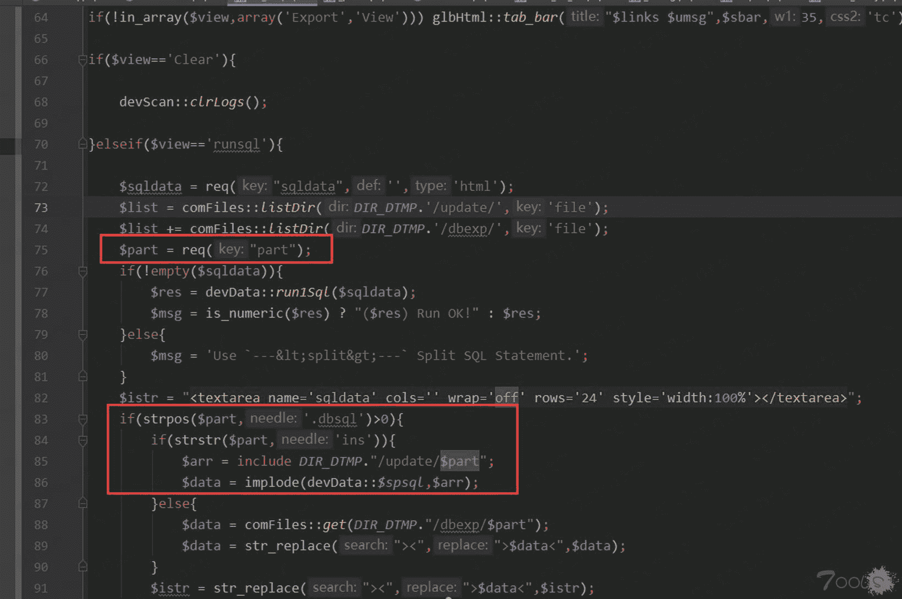
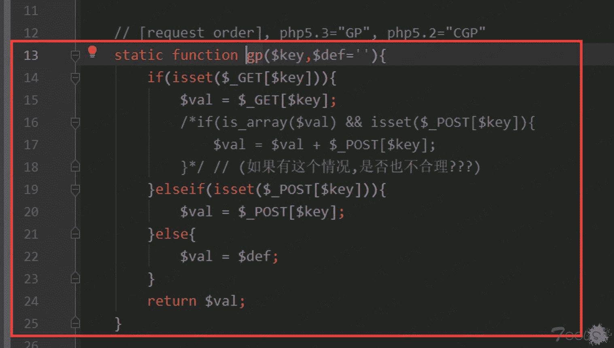
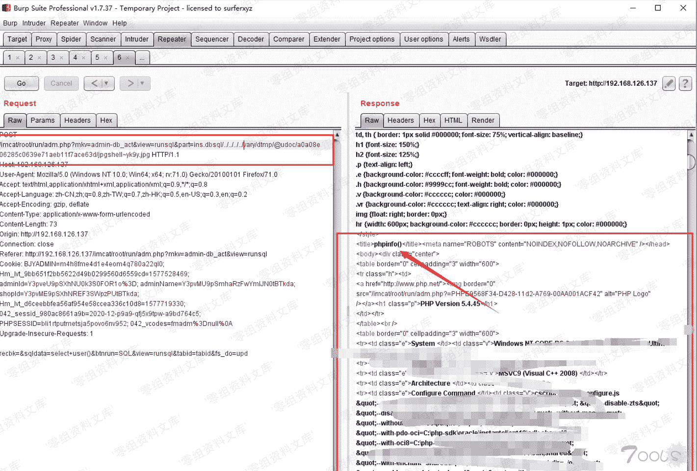

# Imcat 4.2 后台文件包含 getshell

> 原文：[http://book.iwonder.run/0day/Imcat/Imcatcms 4.2 后台文件包含 getshell.html](http://book.iwonder.run/0day/Imcat/Imcatcms 4.2 后台文件包含 getshell.html)

## 一、漏洞简介

Imcat cms（贴心猫）4.2 存在一个 sql shell 的功能上，通过这个 sql shell 功能也是可以直接 getshell 的，但是当 mysql 版本过高的时候，默认有些权限是禁止的，不好弄，不过在这个功能中存在本地文件包含， 所以还可以通过文件包含来进行 getshell。

## 二、漏洞影响

Imcat 4.2

## 三、复现过程

### 漏洞分析

找到相应的 sql shell 功能对应的代码，存在问题的参数是$part，从代码中可以看到$part 参数直接传入到 include 进行文件包含的，虽有两个 if 判断，但是这很容易就可进行绕过了进入文件包含语句中， 所以只要跟踪的$part 参数的传入即可。

跟踪 req()函数

继续跟进

最后跟进到这里，其实就是通过 get/post 等其他方式接收就好，而且并没有进行任何的过滤

### 漏洞复现

写好的图片格式的 shell

找到上传文件的功能，这个在后台中肯定很多可以上传功能，比如上传图片的地方，并获取返回的地址。

然后就可以进入到 sql shell 的地方中随意执行 sql 语句就好

抓包，因为**默认是没有$part 这个参数的传入**的，需要自行添加，然后指定到图片的文件地址即可。

备注：ins.dbsql 这个是用来的绕过两个 if 判断进入到 if 代码块中的。

## 参考链接

> [https://www.t00ls.net/thread-55176-1-1.html](https://www.t00ls.net/thread-55176-1-1.html)

