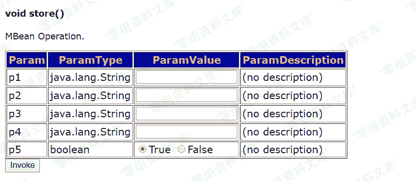
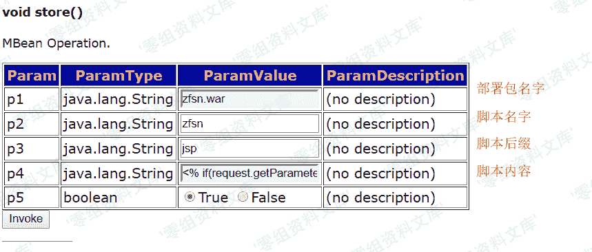

# （CVE-2007-1036）JMX Console HtmlAdaptor Getshell

> 原文：[http://book.iwonder.run/0day/Jboss/（CVE-2007-1036）JMX Console HtmlAdaptor Getshell.html](http://book.iwonder.run/0day/Jboss/（CVE-2007-1036）JMX Console HtmlAdaptor Getshell.html)

## 一、漏洞简介

此漏洞主要是由于 JBoss 中/jmx-console/HtmlAdaptor 路径对外开放，并且没有任何身份验证机制，导致攻击者可以进入到 jmx 控制台，并在其中执行任何功能。该漏洞利用的是后台中 jboss.admin -> DeploymentFileRepository -> store()方法，通过向四个参数传入信息，达到上传 shell 的目的，其中 arg0 传入的是部署的 war 包名字，arg1 传入的是上传的文件的文件名，arg2 传入的是上传文件的文件格式，arg3 传入的是上传文件中的内容。通过控制这四个参数即可上传 shell，控制整台服务器。但是通过实验发现，arg1 和 arg2 可以进行文件的拼接，例如 arg1=she，arg2=ll.jsp。这个时候服务器还是会进行拼接，将 shell.jsp 传入到指定路径下

## 二、漏洞影响

全版本

## 三、复现过程

输入 url:[http://172.26.1.169:8080/jmx-console/HtmlAdaptor?action=inspectMBean&name=jboss.admin%3Aservice%3DDeploymentFileRepository](http://172.26.1.169:8080/jmx-console/HtmlAdaptor?action=inspectMBean&name=jboss.admin%3Aservice%3DDeploymentFileRepository),定位到 store 方法

传入相应的值，即可 getshell

