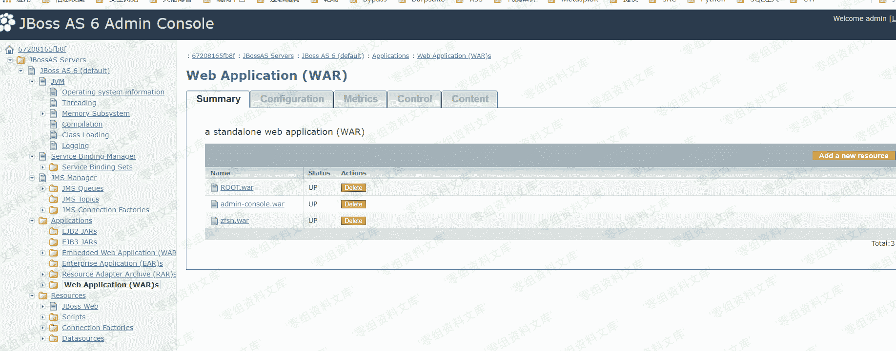

# Administration Console 弱口令 Getshell

> 原文：[http://book.iwonder.run/0day/Jboss/Administration Console 弱口令 Getshell.html](http://book.iwonder.run/0day/Jboss/Administration Console 弱口令 Getshell.html)

## 一、漏洞简介

Administration Console 存在默认密码 admin admin 我们可以登录到后台部署 war 包 getshell

## 二、漏洞影响

全版本

## 三、复现过程

1、点击 Administration console

2、输入弱口令 admin admin 进去

3、点击 Web application ,然后点击右上角的 add

4、把文件传上去即可 getshell

